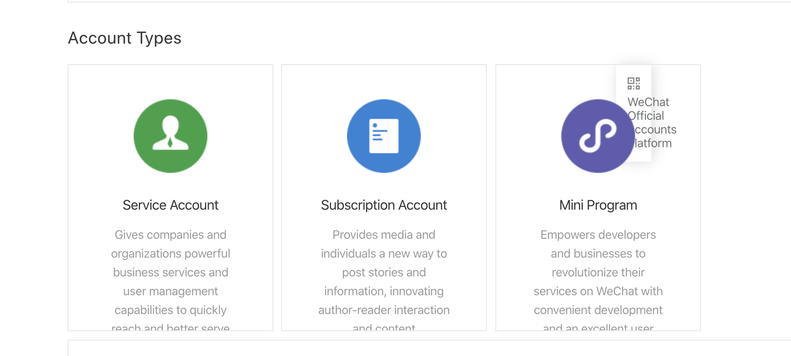
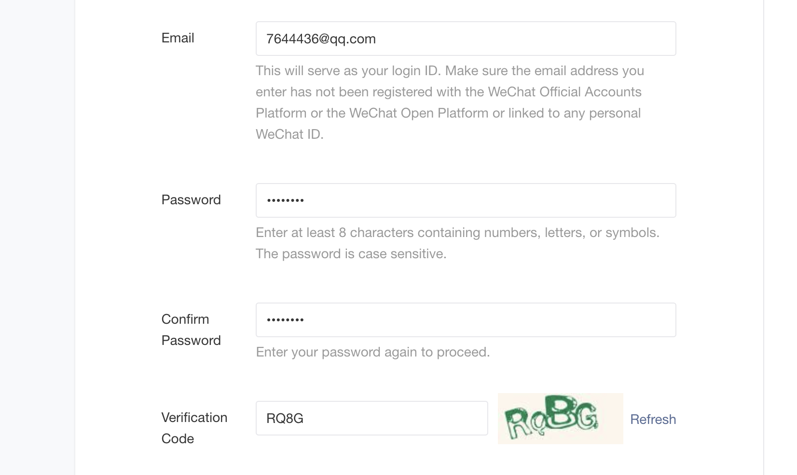
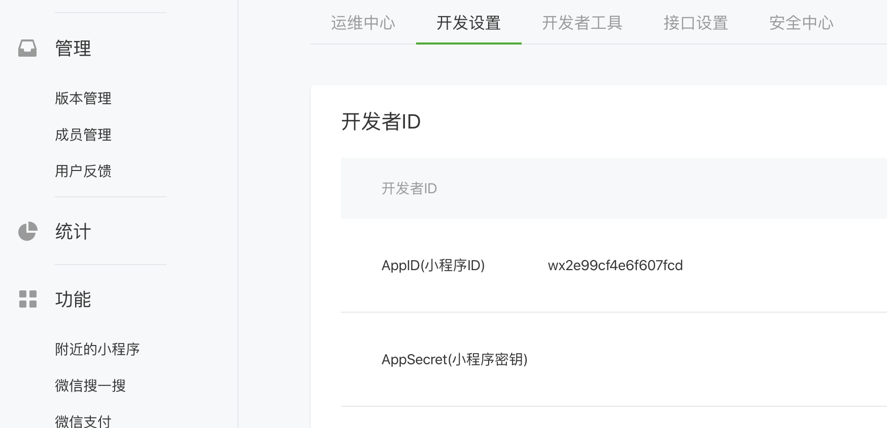
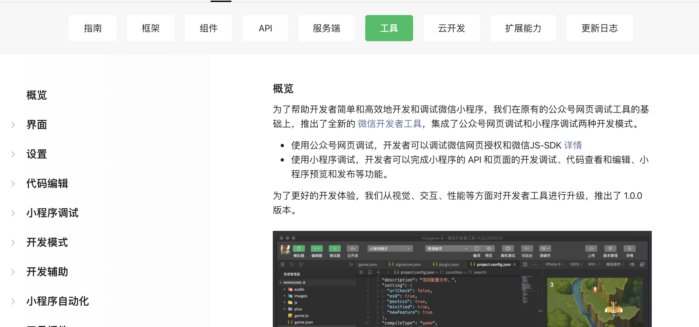
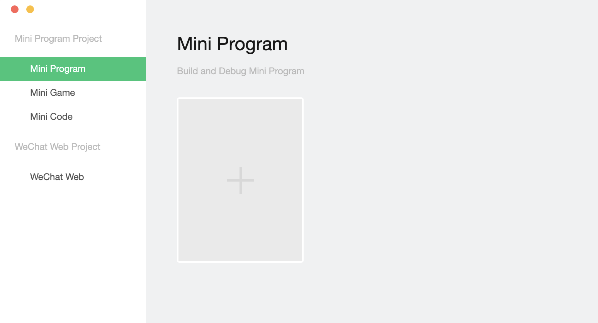
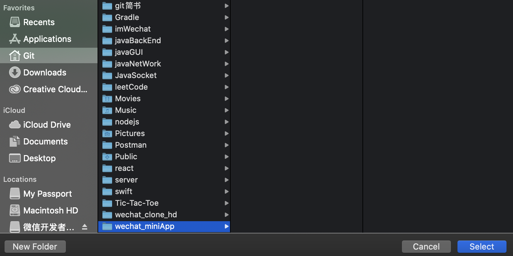
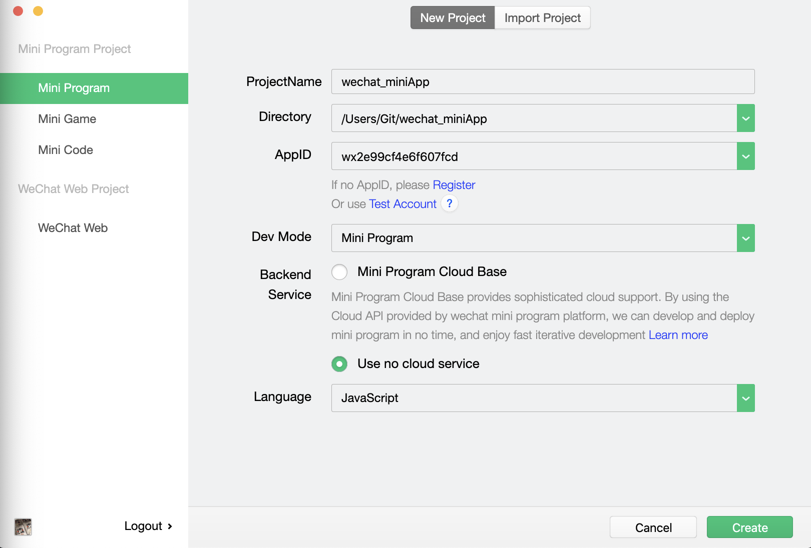

# 2. wechat public platform

- input `微信公众号`

- after register, click `开发` => `开发设置` 
- in chapter 2, we will use key(小程序密钥)

- click `Documentation` => `工具`

- click `下载`， choose `稳定版`
- download for macos
---
## 
- install mini program

- click `+`
- create a new `folder`

- 在小程序后台，复制 app id

---

## 推荐工具 vscode