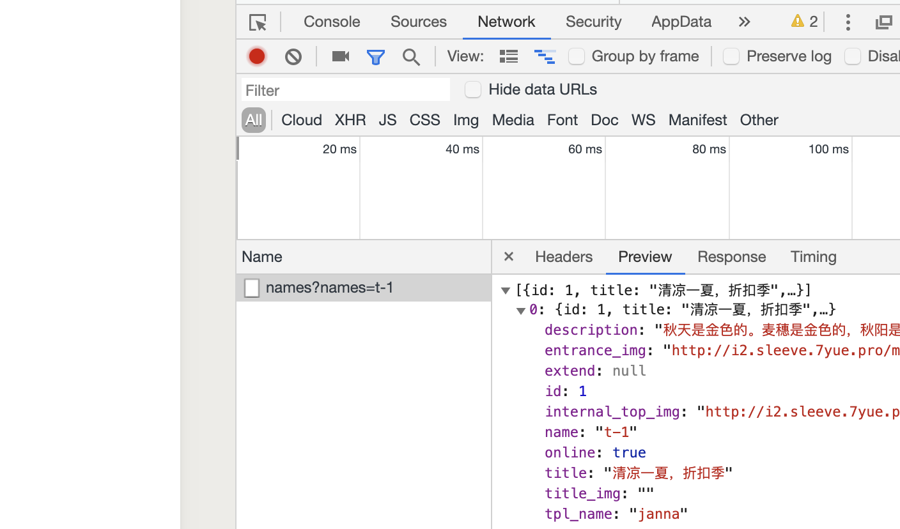
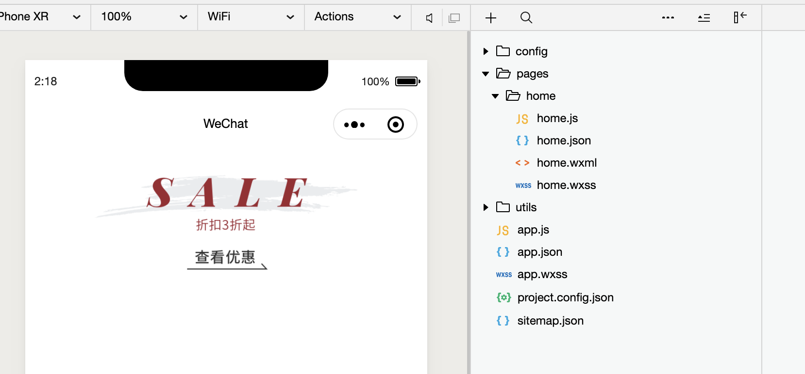

# 1. config | call server API

### import config, from `config/config.js`
```js
import { config } from "../../config/config"

// pages/home/home.js
Page({

  /**
   * Page initial data
   */
  data: {

  },

  /**
   * Lifecycle function--listening when page load
   */
  onLoad: function (options) {
    wx.request({
      //Template string
      url: `${config.apiBaseUrl}theme/by/names`,
      // url: 'http://se.7yue.pro/v1/theme/by/names?names=t-1',
      method: 'GET',
      data: {
        names: 't-1'
      },
      header: {
        appkey: config.appkey
      }
    })
  },
```

- now we may see the result of request

### more detail for home.js


```js
import { config } from "../../config/config"

// pages/home/home.js
Page({

  /**
   * Page initial data
   */
  data: {
    topTheme: null,
  },

  /**
   * Lifecycle function--listening when page load
   */
  onLoad: function (options) {
    wx.request({
      //Template string
      url: `${config.apiBaseUrl}theme/by/names`,
      // url: 'http://se.7yue.pro/v1/theme/by/names?names=t-1',
      method: 'GET',
      data: {
        names: 't-1'
      },
      header: {
        appkey: config.appkey
      },
      success(res) {
        console.log(res);
        this.setData({   //res.data 是这组数据
          topTheme: res.data[0]
        })
      }
    })
  },
```

### update home.wwml
```html
<!--pages/home/home.wxml-->
<view>
	<image class="top-theme" src="{{topTheme.entrance_img}}" />
</view>
```

### update home.js
```js

  /**
   * Lifecycle function--listening when page load
   * JS 类型的约束
   * 业务逻辑
   * 数据绑定
   * view视图层 业务逻辑层 桥梁 中间层
   * mvc C controller
   * Model, Logic, Service
   * Service, Manager,  
   */
  onLoad: function (options) {
    wx.request({
      //Template string
      url: `${config.apiBaseUrl}theme/by/names`,
      // url: 'http://se.7yue.pro/v1/theme/by/names?names=t-1',
      method: 'GET',
      data: {
        names: 't-1'
      },
      header: {
        appkey: config.appkey
      },
      success: (res) => {
        console.log(res);
        this.setData({   //res.data 是这组数据
          topTheme: res.data[0]
        })
      }
    })
  },
```
---
### now we may see the topTheme


 


