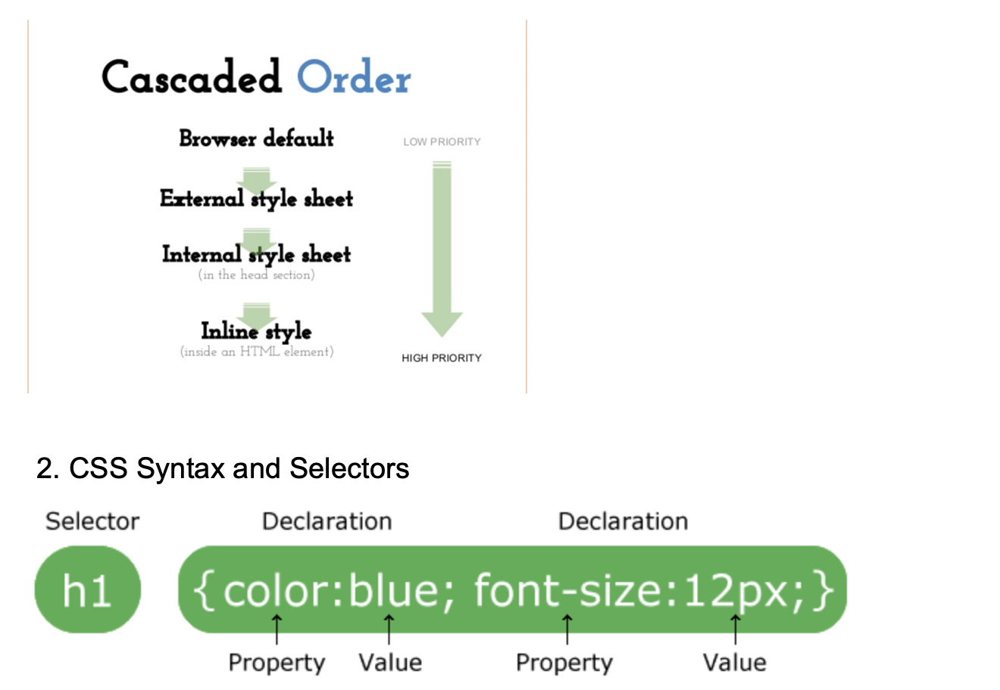

## CSS 1


- What is CSS?
  - CSS stands for Cascading Style Sheets.
  - describes how HTML elements (titles, images, paragraph...) 
    are to be displayed on screen, paper, or in other media


- How to add CSS to HTML?
  
- Inline Styles （Highest priority）
  `<h1 style="color:blue;">This is a heading</h1>`

- Internal(内部的) Style（Priority lower than inline style）

```css
<head>  
    <style>    
        h1 {	
            color: maroon;    
        }   
    </style>
</head>
```

- External(外部的) Style（Priority lower than internal style）
  - Each page must include a reference to the external style sheet file inside the 
    `<link>` element
  - The `<link>` element goes inside the `<head>` section:


```html
<head>  
    <link rel="stylesheet" type="text/css" href="mystyle.css">
</head>
```

---


- The selector  
  -  points to the HTML element you want to style.  
- The declaration block 
  - contains one or more declarations separated by semicolons.
  - each declaration includes a CSS property name and a value, separated by a colon.
  - always ends with a semicolon
  - declaration blocks are surrounded by curly braces.
