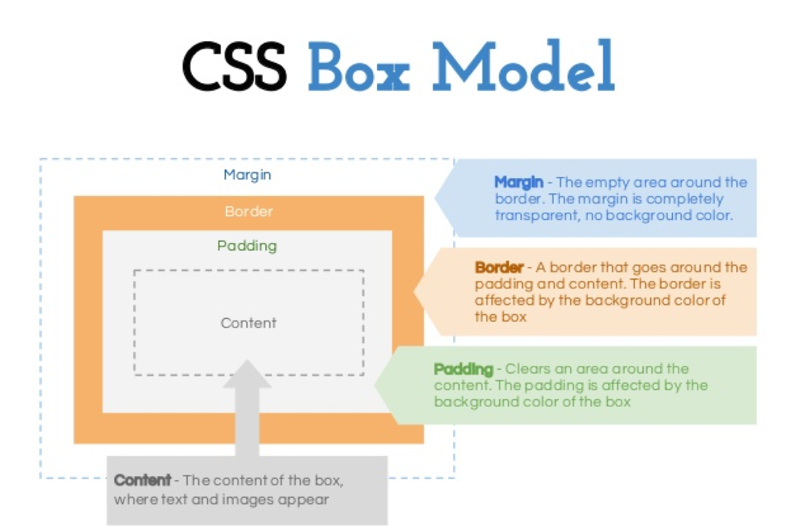
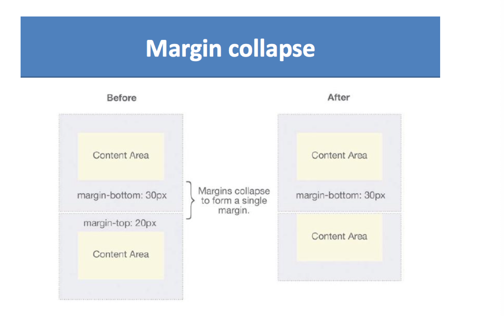

## CSS II   

### Box Model

- The CSS box model is essentially a box that wraps around every HTML element. 
  It consists of: margins, borders, padding, and the actual content. 

- Explanation of the different parts:
  - Content - The content of the box, where text and images appear
  - Padding - Clears an area around the content. The padding is transparent
  - Border - A border that goes around the padding and content
  - Margin - Clears an area outside the border. The margin is transparent

- Every element on a page is a rectangular box.

- There are actually two types of box model, one is W3C standard, the other is IE model. 
  Basically they all calculate the element width and height based on the content width, 
  content height, padding and border, but their formula are different:

- **1. W3C standard**
  - <U>outer box (element space size)</U>
  - Element space width = content width + padding + border + margin
  - Element space height = content height + padding + border + margin

  - <U>inner box (element size)</U>
  - Element width = content width + padding + border
  - Element height = content height + padding + border

- **2. IE box model**
  - <U>outer box (element space size)</U>
  - Element space width = content width + margin 
  - Element space height = content height + margin
  - (content width including padding and border)

- **3. Margin Collapsing**

