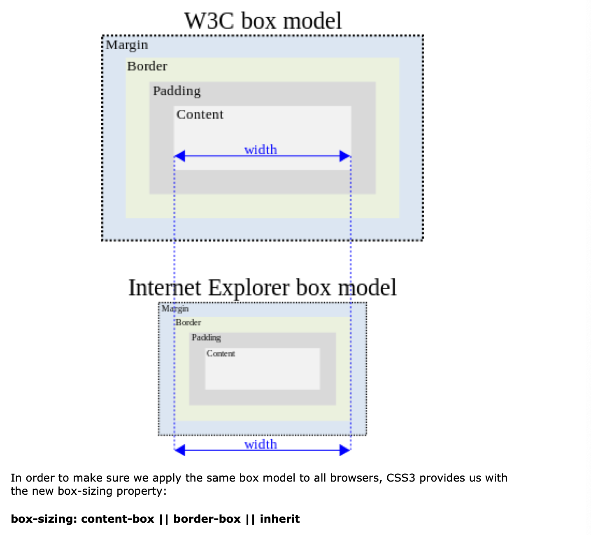
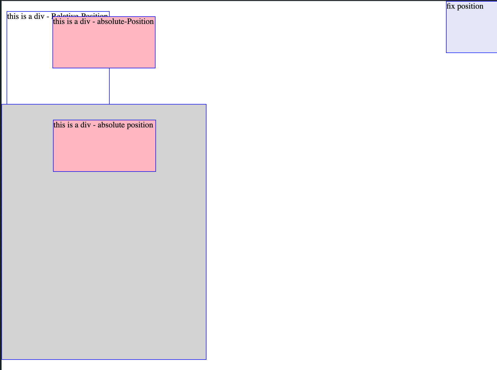

## CSS II   

### Box Model


- The CSS box model is essentially a box that wraps around every HTML element. 
  It consists of: margins, borders, padding, and the actual content. 

- Explanation of the different parts:
  - Content - The content of the box, where text and images appear
  - Padding - Clears an area around the content. The padding is transparent
  - Border - A border that goes around the padding and content
  - Margin - Clears an area outside the border. The margin is transparent

- Every element on a page is a rectangular box.

- There are actually two types of box model, one is W3C standard, the other is IE model. 
  Basically they all calculate the element width and height based on the content width, 
  content height, padding and border, but their formula are different:

- **1. W3C standard**
  - <U>outer box (element space size)</U>
  - Element space width = content width + padding + border + margin
  - Element space height = content height + padding + border + margin

  - <U>inner box (element size)</U>
  - Element width = content width + padding + border
  - Element height = content height + padding + border


- **2. IE box model**
  - <U>outer box (element space size)</U>
  - Element space width = content width + margin 
  - Element space height = content height + margin
  - (content width including padding and border)





- **3. Margin Collapsing**


- [Test Margin Collapse](https://css-tricks.com/what-you-should-know-about-collapsing-margins/)


---

## 2. Floating

- The float CSS property specifies that an element should be placed along the left or 
  right side of its container, allowing text and inline elements to wrap around it. 
  The element is removed from the normal flow of the web page, though still remaining 
  a part of the flow.

- **How floated elements are positioned：**
  - when an element is floated, it is taken out of the normal flow of the 
    document (though still remaining part of it). It is shifted to the left, 
    or right, until it touches the edge of its containing box, 
    or another floated element.


- **Syntax**
  - float: none|left|right|inherit;

  - The float property can have one of the following values:
    - left - The element floats to the left of its container
    - right- The element floats to the right of its container
    - none - The element does not float 
      (will be displayed just where it occurs in the text). This is default
    - inherit - The element inherits the float value of its parent
  
- **Important facts:**
  - 1.	float first
    - When a container has multiple elements, some of them are floating, some of them 
      are not, remember to put all the floating elements in front of the 
      non-floating ones! Browsers try to figure out the spacing for those 
      floating ones first.


- float: 分为 left float, right float
  - float 会 导致 父容器高度塌陷
    - block 元素 无法探知 float 元素的位置
      - 但是 inline | inline-block | float   是可以探知 float 的位置


- clear :
  - The clear property specifies on which sides of an element floating elements 
    are not allowed to float.
    - `.clear { clear: both; /* it can be left|right|both */ }`


- **inline-block**
  - Floating works great, but as you see we need to apply the `.clear` to clear out the 
    floating even for a block element. There is another way to achieve the floating 
    effect, that is to use inline-block display.
  - similar to inline, inline-block allows multiple elements to layout on the same line, 
    the beauty of it is that elements can automatically wrap around if the wrapper 
    container is too small, and if you add a block element right after an inline-block 
    element, we don’t need to use the ugly `.clear` fix.

- https://developer.mozilla.org/en-US/docs/Web/CSS/overflow


---

## 3. Position

- **static (default)**
  - Default value, means the element is not positioned! A static element is said to 
    be not positioned and an element with its position set to anything else is said to 
    be positioned.


- **relative**
  - The top, right, bottom and left properties of a relatively-positioned element will 
    cause it to be adjusted away from **its original position**. Other content will 
    not be adjusted to fit into any gap left by the element.


- **absolute**
  - The top, right, bottom and left properties of an absolute-positioned element will 
    cause it to be positioned relatively to **the nearest positioned ancestor**.


- **fixed**
  - A fixed element is positioned **relative to the viewport**, which means it always 
    stays in the same place even if the page is scrolled. 


- create `relative-position.html`


```html
<!DOCTYPE html>
<html lang="en">
<head>
    <meta charset="UTF-8">
    <meta name="viewport" content="width=device-width, initial-scale=1.0">
    <title>Relative-Position</title>
    <style>
        body,div{
            padding:0;
            margin:0;
        }
        div{
            border: 1px solid blue;
        }

        .rl{
            width: 200px;
            height: 200px;

            /* step 1 相对定位 */
            /* 设置了相对定位之后， 容器的css就可以设置left, right, top, bottom属性 */
            position: relative;
            /* 相对于元素原来的位置 */
            left: 10px;
            top: 20px;
        }

        /* step 2 绝对定位 */
        .ab{
            width: 200px;
            height: 100px;
            background-color: lightpink;

            /* step 2.1 */
            position: absolute;
            top: 30px;
            left: 100px;
        }

        /* tep 3 设置父容器定位 */
        .parent{
            width: 400px;
            height: 500px;
            background-color: lightgray;

            /* step 4 加上定位 */
            position: relative;
        }

        /* step 5 fix position */
        .f{
            position: fixed;
            top:0;
            right: 0;
            height: 100px;
            width: 100px;
            background-color: lavender;
        }
    </style>
</head>
<body>
    <!-- step 1 相对定位 -->
    <div class="rl">
        this is a div - Relative-Position
    </div>

    <!-- step 2 绝对定位 -->
    <div class="ab">
        this is a div - absolute-Position
    </div>

    <!-- step 3 设置父容器定位 comment掉上面的ab -->
    <div class="parent">
        <div class="ab">
            this is a div - absolute position
        </div>
    </div>

    <!-- step 5 fix position -->
    <div class="f">
        fix position
    </div>

</body>
</html>
```




- [example](http://jsbin.com/xepegoh/5/edit?html,css,output)


---


## Z-index

- The z-index property specifies the stack order of an element.

- An element with greater stack order is always in front of an element with a lower stack order.
  - Note: z-index only works on positioned elements (position:absolute, position:relative, 
    or position:fixed).

    


- create `z-index.html`

```html
<!DOCTYPE html>
<html lang="en">
<head>
    <meta charset="UTF-8">
    <meta name="viewport" content="width=device-width, initial-scale=1.0">
    <title>z-index</title>

    <style>
        .ab{
            position: absolute;
            height: 200px;
            width: 200px;
            border: 1px solid lightblue;
        }

        .d1{
            /* 中间层 */
            z-index: 100;
            left: 100px;
            top: 100px;
            background-color: ligthblue;
        }
        .d2{
            /* 最高层 */
            z-index: 200;
            background-color: lightpink;
        }
        .d3{
            /* 最底层 */
            z-index: 4;
            left: 20px;
            top: -30px;
            background-color: lightgreen;
        }
    </style>
</head>
<body>
    <div class="ab d1">中间层</div>
    <div class="ab d2">最高层</div>
    <div class="ab d3">最底层</div>
</body>
</html>
```


---

- [**4. Project HTML+CSS Part**](http://jsbin.com/rafomem/20/edit?html,css,output)


- 5 FlexBox
  - Flexbox is a one-dimensional layout method for laying out items in rows or columns. 
    Let’s take a look at the link below together.

- [Flexbox 延伸阅读](https://css-tricks.com/snippets/css/a-guide-to-flexbox/)


---

```html
<!DOCTYPE html>
<html>
<head>
  <meta charset="UTF-8">
  <meta name="description" content="Item Recommendation">
  <meta name="author" content="Your Name">
  <title>Item Recommendation Final</title>
  <link href='https://fonts.googleapis.com/css?family=Open+Sans:400,300,700' rel='stylesheet' type='text/css'>
  <link rel="stylesheet" href="https://maxcdn.bootstrapcdn.com/font-awesome/4.5.0/css/font-awesome.min.css">
  <link rel="stylesheet" href="styles/main.css">
  <link rel="stylesheet" href="project-new.css">
</head>
<body>
  <header class="top-header">
    <nav class="top-nav">
      <a href="#">Home</a>
      <a href="#">Contact</a>
      <a href="#">About</a>
    </nav>
    <span id="welcome-msg"></span>
    <i id="avatar" class="avatar fa fa-user fa-2x"></i>
  </header>
  
  <div class="container">
    <header>
      <p>
        <span>Item</span>
        <br /> Recommendation
      </p>
    </header>

    <section class="main-section">
      <aside id="item-nav">
        <div class="nav-icon">
          <i class="fa fa-sitemap fa-2x"></i>
        </div>
        <nav class="main-nav">
          <a href="#" id="nearby-btn" class="main-nav-btn active">
            <i class="fa fa-map-marker"></i> Nearby
          </a>
          <a href="#" id="fav-btn" class="main-nav-btn">
            <i class="fa fa-heart"></i> My Favorites
          </a>
          <a href="#" id="recommend-btn" class="main-nav-btn">
            <i class="fa fa-thumbs-up"></i> Recommendation
          </a>
        </nav>
      </aside>

      <ul id="item-list">
        <li class="item">
          
          <div>
            <a class="item-name" href="#">Item</a>
            <p class="item-category">Vegetarian</p>
            <div class="stars">
              <i class="fa fa-star"></i>
              <i class="fa fa-star"></i>
              <i class="fa fa-star"></i>
            </div>
          </div>
          <p class="item-address">699 Calderon Ave<br/>Mountain View<br/> CA</p>
          <div class="fav-link">
            <i class="fa fa-heart"></i>
          </div>
        </li>
      </ul>
    </section>
  </div>
  
  <footer>
    <p class="title">What We Do</p>
    <p>"Help you find the best place around."</p>
    <ul>
      <li>
        <p><i class="fa fa-map-o fa-2x"></i></p>
        <p>San Jose, CA</p>
      </li>
      <li>
        <p><i class="fa fa-envelope-o fa-2x"></i></p>
        <p>info@gmail.com</p>
      </li>
      <li>
        <p><i class="fa fa-phone fa-2x"></i></p>
        <p>+1 800 123 8888</p>
      </li>
    </ul>
  </footer>
  
  <script src="https://rawgit.com/emn178/js-md5/master/build/md5.min.js"></script>
  <script src="scripts/main.js"></script>
</body>
</html>
```


- create `.css`


```css
* {
    box-sizing: border-box;
    margin: 0;
    padding: 0;
  }
  
  body {
    background: #434343;
    color: white;
    font-family: 'Open Sans', sans-serif;
    font-weight: 300;
    font-size: 0.9em;
  }
  
  ul {
    list-style: none;
  }
  
  .top-header {
    width: 100%;
    height: 60px;
    background: #DF574B;
    display: flex;
    align-items: center;
    position: fixed;
    z-index: 1;
    box-shadow: 0px 2px 10px #333;
  }
  
  .avatar {
    background-color: white;
    color: #333;
    border-radius: 50%;
    height: 40px;
    margin-left: 20px;
    padding-left: 9px;
    padding-top:5px;
    width: 40px;
  }
  
  .top-nav a {
    margin-left: 20px;
    color: #F9F9F9;
    text-decoration: none;
    font-weight: 400;
  }
  
  .container > header {
    height: 250px;
    background: url('http://prophoto.com.cy/wp-content/galleries/food/food-restaurant-photographer-cyprus-10.jpg') no-repeat 50% 50%;  
    display: flex;
    align-items: center;
    background-size: 100%;
  }
  
  .container > header p {
    font-weight: 400;
    font-size: 2em;
    margin-left: 220px;
    border-left: 1px solid white;
    padding-left: 5px;
  }
  
  .container > header span {
    color: #FBAF41;
  }
  
  
  .main-section {
    background: #F3BB43;
    //height: 500px; // to be changed
  }
  
  .main-section aside {
    float: left;
    width: 180px;
  }
  
  .nav-icon {
    color: #624630;
    padding: 20px;
    text-align: center;
  }
  
  .main-nav-btn {
    background: none;
    color: white;
    display: block;
    text-decoration: none;
    padding: 20px;
    border-top: 1px solid white;
    text-align: left;
  }
  
  .main-nav-btn:hover {
    background: rgba(255, 255, 255, 0.8);
    color: #624630;
  }
  
  .main-nav-btn.active {
    background: #F2EBD9;
    color: #624630;
  }
  
  .main-nav-btn i{
    width: 20px;
  }
  
  
  .restaurant-list {
    list-style:  none;
    margin-left: 180px;
    min-height:  250px;
    padding:     10px;
    background:  #F2EBD9;
  }
  
  .restaurant {
    display: flex;
    align-items: center;
    color: #624630;
    border-bottom: 1px solid white;
    margin: 10px;
    padding: 15px;
  }
  
  .restaurant:hover {
    background: rgba(255, 255, 255, 0.8);
  }
  
  .restaurant:last-child {
    border: none;
  }
  
  .restaurant img {
    border: 1px solid #FFFFFF;
    height: 80px;
    width:  80px;
  }
  
  .restaurant div:first-of-type {
    flex: 1;
    margin-left:  10px;
    margin-right: 10px;
  }
  
  .restaurant-name {
    color: #624630;
    font-weight:     400;
    text-decoration: none;
  }
  
  .restaurant-name:hover {
    text-decoration: underline;
  }
  
  .restaurant-address {
    line-height: 20px;
    padding-right: 20px;
    text-align: right;
  }
  
  .stars {
    padding-top: 10px;
  }
  
  footer {
    background: #434343;
    font-size:  0.8em;
    height:     200px;
    position:   relative;
  }
  
  footer p {
    text-align: center;
  }
  
  footer p.title {
    font-size: 1.2em;
    padding:   15px;
  }
  
  footer ul {
    display: flex;
    align-items: center;
    padding: 20px;
  }
  
  footer ul li {
     flex: 1;
  }
  
```


