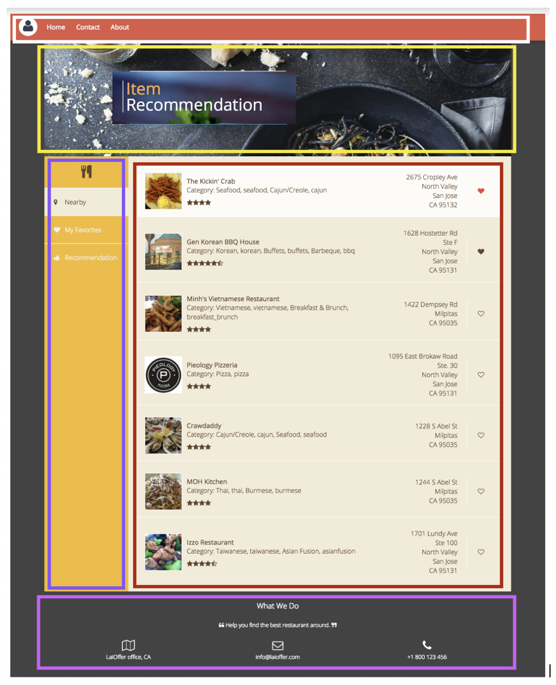
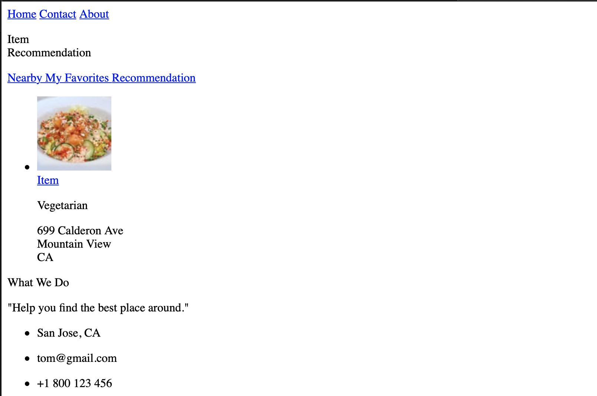

## Lesson 2 HTML

- What is HTML?
  - Hypertext Markup Language (中文:超文本标记语言)

- What is HTML structure?
  - 最简单的HTML


```html
<!DOCTYPE html> 
<html>
    <head></head>
    <body></body> 
</html>
```

---


## HTML Tags

- <head> 标签： 
  - provides general information (metadata) about the document,including its title 
    and links to its scripts and style sheets.

- <body> 标签：
  - 标题标签 <h1> - <h6>， **独占一行** 
  - 段落标签 <p>, **独占一行**
  - 换行标签 <br>
  - 文本节标签 span

- <ul>标签 - 无序列表标签
  - represents an unordered list of items
  - typically rendered as a bulleted list
  - uses with <li>

- <ol>标签 - 有序 列表标签
  - represents an ordered list of items
  - An ordered list can be numerical or alphabetical.
  - uses with <li>

- <a>标签 - 超级链接标签
  - creates a hyperlink to other web pages, files, locations within the same page, 
    email addresses, or any other URL.
  - <a href="https://www.google.com">Google</a>
  - href attribute: contains a URL or a URL fragment that the hyperlink points to.
  - #: link to an element with a specified id within the page (like href="#top")
  - target attribute: _blank vs. _self

---

## Block Elements vs Inline Elements

- <div>标签
  - the generic container for flow content and does not inherently represent anything.
  - use it to group elements for purposes.
  
- recall<span>标签
  - a generic inline container for phrasing content. 
    (a标签是inline, 就是并排在一行)
  - does not inherently represent anything.
  - use it to group elements for purposes.

- <div> vs. <span>

---

## HTML Semantic Tags

- A semantic element clearly describes its meaning to both the browser and the developer
  - examples of **non-semantic** elements: <div> and <span> - tells nothing about its content
  - examples of **semantic** elements: <form>, <table>, and <article> - clearly defines 
    its content.


- Semantic elements
  - <header> 页眉:
    represents a container for introductory content or a set of navigational links.
  - <section> 区块: 
    represents a standalone section of functionality contained within an HTML document, typically with a heading, 
    which doesn't have a more specific semantic element to represent it.
  - <aside> 侧边栏: 
    represents a section of a document with content connected tangentially to 
    the main content of the document (often presented as a sidebar).
  - <nav> 导航: 
    represents a section of a page whose purpose is to provide navigation links, 
    either within the current document or to other documents. 
    Common examples of navigation sections are menus, tables of contents, and indexes.
  - <footer> 页脚: 
    defines a footer for a document or section which contain information about 
    its containing element.

---



### 现在开始动手来写一下这个网页结构

```html
<!DOCTYPE html>
<html>
<head>
  <meta charset="UTF-8">
  <meta name="description" content="Item Recommendation">
  <meta name="author" content="Your Name">
  <title>Item Recommendation Final</title>
</head>
<body>
  <header class="top-header">
    <nav class="top-nav">
      <a href="#">Home</a>
      <a href="#">Contact</a>
      <a href="#">About</a>
    </nav>
  </header>
  
  <div class="container">
    <header>
      <p>
        <span>Item</span>
        <br /> Recommendation
      </p>
    </header>

    <section class="main-section">

      <aside id="item-nav">
        <div class="nav-icon">
          <i class="fa fa-sitemap fa-2x"></i>
        </div>
        <nav class="main-nav">
          <a href="#" id="nearby-btn" class="main-nav-btn active">
            <i class="fa fa-map-marker"></i> Nearby
          </a>
          <a href="#" id="fav-btn" class="main-nav-btn">
            <i class="fa fa-heart"></i> My Favorites
          </a>
          <a href="#" id="recommend-btn" class="main-nav-btn">
            <i class="fa fa-thumbs-up"></i> Recommendation
          </a>
        </nav>
      </aside>

      <ul id="item-list">
        <li class="item">
          
          <div>
            <a class="item-name" href="#">Item</a>
            <p class="item-category">Vegetarian</p>
            <div class="stars">
              <i class="fa fa-star"></i>
              <i class="fa fa-star"></i>
              <i class="fa fa-star"></i>
            </div>
          </div>
          <p class="item-address">699 Calderon Ave<br/>Mountain View<br/> CA</p>
          <div class="fav-link">
            <i class="fa fa-heart"></i>
          </div>
        </li>
      </ul>
    </section>
  </div>
  
  <footer>
    <p class="title">What We Do</p>
    <p>"Help you find the best place around."</p>
    <ul>
      <li>
        <p><i class="fa fa-map-o fa-2x"></i></p>
        <p>San Jose, CA</p>
      </li>
      <li>
        <p><i class="fa fa-envelope-o fa-2x"></i></p>
        <p>tom@gmail.com</p>
      </li>
      <li>
        <p><i class="fa fa-phone fa-2x"></i></p>
        <p>+1 800 123 456</p>
      </li>
    </ul>
  </footer>
</body>
</html>
```

---

- <aside> 语义标签
- <section> 也可以用 <div> 来代替，只不过<section> 是有语义的，这样更好
- 具体效果如下:

