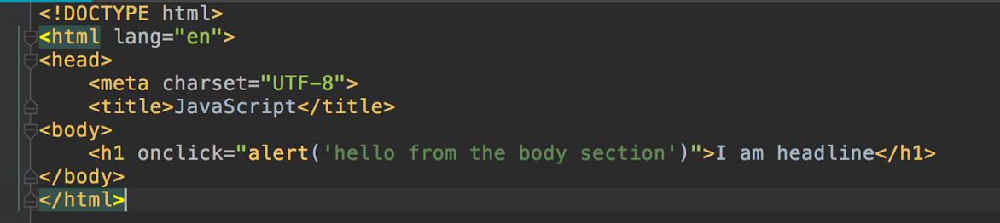
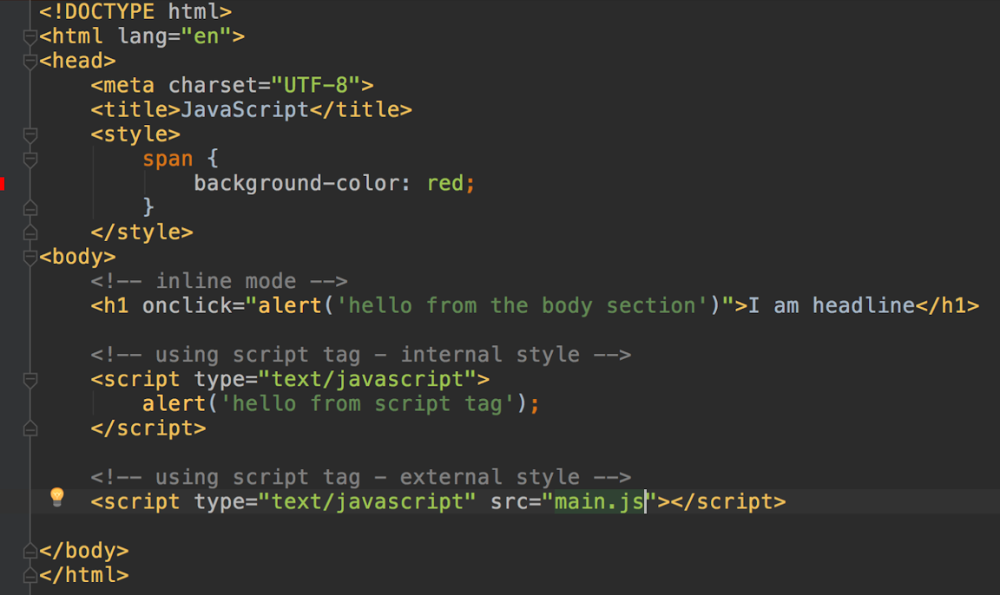
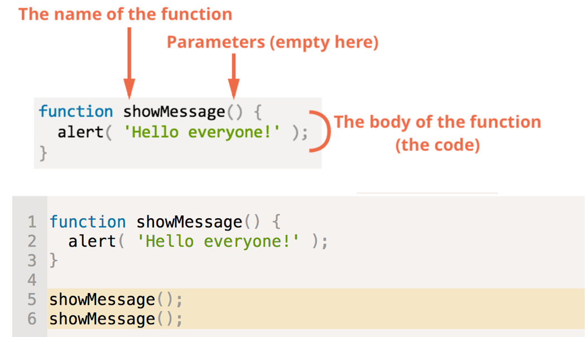
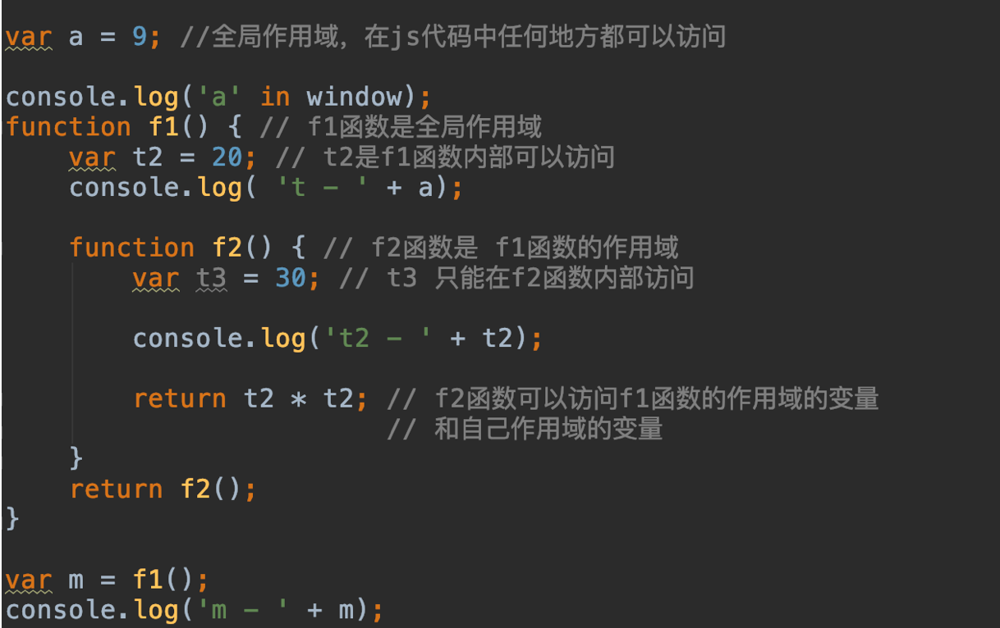
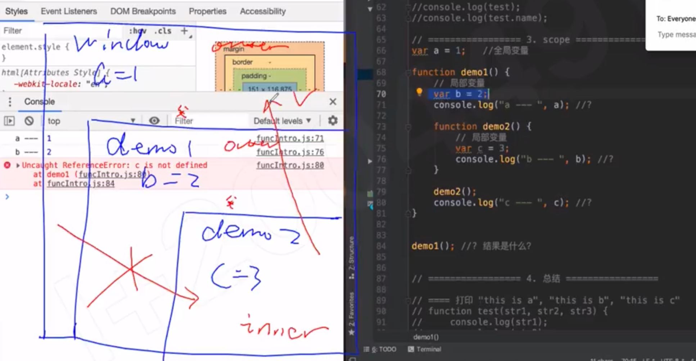

## JavaScript


- 1.Linking JavaScript file and html file
- 2.JavaScript Fundamentals
  - 2.1 Variables
  - 2.2 Data Types
  - 2.4 Functions
  - 2.5 Hoisting
  - 2.6 Closure

---


### 1.Linking JavaScript file and html file

- 1.1 Adding JavaScript into an HTML Document
  - You can add JavaScript code in an HTML document by employing the dedicated HTML tag 
    `script` that wraps around JavaScript code.
    Method 1: inline mode



- 这种模式不推荐

---


- Method 2: using `script ` tag
  - 2.1 internal style
  - 2.2 external style (推荐)



---


### 2. JavaScript Fundamentals

- 2.1. Variables
  - 1. three ways of variable declaration: `let`, `var` and `const`.
    We use those three keywords to create variables in JavaScript.
    e.g. `let message;` or `var message;` or `const message;`

- Note:
  - 1. `var` variables are defined from the beginning of the function, no matter where 
    the definition is.（`var is function scope`）
  - 2.	`var` is function scope, so it has no `block scope`, but `let` and `const` are block scope.
  - 3. `var` can be declared many times, but `let` and `const` cannot in the same scope.


- 2.2 Data Types
  - JavaScript is “dynamically typed”, meaning that there are data types, but variables are not bound to 
    any of them. In JavaScript there are two types of data: `primitive` and `reference value`.

```js
//no error
let message = "hello";
message = 123456;
```

- Data types: Number, String, Boolean, Object, Function, `Null, Undefined`

```js
var = length = 16; //number
var lastName = 'Johnson';  //string
var lastName = "Johnson";  //string
var p = {firstName: 'John', lastName:'Doe'}; //object
var isGood = true; //booelan
var isPlenty = true; //booelan
var isGoodAndPlenty = true; //booelan
var arr = [1, 2, 3]; //array
var arr1 = [1, 2, 3, 'John', 'richard', 'bob']; //array

//function
function say(){
  return 'I am a function';
}
//function expression
var say = function(){
  return 'I am a function';
}

var u;
typeof u //undefined
```

---

#### Null & Undefined

- **null** is a special value meaning "no value". On the other hand, **undefined** means that the variable 
  has not been declared, or has not been given a value.


- object
  - Objects are used to store keyed collections of various data and more complex entities.


- Function
  - Functions are the main “building blocks” of the program. They allow the code to be called 
    many times without repetition.


- Function Declaration


```js
function showMessage(){
  alert('Hello everyone!');
}
```

- The function keyword goes first, then goes the name of the function, then a list of parameters between 
  the parentheses (empty in the example above) and finally the code of the function, also named 
  “the function body”, between curly braces.

  


- Function Expression

```js
let sayHi = function(){
  alert("Hello");
};
```

- Primitive Type VS. Reference Type
  - 1. Numbers, Strings, Booleans, and the null and undefined types are primitive. 
  - 2. Objects, and functions are reference types.


### 2.3 Scope






- 这张图， 越往inner的函数，越可以访问 outter 函数， inner 可以访问 outter, 但是不可以相反

---


### 2.4 Hoisting (面试必考)

```js
//example 1 - 结果?
test();
function test(){
    console.log("test1");
}
//test1


//example 2 - 结果 ？
//what about var c;
console.log(c); // c = ?
var c = 10; //waht about var c;
//undefined


//结论：
//1. 函数声明整体提升了 - 可以调用函数
//2. 变量声明提升了， 但是赋值没有提升
```

- **Hoisting**
  - Hoisting is a JavaScript mechanism where variables and function declarations 
    are moved to the top of their scope before code execution.

- 总结： 说白了就是 我可以函数先执行，再定义； 但是变量不行, 这么做的话拿不到变量值

---


