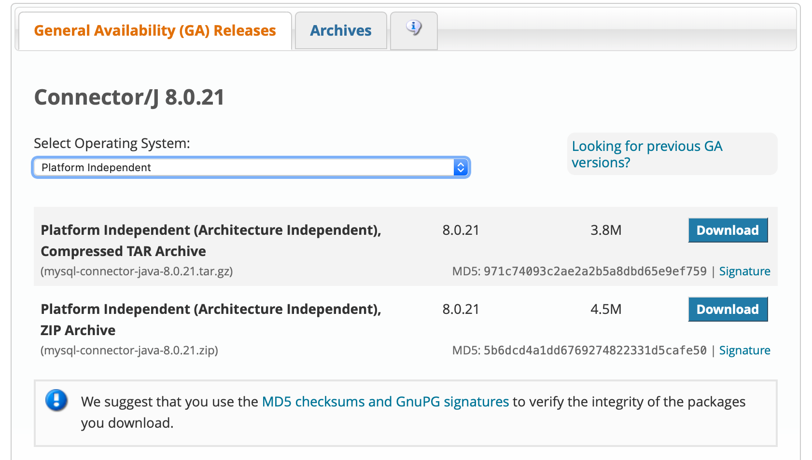
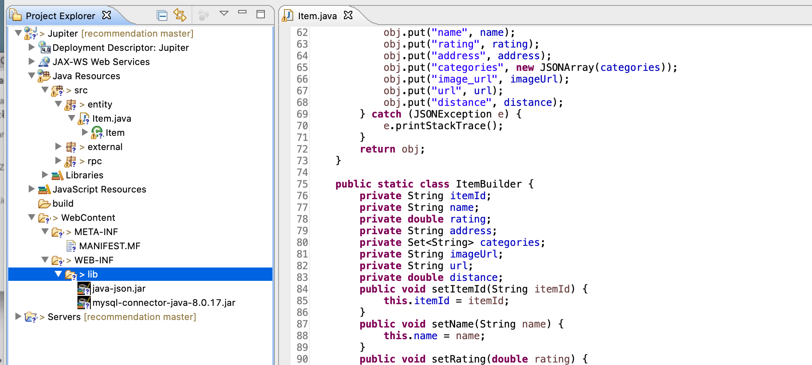
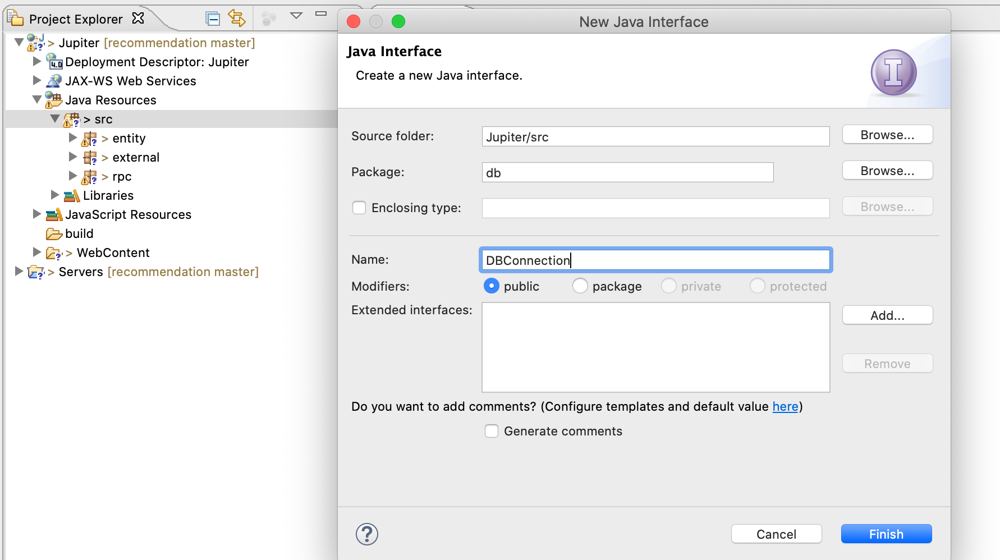
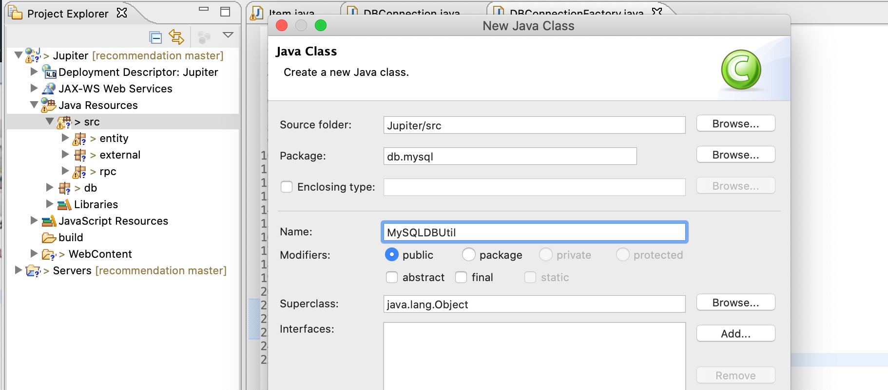

## MySQL I

### Recall Database and Database-Management System

- What is Database?
  - A database is an organized collection of data. 

- What is Database-Management System?
  - A database-management system (DBMS) is a computer-software application that interacts 
    with end-users, other applications, and the database itself to capture and 
    analyze data. A general-purpose DBMS allows the definition, creation, querying, 
    update, and administration of databases. 


- Why do we need Database?
- We need to store some data set, a list of events with id, name, address, and date. 
  What will you do? Text File? Excel?
  - 1. The size of list is large( > 1 million users).
  - 2. Add some constraints to some data, such as ID of each user should be different.
  - 3. Create relations between different kind of data, such as users saved some events   
    before.
  - 4. Quickly retrieve data based on given condition, such as retrieve all events 
    happened in San Francisco.
  - 5. Quickly update or delete data based on given condition, such as update all favorite 
    events for a given user.
  - 6. Need access control on the data, meaning only authorized users can have access to 
    the data set.
  - 7.	Allow multiple users access(add, search, update, delete) the data set 
    at the same time.

- A DBMS allows you to fulfill all requirement above easily.


### Create our database by using MAMP

- I have installed `XAMPP`, 这里我就不再介绍 MAMP


### MySQL

- An open source DBMS. Widely used.


#### Basic Concepts

- **Table**: a collection of attributions. Similar to what you’ve seen in an excel chart. 
  Each column is an attribute of an entity, and each row is a record/instance of an entity.
- **Row**: a single, implicitly structured data item in a table
- **Column**: a set of data values of a particular simple type, 
  one for each row of the table
- **Schema**: blueprint of how table is constructed.


### Our tables in our MySQL

- **Entities**, which are represented by rectangles. An entity is an object or concept 
  about which you want to store information.
- **Actions**, which are represented by diamond shapes, show how two entities share 
  information in the database.
- **Attributes**, which are represented by ovals. A key attribute is the unique, 
  distinguishing characteristic of the entity. For example, an employee's social security 
  number might be the employee's key attribute.


- users - store user information.

| User_id | password | first_name | last_name |
| --- | --- | --- | --- |
| 1111 | abcd | Tom | Zheng |     
| 2222 | efgh | Jack | Chen | 


---


- items - store item information


Item_id | name | ... | rating | url
------- | -------- | ------- | -------- | -------- 
abcd | macbook Pro | ... | 5 | www.apple.com     
efgh | ipad Pro | ... | 0 | www.apple.com  


- category - store item-category relationship
  - It’s an implementation detail, we could save category in item table, 
    but there will be more string join/split manipulations in our code, 
    so let’s save them in a separate table.

item_id | category
--- | ---
abcd | party
efgh | party
efgh | sports


- **Primary key** = item_id + category 
- **Foreign key** = item_id => items(item_id)

---


- history - store user favorite history


user_id | item_id | time
--- | --- | ---
1111 | abcd | 01/01/2019
1111 | efgh | 01/02/2019
2222 | efgh | 01/03/2019


- **Primary key** = item_id + user_id
- **Foreign key** = user_id => users(user_id)
- **Foreign key** = item_id => items(item_id) 

---

- 我们在写一个 query 的时候我们并不知道返回哪一个 `row`, 因为 item_id 有 duplicate = `efgh`
  我们希望只返回一行, 


### A few more concept:

- **Primary key**: Also a key that is unique for each record. Cannot be NULL and 
  used as a unique identifier.
- **Foreign key**: a key used to link two tables together. A `FOREIGN KEY` is a field 
  (or collection of fields) in one table that refers to the PRIMARY KEY in another table.
 


### SQL

- Structured Query Language is a programming language, which is used to communicate 
  with DBMS. The standard language for relational DBMS.

- Create tables in Java program

- Step 1, Connect to database from our Java program by JDBC

- Just like our Java servlet classes. JDBC provides interfaces and classes for writing 
  database operations. Technically speaking, JDBC (Java Database Connectivity) 
  is a standard API that defines how Java programs access database management systems. 
  Since JDBC is a standard specification, one Java program that uses the JDBC API
  can connect to any database management system (DBMS), 
  as long as a driver exists for that particular DBMS.

- Step 1.1, download JDBC archive from `http://dev.mysql.com/downloads/connector/j/`, 
  then unzip it and you will see a `mysql-connector-java-8.0.14.jar` file.


- 选第一个下载  

- Step 1.2, add the `.jar` file into your Eclipse lib. You can drag `.jar` file to 
  `WebContent/WEB-INF/lib` directly, or copy that file and paste it (if it does not exist). 




- For DB related functions, please always use: `import java.sql.xxx`;

- **Step 2: Create our db related package**

- Step 2.1 create a new package named db, then add a new interface called DBConnection. 



- Step 2.2, add the following code into DBConnection, we’ll implement them one by one 
  in both MySQL and MongoDB later.

- now we define some `DBConnection`'s methods

```java
import java.util.List;
import java.util.Set;

import entity.Item;

public interface DBConnection {
	/**
	 * Close the connection.
	 */
	public void close();

	/**
	 * Insert the favorite items for a user.
	 * 
	 * @param userId
	 * @param itemIds
	 */
	public void setFavoriteItems(String userId, List<String> itemIds);

	/**
	 * Delete the favorite items for a user.
	 * 
	 * @param userId
	 * @param itemIds
	 */
	public void unsetFavoriteItems(String userId, List<String> itemIds);

	/**
	 * Get the favorite item id for a user.
	 * 
	 * @param userId
	 * @return itemIds
	 */
	public Set<String> getFavoriteItemIds(String userId);

	/**
	 * Get the favorite items for a user.
	 * 
	 * @param userId
	 * @return items
	 */
	public Set<Item> getFavoriteItems(String userId);

	/**
	 * Gets categories based on item id
	 * 
	 * @param itemId
	 * @return set of categories
	 */
	public Set<String> getCategories(String itemId);

	/**
	 * Search items near a geolocation and a term (optional).
	 * 
	 * @param userId
	 * @param lat
	 * @param lon
	 * @param term
	 *            (Nullable)
	 * @return list of items
	 */
	public List<Item> searchItems(double lat, double lon, String term);

	/**
	 * Save item into db.
	 * 
	 * @param item
	 */
	public void saveItem(Item item);

	/**
	 * Get full name of a user. (This is not needed for main course, just for demo
	 * and extension).
	 * 
	 * @param userId
	 * @return full name of the user
	 */
	public String getFullname(String userId);

	/**
	 * Return whether the credential is correct. (This is not needed for main
	 * course, just for demo and extension)
	 * 
	 * @param userId
	 * @param password
	 * @return boolean
	 */
	public boolean verifyLogin(String userId, String password);
}

```

---

- Step 2.3, create another class called DBConnectionFactory, we’ll use it to create 
  different db instances.


```java
package db;

public class DBConnectionFactory {
	// This should change based on the pipeline.
	private static final String DEFAULT_DB = "mysql";
	
	public static DBConnection getConnection(String db) {
		switch (db) {
		case "mysql":
			// return new MySQLConnection();
			return null;
		case "mongodb":
			// return new MongoDBConnection();
			return null;
		default:
			throw new IllegalArgumentException("Invalid db:" + db);
		}

	}

	public static DBConnection getConnection() {
		return getConnection(DEFAULT_DB);
	}
}
```

---

- **Step 3, create MySQL version of DBConnection implementation**

- Step 3.1, create another package db.mysql, which will only contains mysql version of
  DBConnection implementation. Then create MySQLDBUtil class in db.mysql package.



