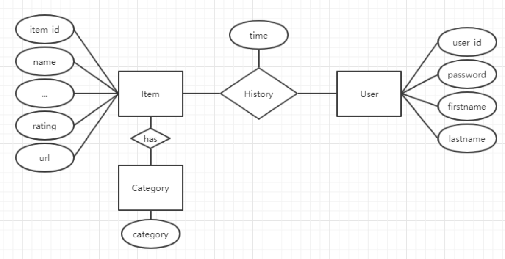

## MySQL I

### Recall Database and Database-Management System

- What is Database?
  - A database is an organized collection of data. 

- What is Database-Management System?
  - A database-management system (DBMS) is a computer-software application that interacts 
    with end-users, other applications, and the database itself to capture and 
    analyze data. A general-purpose DBMS allows the definition, creation, querying, 
    update, and administration of databases. 

- Why do we need Database?
- We need to store some data set, a list of events with id, name, address, and date. 
  What will you do? Text File? Excel?
  - 1. The size of list is large( > 1 million users).
  - 2. Add some constraints to some data, such as ID of each user should be different.
  - 3. Create relations between different kind of data, such as users saved some events   
    before.
  - 4. Quickly retrieve data based on given condition, such as retrieve all events 
    happened in San Francisco.
  - 5. Quickly update or delete data based on given condition, such as update all favorite 
    events for a given user.
  - 6. Need access control on the data, meaning only authorized users can have access to 
    the data set.
  - 7.	Allow multiple users access(add, search, update, delete) the data set 
    at the same time.

- A DBMS allows you to fulfill all requirement above easily.

### Create our database by using MAMP

- I have installed `XAMPP`, 这里我就不再介绍 MAMP

### MySQL

- An open source DBMS. Widely used.

#### Basic Concepts

- **Table**: a collection of attributions. Similar to what you’ve seen in an excel chart. 
  Each column is an attribute of an entity, and each row is a record/instance of an entity.
- **Row**: a single, implicitly structured data item in a table
- **Column**: a set of data values of a particular simple type, 
  one for each row of the table
- **Schema**: blueprint of how table is constructed.

### Our tables in our MySQL

- **Entities**, which are represented by rectangles. An entity is an object or concept 
  about which you want to store information.
- **Actions**, which are represented by diamond shapes, show how two entities share 
  information in the database.
- **Attributes**, which are represented by ovals. A key attribute is the unique, 
  distinguishing characteristic of the entity. For example, an employee's social security 
  number might be the employee's key attribute.

- users - store user information.

User_id | password | first_name | last_name
------- | -------- | ------- | -------- 
1111 | abcd | Tom | Zheng     
2222 | efgh | Jack | Chen  

---

- items - store item information

Item_id | name | ... | rating | url
------- | -------- | ------- | -------- | -------- 
abcd | macbook Pro |  | 5 | www.apple.com     
efgh | ipad Pro |  | 0 | www.apple.com  

- category - store item-category relationship
  - It’s an implementation detail, we could save category in item table, 
    but there will be more string join/split manipulations in our code, 
    so let’s save them in a separate table.

### A few more concept:

- **Primary key**: Also a key that is unique for each record. Cannot be NULL and 
  used as a unique identifier.
- **Foreign key**: a key used to link two tables together. A `FOREIGN KEY` is a field 
  (or collection of fields) in one table that refers to the PRIMARY KEY in another table.
 

### SQL

- Structured Query Language is a programming language, which is used to communicate 
  with DBMS. The standard language for relational DBMS.

- Create tables in Java program

- Step 1, Connect to database from our Java program by JDBC

- Just like our Java servlet classes. JDBC provides interfaces and classes for writing 
  database operations. Technically speaking, JDBC (Java Database Connectivity) 
  is a standard API that defines how Java programs access database management systems. 
  Since JDBC is a standard specification, one Java program that uses the JDBC API
  can connect to any database management system (DBMS), 
  as long as a driver exists for that particular DBMS.

- Step 1.1, download JDBC archive from `http://dev.mysql.com/downloads/connector/j/`, 
  then unzip it and you will see a `mysql-connector-java-8.0.14.jar` file.

- Step 1.2, add the `.jar` file into your Eclipse lib. You can drag `.jar` file to 
  `WebContent/WEB-INF/lib` directly, or copy that file and paste it (if it does not exist). 

