## MySQL II


- **Step 1, save search results to database**
- Step 1.1, Under db.mysql package, create class MySQLConnection.java.


- Step 1.2, implement DBConnection interface:

```java
public class MySQLConnection implements DBConnection {

	@Override
	public void close() {
		// TODO Auto-generated method stub

	}

	@Override
	public void setFavoriteItems(String userId, List<String> itemIds) {
		// TODO Auto-generated method stub

	}

	@Override
	public void unsetFavoriteItems(String userId, List<String> itemIds) {
		// TODO Auto-generated method stub

	}

	@Override
	public Set<String> getFavoriteItemIds(String userId) {
		// TODO Auto-generated method stub
		return null;
	}

	@Override
	public Set<Item> getFavoriteItems(String userId) {
		// TODO Auto-generated method stub
		return null;
	}

	@Override
	public Set<String> getCategories(String itemId) {
		// TODO Auto-generated method stub
		return null;
	}

	@Override
	public List<Item> searchItems(double lat, double lon, String term) {
		// TODO Auto-generated method stub
		return null;
	}

	@Override
	public void saveItem(Item item) {
		// TODO Auto-generated method stub

	}

	@Override
	public String getFullname(String userId) {
		// TODO Auto-generated method stub
		return null;
	}

	@Override
	public boolean verifyLogin(String userId, String password) {
		// TODO Auto-generated method stub
		return false;
	}

}
```


- Step 1.3, implement both close method and constructor. 
  **Again, careful with the import suggestions. Always choose java.sql.*.**


```java
public class MySQLConnection implements DBConnection {

	private Connection conn;

	public MySQLConnection() {
		try {
			Class.forName("com.mysql.cj.jdbc.Driver").getConstructor().newInstance();
			conn = DriverManager.getConnection(MySQLDBUtil.URL);
		} catch (Exception e) {
			// TODO Auto-generated catch block
			e.printStackTrace();
		}
	}

	@Override
	public void close() {
		if (conn != null) {
			try {
				conn.close();
			} catch (Exception e) {
				e.printStackTrace();
			}
		}
	}
```


- Step 1.4: implement `searchItems()` in `MySQLConnection`. Previously we call 
  TicketMasterClient.search from our SearchItem servlet directly. But actually our 
  recommendation code also needs to call the same search function, so we make a designated 
  function here to do the search call.
  The code is simply copied from what we’ve already had in SearchItem.java.


```java
	@Override
	public List<Item> searchItems(double lat, double lon, String term) {
		TicketMasterClient ticketMasterClient = new TicketMasterClient();
		List<Item> items = ticketMasterClient.search(lat, lon, term);
		for(Item item : items) {
			saveItem(item);
		}
		return items;
	}
```

- Step 1.5, after searchItem, let’s try `saveItem` to save data into database. 
  **Again, careful with the import suggestions. Always choose java.sql.*.**


```java
	@Override
	public void saveItem(Item item) {
		if (conn == null) {
			System.out.println("DB connection failed");
			return;
		}
		try {
			String sql = "INSERT IGNORE INTO items VALUES (?, ?, ?, ?, ?, ?, ?)";
			PreparedStatement ps = conn.prepareStatement(sql);
			ps.setString(1, item.getItemId());
			ps.setString(2, item.getName());
			ps.setDouble(3, item.getRating());
			ps.setString(4, item.getAddress());
			ps.setString(5, item.getImageUrl());
			ps.setString(6, item.getUrl());
			ps.setDouble(7, item.getDistance());
			ps.execute();

			sql = "INSERT IGNORE INTO categories VALUES(?, ?)";
			ps = conn.prepareStatement(sql);
			ps.setString(1, item.getItemId());
			for (String category : item.getCategories()) {
				ps.setString(2, category);
				ps.execute();
			}

		} catch (Exception e) {
			// TODO: handle exception
			e.printStackTrace();
		}

	}
```

- Step 1.6: update DBConnectionFactory.

```java
package db;

import db.mysql.MySQLConnection;

public class DBConnectionFactory {
	// This should change based on the pipeline.
	private static final String DEFAULT_DB = "mysql";
	
	public static DBConnection getConnection(String db) {
		switch (db) {
		case "mysql":
			return new MySQLConnection();
		case "mongodb":
			// return new MongoDBConnection();
			return null;
		default:
			throw new IllegalArgumentException("Invalid db:" + db);
		}

	}

	public static DBConnection getConnection() {
		return getConnection(DEFAULT_DB);
	}
}
```

- Step 1.7, In src/rpc/SearchItem.java, update `doGet()`.


```java
package rpc;

import java.io.IOException;
import java.io.PrintWriter;
import java.util.List;

import javax.servlet.ServletException;
import javax.servlet.annotation.WebServlet;
import javax.servlet.http.HttpServlet;
import javax.servlet.http.HttpServletRequest;
import javax.servlet.http.HttpServletResponse;

import org.json.JSONArray;
import org.json.JSONException;
import org.json.JSONObject;

import db.DBConnection;
import db.DBConnectionFactory;
import external.TicketMasterClient;
import entity.Item;

/**
 * Servlet implementation class SearchItem
 */
@WebServlet("/search")
public class SearchItem extends HttpServlet {
	private static final long serialVersionUID = 1L;

	/**
	 * @see HttpServlet#HttpServlet()
	 */
	public SearchItem() {
		super();
	}

	/**
	 * @see HttpServlet#doGet(HttpServletRequest request, HttpServletResponse
	 *      response)
	 */
	protected void doGet(HttpServletRequest request, HttpServletResponse response)
			throws ServletException, IOException {

		double lat = Double.parseDouble(request.getParameter("lat"));
		double lon = Double.parseDouble(request.getParameter("lon"));
		// Term can be empty or null.
		String term = request.getParameter("term");
		DBConnection connection = DBConnectionFactory.getConnection();
		try {
			List<Item> items = connection.searchItems(lat, lon, term);

			JSONArray array = new JSONArray();
			for (Item item : items) {
				array.put(item.toJSONObject());
			}
			RpcHelper.writeJsonArray(response, array);

		} catch (Exception e) {
			e.printStackTrace();
		} finally {
			connection.close();
		}

	}

	/**
	 * @see HttpServlet#doPost(HttpServletRequest request, HttpServletResponse
	 *      response)
	 */
	protected void doPost(HttpServletRequest request, HttpServletResponse response)
			throws ServletException, IOException {
		// TODO Auto-generated method stub
		doGet(request, response);
	}

}
```


- Step 1.8, verify search service from browser or postman. Make sure you’ve saved all 
  changes. Restart Tomcat Server. Open browser or postman. Send a GET request:
  - `http://localhost:8080/Jupiter/search?lat=37.38&lon=-122.08`

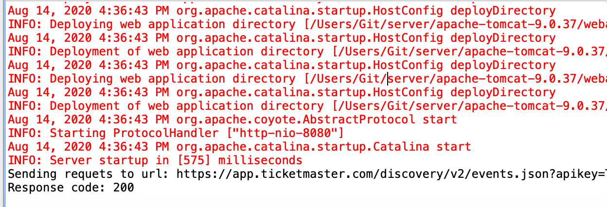

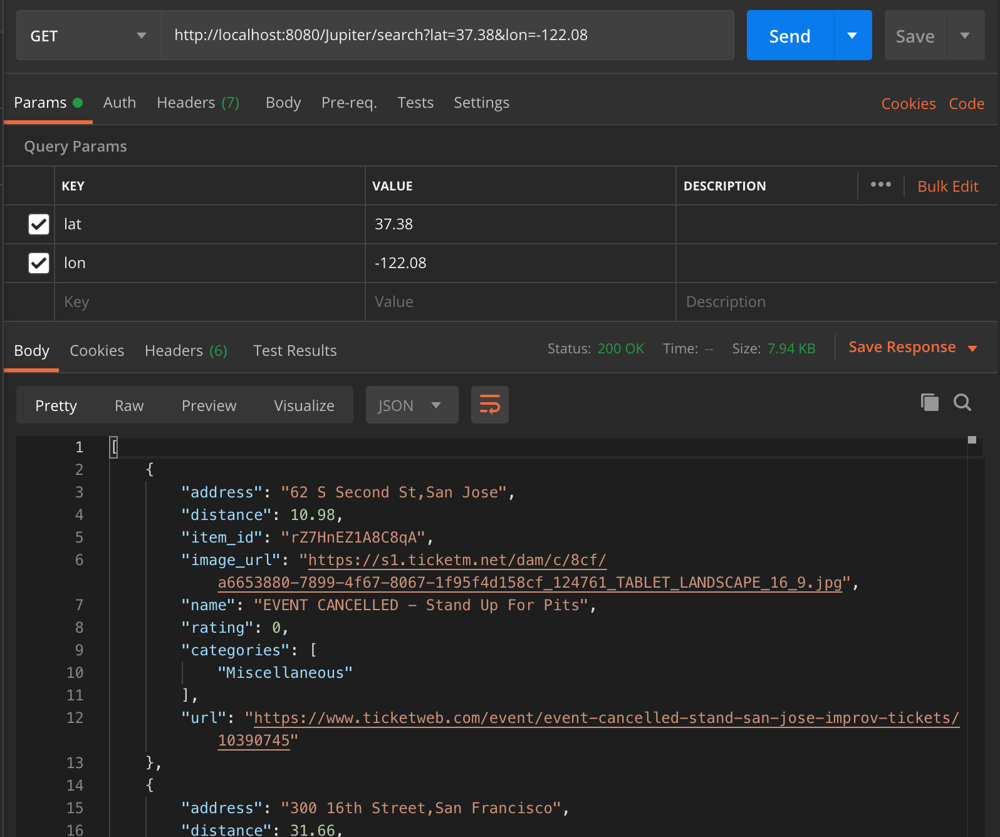

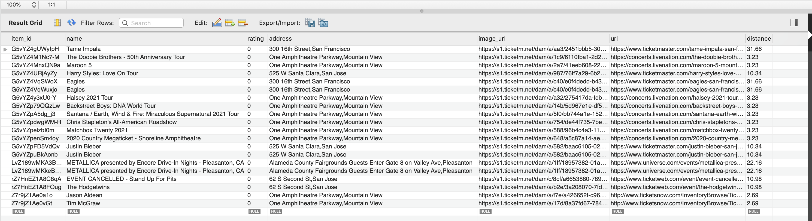


- If any error occurs, try to read the debugging info on the output console and 
  see if you can find the causes yourself.

- Well done for the first API!

---

- **Step 2, let’s try to implement set/unset favorite related functions**
  
- Step 2.1, let’s try `setFavoriteItem` and `unsetFavoriteItem`

```java
public class MySQLConnection implements DBConnection {


	@Override
	public void setFavoriteItems(String userId, List<String> itemIds) {
		if (conn == null) {
			System.out.println("DB connection failed");
			return;
		}
		try {
			String sql = "INSERT IGNORE INTO history(user_id, item_id) VALUES (?, ?)";
			PreparedStatement ps = conn.prepareStatement(sql);
			ps.setString(1, userId);
			for (String itemId : itemIds) {
				ps.setString(2, itemId);
				ps.execute();
			}
		} catch (Exception e) {
			e.printStackTrace();
		}

	}

	@Override
	public void unsetFavoriteItems(String userId, List<String> itemIds) {
		if (conn == null) {
			System.err.println("DB connection failed");
			return;
		}

		try {
			String sql = "DELETE FROM history WHERE user_id = ? AND item_id = ?";
			PreparedStatement ps = conn.prepareStatement(sql);
			ps.setString(1, userId);
			for (String itemId : itemIds) {
				ps.setString(2, itemId);
				ps.execute();
			}

		} catch (Exception e) {
			e.printStackTrace();
		}
	}
```


- Step 2.2, create a new servlet called ItemHistory, instead of click 
  OK, click next this time.


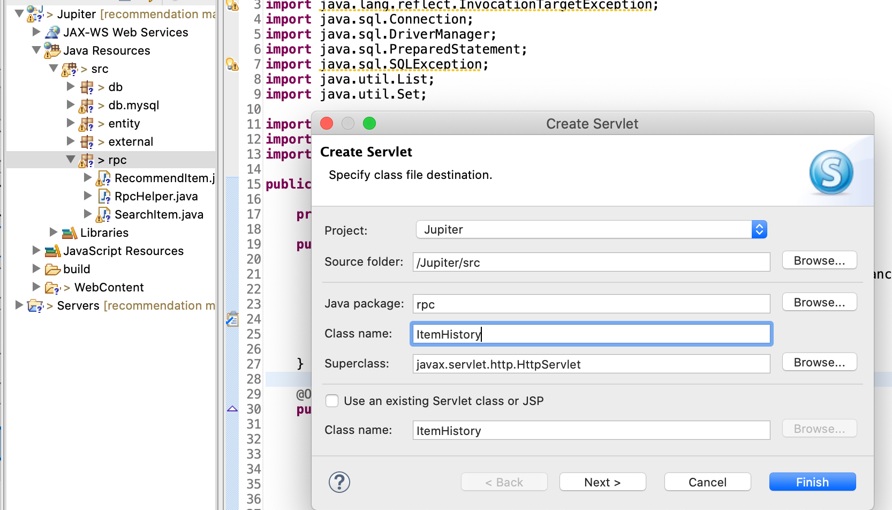


- Step 2.3, update the url mapping, and then click next.


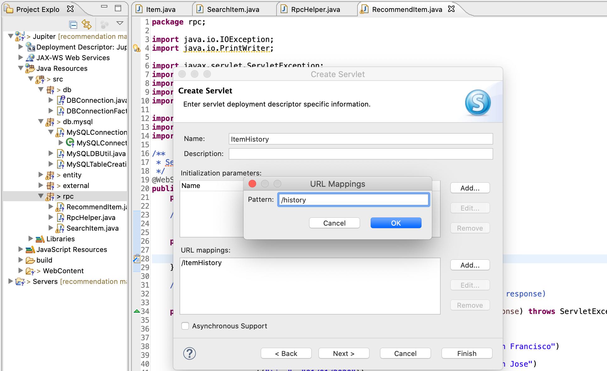


- Step 2.4, check doDelete method, then click finish.

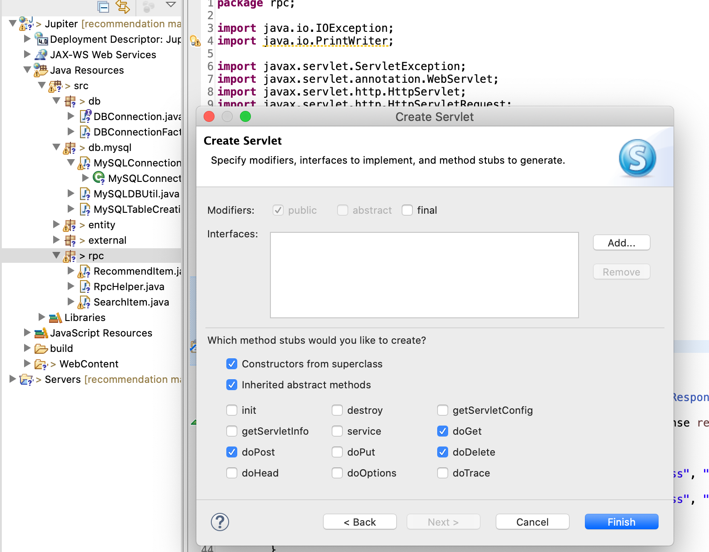


- Step 2.5, create a new class in `RpcHelper.java`  to parse HTTP 
  request body. Imagine the input HTTP request looks like:


```java
public class RpcHelper {
	// Writes a JSONArray to http response.

	// Parses a JSONObject from http request.
	public static JSONObject readJSONObject(HttpServletRequest request) {
		StringBuilder sBuilder = new StringBuilder();
		try (BufferedReader reader = request.getReader()) {
			String line = null;
			while ((line = reader.readLine()) != null) {
				sBuilder.append(line);
			}
			return new JSONObject(sBuilder.toString());

		} catch (Exception e) {
			e.printStackTrace();
		}

		return new JSONObject();
	}

}
```


- Step 2.6, update doPost() and doDelete in `ItemHistory.java` to use 
  this new function.


```java
/**
 * Servlet implementation class ItemHistory
 */
@WebServlet("/ItemHistory")
public class ItemHistory extends HttpServlet {
	private static final long serialVersionUID = 1L;

	/**
	 * @see HttpServlet#HttpServlet()
	 */
	public ItemHistory() {
		super();
		// TODO Auto-generated constructor stub
	}


	/**
	 * @see HttpServlet#doPost(HttpServletRequest request, HttpServletResponse
	 *      response)
	 */
	protected void doPost(HttpServletRequest request, HttpServletResponse response)
			throws ServletException, IOException {
		DBConnection connection = DBConnectionFactory.getConnection();
		try {
			JSONObject input = RpcHelper.readJSONObject(request);
			String userId = input.getString("user_id");
			JSONArray array = input.getJSONArray("favorite");
			List<String> itemIds = new ArrayList<>();
			for (int i = 0; i < array.length(); ++i) {
				itemIds.add(array.getString(i));
			}
			connection.setFavoriteItems(userId, itemIds);
			RpcHelper.writeJsonObject(response, new JSONObject().put("result", "SUCCESS"));

		} catch (Exception e) {
			e.printStackTrace();
		} finally {
			connection.close();
		}

	}

	/**
	 * @see HttpServlet#doDelete(HttpServletRequest, HttpServletResponse)
	 */
	protected void doDelete(HttpServletRequest request, HttpServletResponse response)
			throws ServletException, IOException {
		DBConnection connection = DBConnectionFactory.getConnection();
		try {
			JSONObject input = RpcHelper.readJSONObject(request);
			String userId = input.getString("user_id");
			JSONArray array = input.getJSONArray("favorite");
			List<String> itemIds = new ArrayList<>();
			for (int i = 0; i < array.length(); ++i) {
				itemIds.add(array.getString(i));
			}
			connection.unsetFavoriteItems(userId, itemIds);
			RpcHelper.writeJsonObject(response, new JSONObject().put("result", "SUCCESS"));

		} catch (Exception e) {
			e.printStackTrace();
		} finally {
			connection.close();
		}
	}

}
```


- Step 2.7, save your changes and restart your server.


- Step 2.7.1, open postman, switch to post method, use 
  http://localhost:8080/Jupiter/history, then copy the following JSON 
  object into body. Replace item_id1 and item_id2 with the real 
  item_id exist in your item table.


```json
{
    'user_id':'1111',
    'favorite' : [
        'G5vYZ4gUWyfpH',
        'G5vYZ4M1Nc7-M'
    ]
}
```

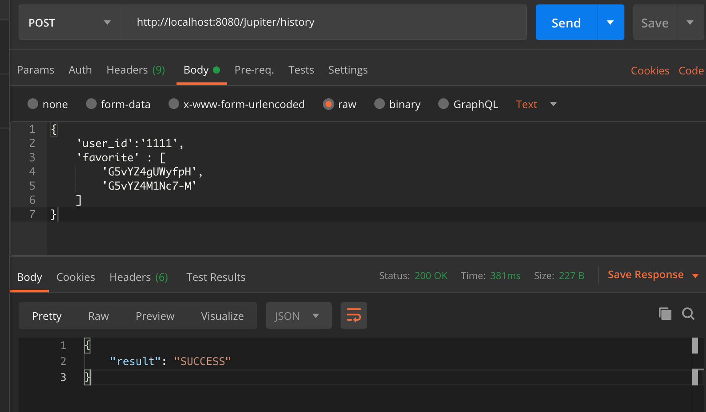


- Step 2.7.2, go to phpMyAdmin page, check if history table has 
  already changed.

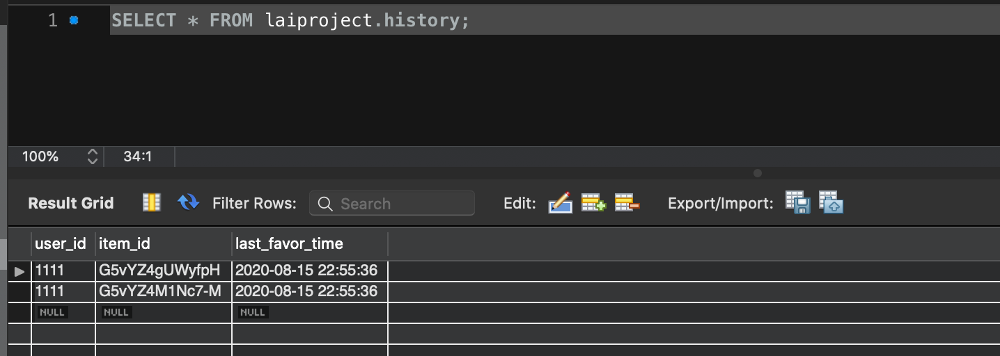


- Step 2.7.3, now let’s send another request to test our delete function. Open another 
  tab in postman, switch method to delete, use http://localhost:8080/Jupiter/history, 
  then copy the following JSON object into body. Again replace item_id1 with the real 
  item_id exist in your history table.

```json
{
    'user_id':'1111',
    'favorite' : [
        'G5vYZ4M1Nc7-M',
    ]
}
```

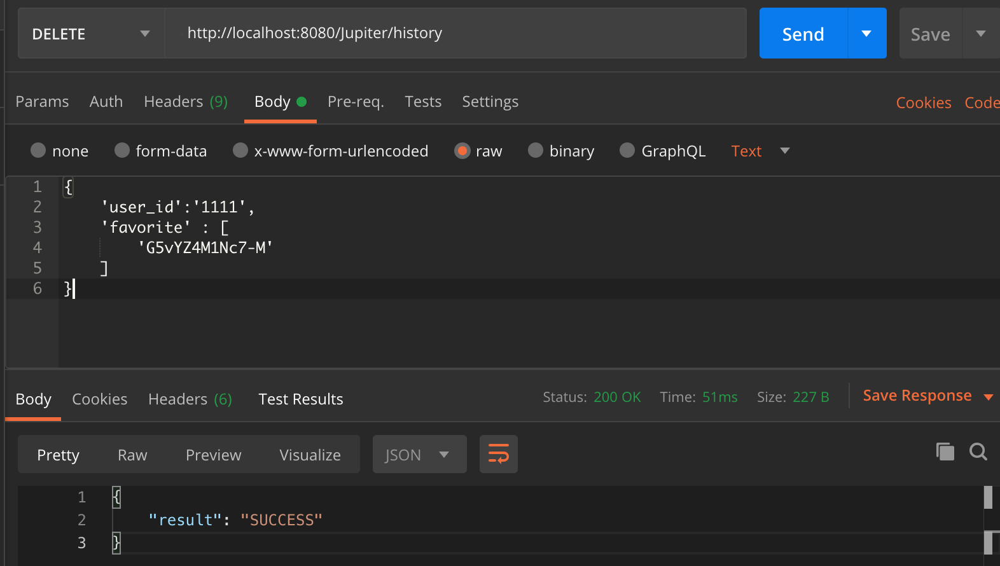

- Step 2.7.4, go to phpMyAdmin page, history table should be updated again.

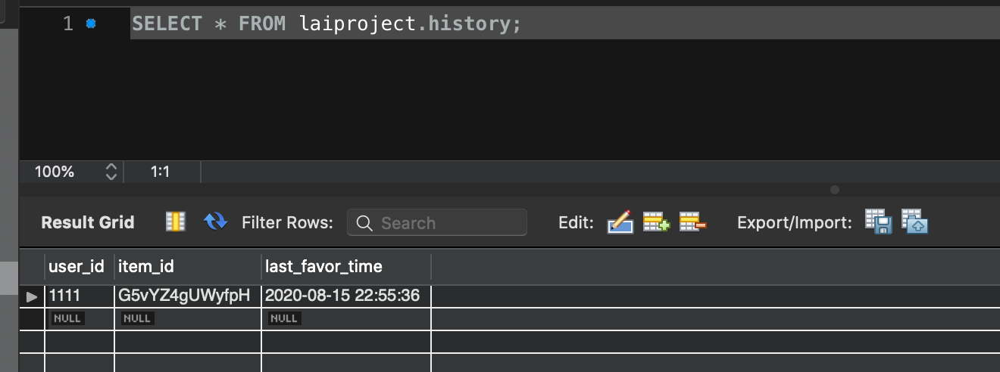


---

## Continue to implement get history

- Step 1, implement `getFavoriteItems` method for `MySQLConnection`.

```java
	@Override
	public Set<Item> getFavoriteItems(String userId) {
		if (conn == null) {
			return new HashSet<>();
		}

		Set<Item> favoriteItems = new HashSet<>();
		Set<String> itemIds = getFavoriteItemIds(userId);

		try {
			String sql = "SELECT * FROM items WHERE item_id = ?";
			PreparedStatement stmt = conn.prepareStatement(sql);
			for (String itemId : itemIds) {
				stmt.setString(1, itemId);

				ResultSet rs = stmt.executeQuery();

				ItemBuilder builder = new ItemBuilder();

				while (rs.next()) {
					builder.setItemId(rs.getString("item_id"));
					builder.setName(rs.getString("name"));
					builder.setAddress(rs.getString("address"));
					builder.setImageUrl(rs.getString("image_url"));
					builder.setUrl(rs.getString("url"));
					builder.setCategories(getCategories(itemId));
					builder.setDistance(rs.getDouble("distance"));
					builder.setRating(rs.getDouble("rating"));

					favoriteItems.add(builder.build());
				}
			}
		} catch (SQLException e) {
			e.printStackTrace();
		}

		return favoriteItems;

	}
```


- Step 2 Next, let’s try `getFavoriteItemIds` and `getCategories`


```java
      @Override
        	public Set<String> getFavoriteItemIds(String userId) {
                    	if (conn == null) {
                                	return new HashSet<>();
                    	}
                       
                    	Set<String> favoriteItems = new HashSet<>();
                       
                    	try {
                                	String sql = "SELECT  item_id FROM history WHERE user_id = ?";
                                	PreparedStatement stmt = conn.prepareStatement(sql);
                                	stmt.setString(1, userId);
                                   
                                	ResultSet rs = stmt.executeQuery();
                                   
                                	while (rs.next()) {
                                            	String itemId = rs.getString("item_id");
                                            	favoriteItems.add(itemId);
                                	}
                    	} catch (SQLException e) {
                                	e.printStackTrace();
                    	}
                       
                    	return favoriteItems;
 
        	}
 
        	@Override
        	public Set<String> getCategories(String itemId) {
                    	if (conn == null) {
                                	return null;
                    	}
                    	Set<String> categories = new HashSet<>();
                    	try {
                                	String sql = "SELECT category from categories WHERE item_id = ? ";
                                	PreparedStatement statement = conn.prepareStatement(sql);
                                	statement.setString(1, itemId);
                                	ResultSet rs = statement.executeQuery();
                                	while (rs.next()) {
                                            	String category = rs.getString("category");
                                            	categories.add(category);
                                	}
                    	} catch (SQLException e) {
                                	System.out.println(e.getMessage());
                    	}
                    	return categories;
 
        	}
```


- Step 3, get back to `ItemHistory.java`, update `doGet` method.


```java
            /**
        	 * @see HttpServlet#doGet(HttpServletRequest request, HttpServletResponse
        	 *      response)
        	 */
        	protected void doGet(HttpServletRequest request, HttpServletResponse response)
                                	throws ServletException, IOException {
                    	String userId = request.getParameter("user_id");
                    	JSONArray array = new JSONArray();
                       
                    	DBConnection conn = DBConnectionFactory.getConnection();
                    	try {
                                	Set<Item> items = conn.getFavoriteItems(userId);
                                	for (Item item : items) {
                                            	JSONObject obj = item.toJSONObject();
                                            	obj.append("favorite", true);
                                            	array.put(obj);
                                	}
                                   
                                	RpcHelper.writeJsonArray(response, array);
                    	} catch (JSONException e) {
                                	e.printStackTrace();
                    	} finally {
                                	conn.close();
                    	}
 
        	}
```


- Step 4, save your changes and test this function. If you html/javascript is ready, 
  use the my favorites button to test. Otherwise, send a get request to 
  http://localhost:8080/Jupiter/history?user_id=1111, or simply type the url in 
  browser. You should see the result like this:


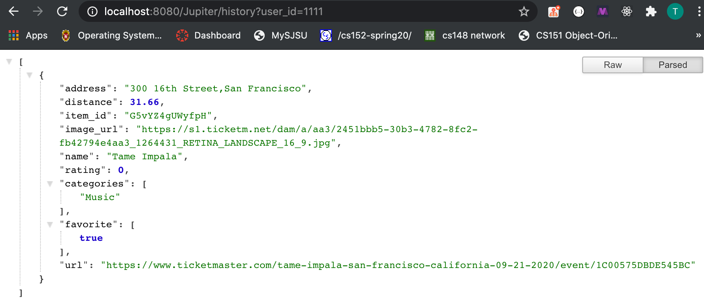