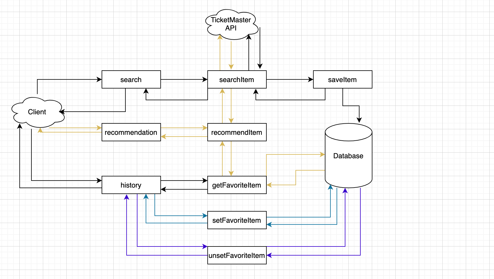
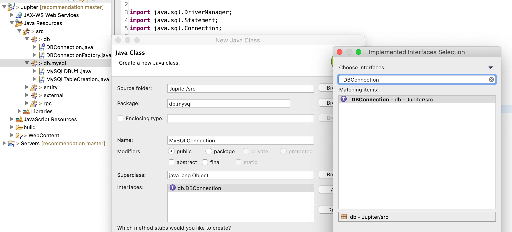

## MySQL II




- **Step 1, save search results to database**
- Step 1.1, Under db.mysql package, create class MySQLConnection.java.



- Step 1.2, implement DBConnection interface:

```java
public class MySQLConnection implements DBConnection {

	@Override
	public void close() {
		// TODO Auto-generated method stub

	}

	@Override
	public void setFavoriteItems(String userId, List<String> itemIds) {
		// TODO Auto-generated method stub

	}

	@Override
	public void unsetFavoriteItems(String userId, List<String> itemIds) {
		// TODO Auto-generated method stub

	}

	@Override
	public Set<String> getFavoriteItemIds(String userId) {
		// TODO Auto-generated method stub
		return null;
	}

	@Override
	public Set<Item> getFavoriteItems(String userId) {
		// TODO Auto-generated method stub
		return null;
	}

	@Override
	public Set<String> getCategories(String itemId) {
		// TODO Auto-generated method stub
		return null;
	}

	@Override
	public List<Item> searchItems(double lat, double lon, String term) {
		// TODO Auto-generated method stub
		return null;
	}

	@Override
	public void saveItem(Item item) {
		// TODO Auto-generated method stub

	}

	@Override
	public String getFullname(String userId) {
		// TODO Auto-generated method stub
		return null;
	}

	@Override
	public boolean verifyLogin(String userId, String password) {
		// TODO Auto-generated method stub
		return false;
	}

}
```


- Step 1.3, implement both close method and constructor. 
  **Again, careful with the import suggestions. Always choose java.sql.*.**


```java
public class MySQLConnection implements DBConnection {

	private Connection conn;

	public MySQLConnection() {
		try {
			Class.forName("com.mysql.cj.jdbc.Driver").getConstructor().newInstance();
			conn = DriverManager.getConnection(MySQLDBUtil.URL);
		} catch (Exception e) {
			// TODO Auto-generated catch block
			e.printStackTrace();
		}
	}

	@Override
	public void close() {
		if (conn != null) {
			try {
				conn.close();
			} catch (Exception e) {
				e.printStackTrace();
			}
		}
	}
```


- Step 1.4: implement `searchItems()` in `MySQLConnection`. Previously we call 
  TicketMasterClient.search from our SearchItem servlet directly. But actually our 
  recommendation code also needs to call the same search function, so we make a designated 
  function here to do the search call.
  The code is simply copied from what we’ve already had in SearchItem.java.


```java
	@Override
	public List<Item> searchItems(double lat, double lon, String term) {
		TicketMasterClient ticketMasterClient = new TicketMasterClient();
		List<Item> items = ticketMasterClient.search(lat, lon, term);
		for(Item item : items) {
			saveItem(item);
		}
		return items;
	}
```

- Step 1.5, after searchItem, let’s try `saveItem` to save data into database. 
  **Again, careful with the import suggestions. Always choose java.sql.*.**


```java
	@Override
	public void saveItem(Item item) {
		if (conn == null) {
			System.out.println("DB connection failed");
			return;
		}
		try {
			String sql = "INSERT IGNORE INTO items VALUES (?, ?, ?, ?, ?, ?, ?)";
			PreparedStatement ps = conn.prepareStatement(sql);
			ps.setString(1, item.getItemId());
			ps.setString(2, item.getName());
			ps.setDouble(3, item.getRating());
			ps.setString(4, item.getAddress());
			ps.setString(5, item.getImageUrl());
			ps.setString(6, item.getUrl());
			ps.setDouble(7, item.getDistance());
			ps.execute();

			sql = "INSERT IGNORE INTO categories VALUES(?, ?)";
			ps = conn.prepareStatement(sql);
			ps.setString(1, item.getItemId());
			for (String category : item.getCategories()) {
				ps.setString(2, category);
				ps.execute();
			}

		} catch (Exception e) {
			// TODO: handle exception
			e.printStackTrace();
		}

	}
```

- Step 1.6: update DBConnectionFactory.

```java
package db;

import db.mysql.MySQLConnection;

public class DBConnectionFactory {
	// This should change based on the pipeline.
	private static final String DEFAULT_DB = "mysql";
	
	public static DBConnection getConnection(String db) {
		switch (db) {
		case "mysql":
			return new MySQLConnection();
		case "mongodb":
			// return new MongoDBConnection();
			return null;
		default:
			throw new IllegalArgumentException("Invalid db:" + db);
		}

	}

	public static DBConnection getConnection() {
		return getConnection(DEFAULT_DB);
	}
}
```

- Step 1.7, In src/rpc/SearchItem.java, update `doGet()`.


```java
package rpc;

import java.io.IOException;
import java.io.PrintWriter;
import java.util.List;

import javax.servlet.ServletException;
import javax.servlet.annotation.WebServlet;
import javax.servlet.http.HttpServlet;
import javax.servlet.http.HttpServletRequest;
import javax.servlet.http.HttpServletResponse;

import org.json.JSONArray;
import org.json.JSONException;
import org.json.JSONObject;

import db.DBConnection;
import db.DBConnectionFactory;
import external.TicketMasterClient;
import entity.Item;

/**
 * Servlet implementation class SearchItem
 */
@WebServlet("/search")
public class SearchItem extends HttpServlet {
	private static final long serialVersionUID = 1L;

	/**
	 * @see HttpServlet#HttpServlet()
	 */
	public SearchItem() {
		super();
	}

	/**
	 * @see HttpServlet#doGet(HttpServletRequest request, HttpServletResponse
	 *      response)
	 */
	protected void doGet(HttpServletRequest request, HttpServletResponse response)
			throws ServletException, IOException {

		double lat = Double.parseDouble(request.getParameter("lat"));
		double lon = Double.parseDouble(request.getParameter("lon"));
		// Term can be empty or null.
		String term = request.getParameter("term");
		DBConnection connection = DBConnectionFactory.getConnection();
		try {
			List<Item> items = connection.searchItems(lat, lon, term);

			JSONArray array = new JSONArray();
			for (Item item : items) {
				array.put(item.toJSONObject());
			}
			RpcHelper.writeJsonArray(response, array);

		} catch (Exception e) {
			e.printStackTrace();
		} finally {
			connection.close();
		}

	}

	/**
	 * @see HttpServlet#doPost(HttpServletRequest request, HttpServletResponse
	 *      response)
	 */
	protected void doPost(HttpServletRequest request, HttpServletResponse response)
			throws ServletException, IOException {
		// TODO Auto-generated method stub
		doGet(request, response);
	}

}
```


- Step 1.8, verify search service from browser or postman. Make sure you’ve saved all 
  changes. Restart Tomcat Server. Open browser or postman. Send a GET request:
  - `http://localhost:8080/Jupiter/search?lat=37.38&lon=-122.08`


