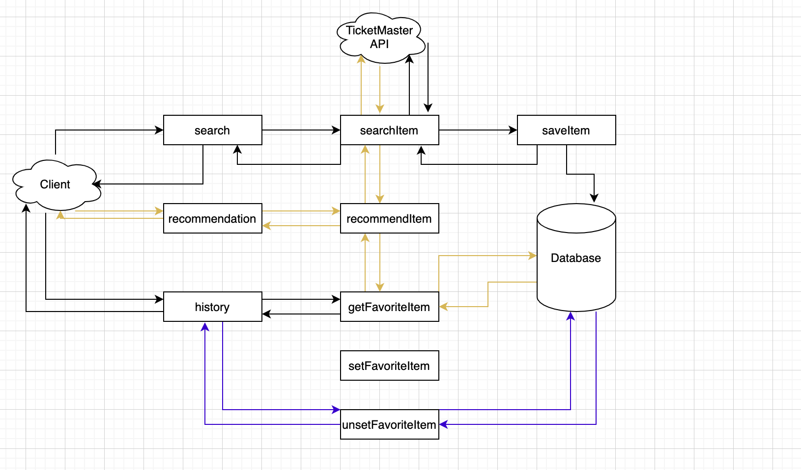

## MySQL II



- **Step 1, save search results to database**
- Step 1.1, Under db.mysql package, create class MySQLConnection.java.


- Step 1.2, implement DBConnection interface:

```java
public class MySQLConnection implements DBConnection {

	@Override
	public void close() {
		// TODO Auto-generated method stub

	}

	@Override
	public void setFavoriteItems(String userId, List<String> itemIds) {
		// TODO Auto-generated method stub

	}

	@Override
	public void unsetFavoriteItems(String userId, List<String> itemIds) {
		// TODO Auto-generated method stub

	}

	@Override
	public Set<String> getFavoriteItemIds(String userId) {
		// TODO Auto-generated method stub
		return null;
	}

	@Override
	public Set<Item> getFavoriteItems(String userId) {
		// TODO Auto-generated method stub
		return null;
	}

	@Override
	public Set<String> getCategories(String itemId) {
		// TODO Auto-generated method stub
		return null;
	}

	@Override
	public List<Item> searchItems(double lat, double lon, String term) {
		// TODO Auto-generated method stub
		return null;
	}

	@Override
	public void saveItem(Item item) {
		// TODO Auto-generated method stub

	}

	@Override
	public String getFullname(String userId) {
		// TODO Auto-generated method stub
		return null;
	}

	@Override
	public boolean verifyLogin(String userId, String password) {
		// TODO Auto-generated method stub
		return false;
	}

}
```


- Step 1.3, implement both close method and constructor. 
  **Again, careful with the import suggestions. Always choose java.sql.*.**


