# Java Servlet | HTTP request and response

- Goal
  - Create my first servlet to provide a simple service

---

### HTTP request and response

- In our project, what http methods shall we use in the following cases?
  -	Search for events nearby, giving a geo location, return a list of events. [GET]
  -	Recommend events for the user, giving user information, return a list of recommended events. [GET]
  -	Get user favorite events, giving user information, return a list of favorite events. [GET] 
  -	Set/Unset user favorite events, giving user information and events to set/unset, 
    return OK if operation is successfully done. [POST/DELETE]
  -	Login [POST], 因为你如果用 `get` 发起请求，比如你要登录 chase bank, 它在 login 的时候，用
    `get` method, 把我们的账号密码 全部显现在 url 后面， 如果有人看到，这是非常危险的， 而 `post`
    会在单独的 request body 里。 不会在 url 里.
    - 所以 sigup 肯定也是用 `post`
 
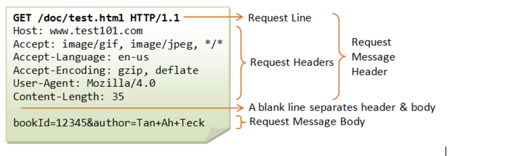
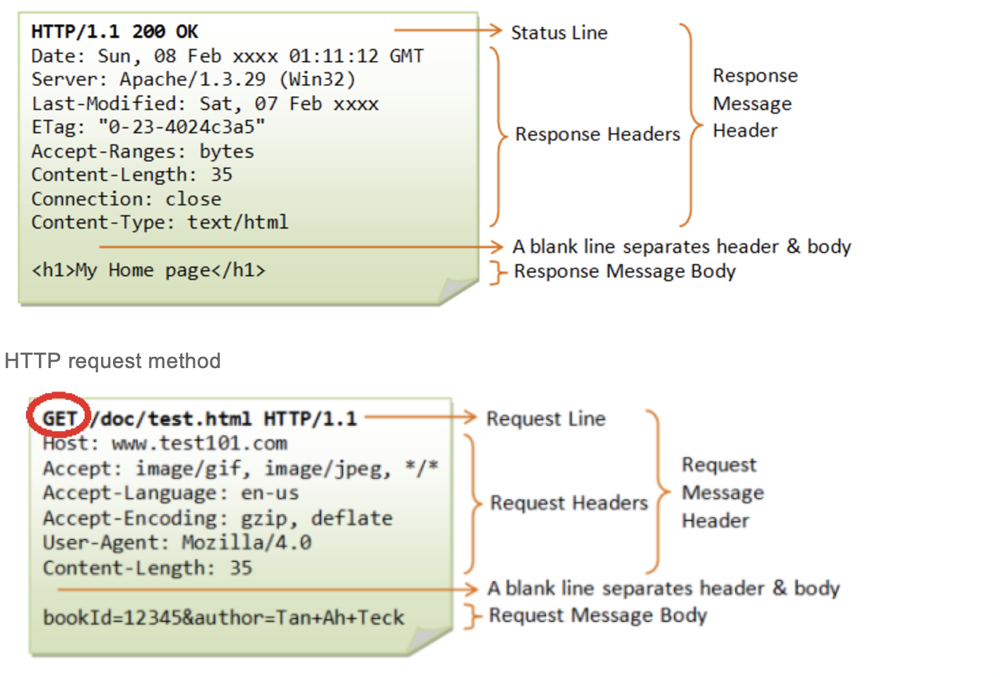

- HTTP supports all CRUD (Create/Read/Update/Delete) operations. 
  Two commonly used methods are:
  - **GET  - Request** data from server.
  - **POST - Update** data on server.  


## Endpoint

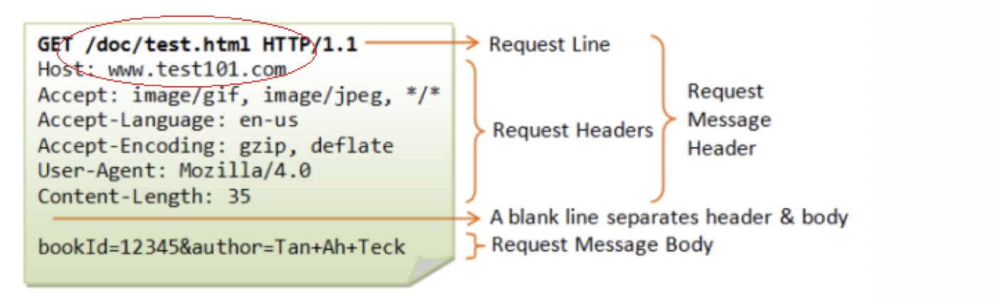

- A URL is used to uniquely identify a resource over the web. URL has the following syntax:
  - `protocol://hostname:port/endpoint?query`
  - `http://www.laioffer.com:80/index.html`


## HTTP request/response body

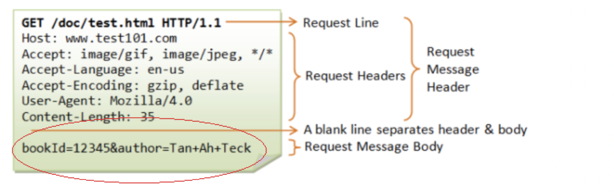
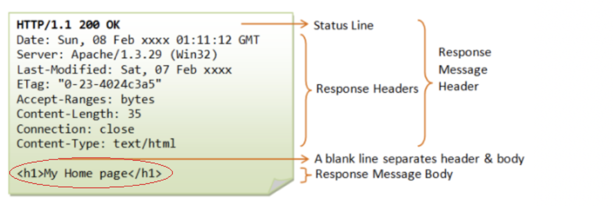

- A message body is the one which carries the actual HTTP request data 
  (including form data and uploaded etc.) and HTTP response data from 
  the server ( including files, images etc). Normally we don’t return static HTML code 
  to frontend directly because it should be created by frontend developer. 
  We just need to return correct data that should be displayed by frontend. 
  In our project, we’ll use JSON as for body format.

---

## Create First Java Servlet

- Step 1, open Eclipse. Right click on your project `Jupiter`, choose New->Servlet. 

- Step 2, name it `SearchItem` and the package name is `rpc`, then click Finish.

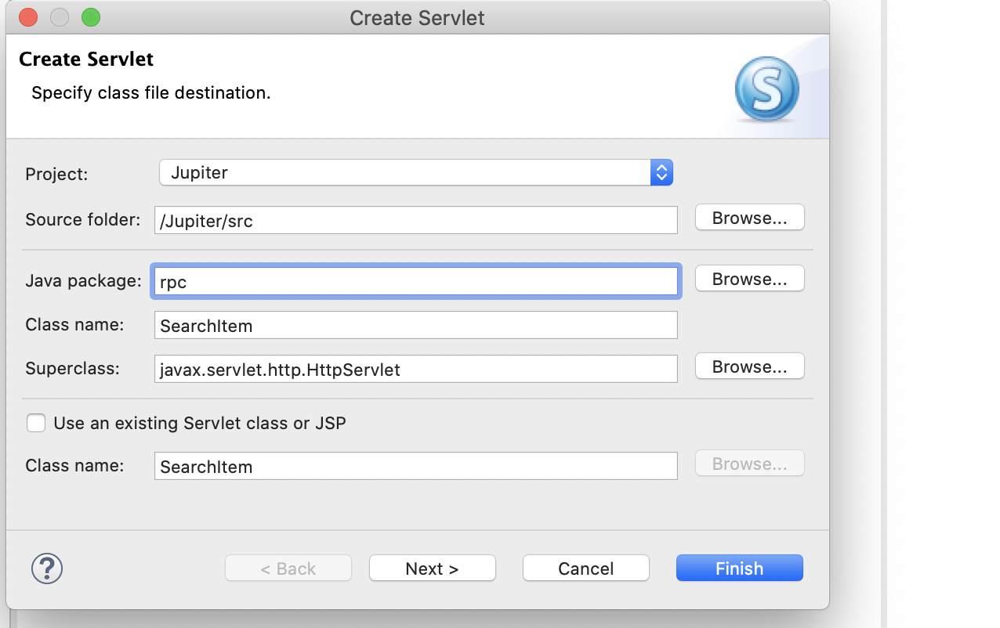

- Eclipse will automatically create a Java class called SearchItem in package rpc for you. 

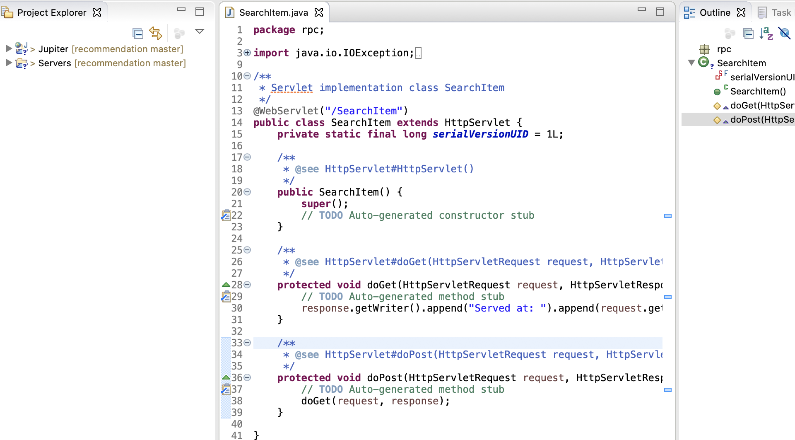

- Step 3, At line 13, change the url mapping to “/search”.

- Step 4, Save your change and right click on ‘Tomcat v9.0 Server at localhost’, 
  choose `Start`.


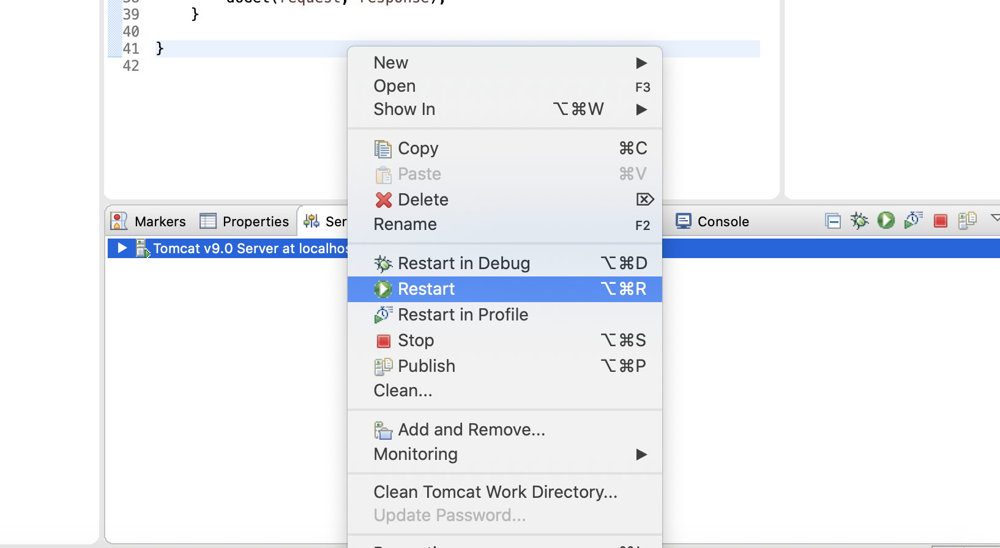

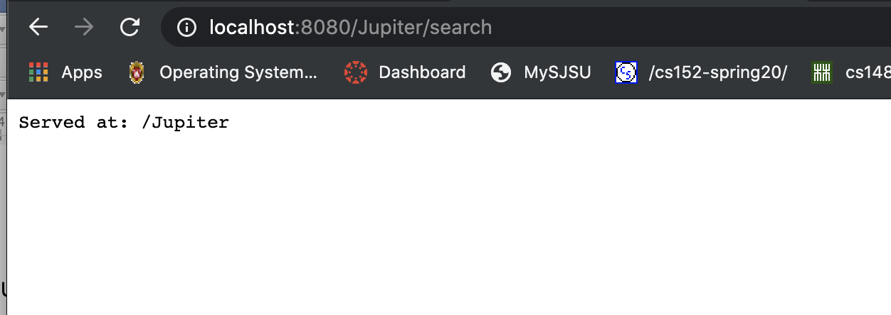

#### Or you can test it in Postman:

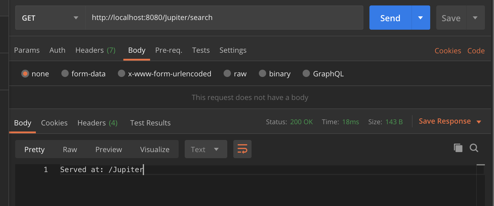


- Step 6, update doGet to return data in HTML format.


```java
	/**
	 * @see HttpServlet#doGet(HttpServletRequest request, HttpServletResponse response)
	 */
	protected void doGet(HttpServletRequest request, HttpServletResponse response) throws ServletException, IOException {
		// TODO Auto-generated method stub
		response.setContentType("text/html");
		PrintWriter writer = response.getWriter();
		
		writer.println("<html><body>");
		writer.println("<h1>Hello World</h1>");
		writer.println("</body></html>");
		
		writer.close();	
	}
```

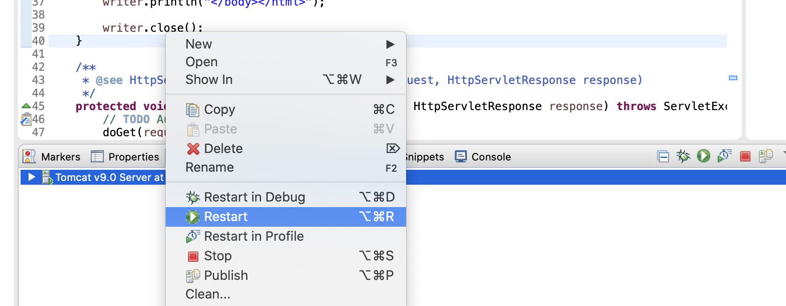

- restart server

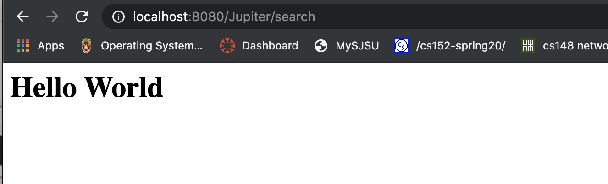

- postman

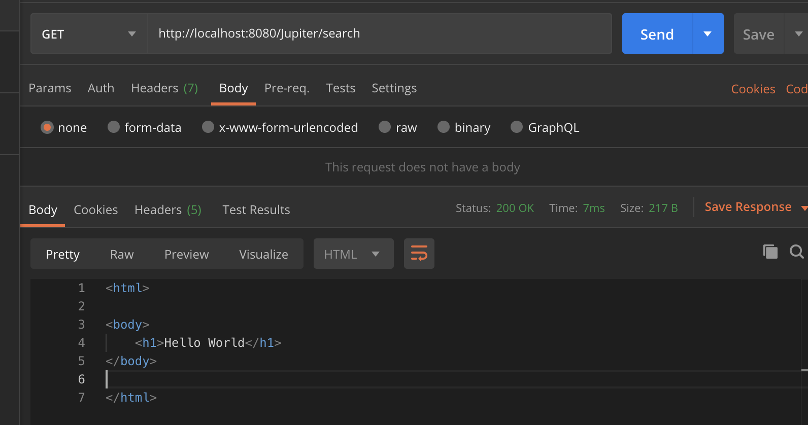


- Step 8, since our project provides dynamic services to users, we should be able to 
  return different results based on different parameters from user input. 
  Let’s try to add the following code into doGet method in SearchItem.java.


```java
	/**
	 * @see HttpServlet#doGet(HttpServletRequest request, HttpServletResponse response)
	 */
	protected void doGet(HttpServletRequest request, HttpServletResponse response) throws ServletException, IOException {

		response.setContentType("text/html");//告诉browser, 我们set的file的格式是html
        //如果这里不call这个method, browser 也会默认为html format

		PrintWriter writer = response.getWriter();//得到了一个response write
		
		if (request.getParameter("username") != null) {//检查username 是否存在 
			String username = request.getParameter("username");
			
			writer.println("<html><body>");
			writer.println("<h1>Hello " + username + "</h1>");
			writer.println("</body></html>");
		}
		
		writer.close();	
	}
```


- Step 9, save the change and open a new tab in your browser. In the address bar, type in:

- `http://localhost:8080/Jupiter/search?username=1234`

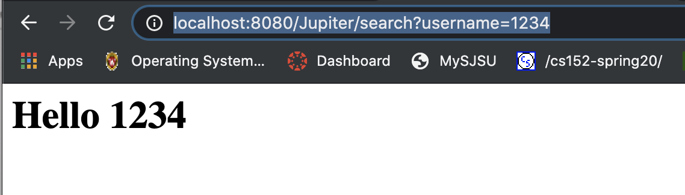

- 这里的逻辑是： hit `enter` 以后， 到 servlet, `doGet` method, 


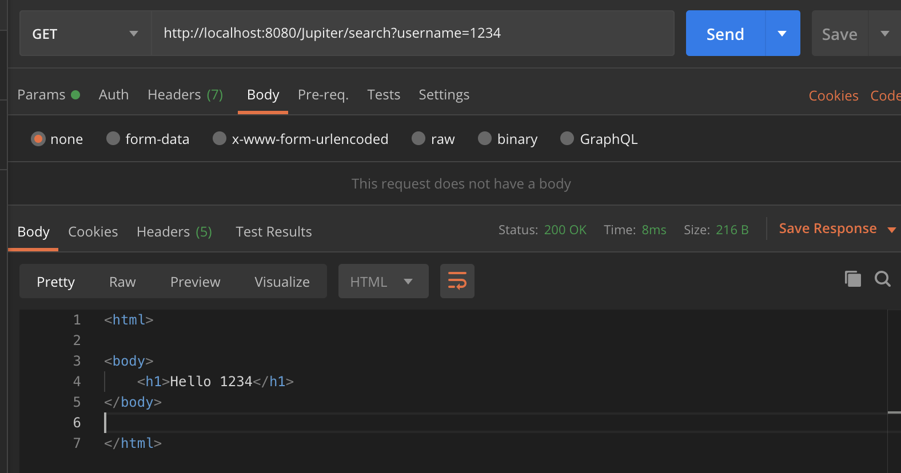

---

- Step 10, return a JSON object in response body. 

- [10.1 Download JSON to download JSON library, visit](http://www.java2s.com/Code/JarDownload/java-json/java-json.jar.zip) 

- Unzip it and you will see a java-json.jar file. Click that file and use Command-c (Mac) to copy it. 
  Then in your Jupiter project’s WebContent/WEB-INF/lib, use Command-v (Mac) to paste it. 

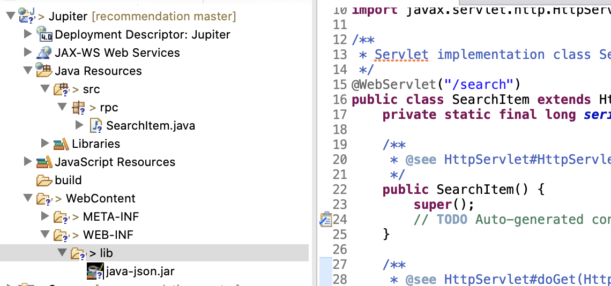


- Step 10.2 in your SearchItem.java doGet method. Add the  

```java
	protected void doGet(HttpServletRequest request, HttpServletResponse response) throws ServletException, IOException {
		// TODO Auto-generated method stub
//		response.setContentType("text/html");
		response.setContentType("application/json");
		PrintWriter writer = response.getWriter();
		
		if (request.getParameter("username") != null) {
			String username = request.getParameter("username");
			JSONObject obj = new JSONObject();
			try {
				obj.put("username", username);
			}catch(JSONException e) {
				e.printStackTrace();
			}
			writer.print(obj);
		}
		
		writer.close();	
	}
```


- Step 10.4 save the changes. Restart Tomcat server, and type in the following URL in your browser: 
  `http://localhost:8080/Jupiter/search?username=abcd`


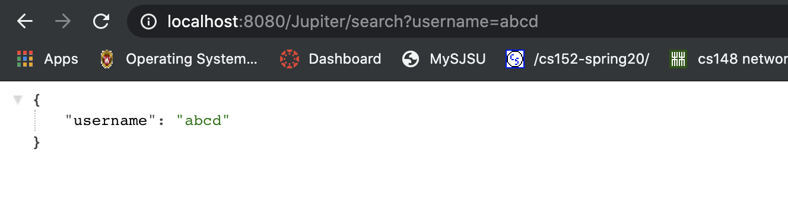


- Step 10.5, in the future we’ll return a list of nearby events for client, 
  so let’s try to return a list of usernames first. Open SearchItem.
  java’s doGet method, change it to, and import org.json.JSONArray.


```java
	protected void doGet(HttpServletRequest request, HttpServletResponse response) throws ServletException, IOException {
		// TODO Auto-generated method stub
//		response.setContentType("text/html");
		response.setContentType("application/json");
		PrintWriter writer = response.getWriter();
		
		JSONArray array = new JSONArray();
		try {
			array.put(new JSONObject().put("username", "abcd"));
			array.put(new JSONObject().put("username", "1234"));
		} catch (JSONException e) {
			// TODO Auto-generated catch block
			e.printStackTrace();
		}
		writer.print(array);
		writer.close();
	}
```

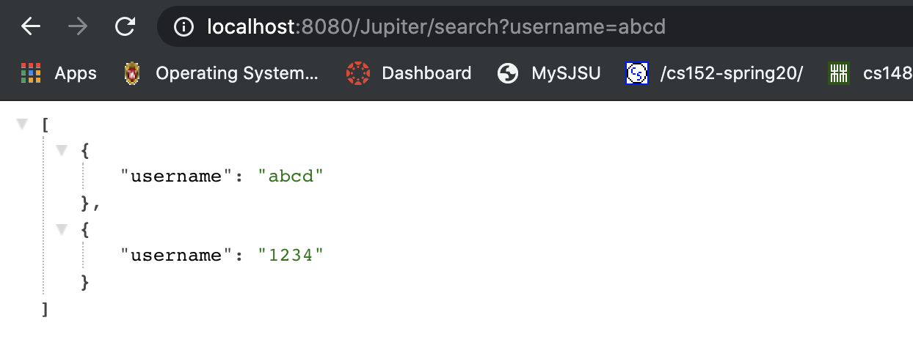

- Step 10.6, save the changes and restart Tomcat server, then use the following URL to test:
  `http://localhost:8080/Jupiter/search`

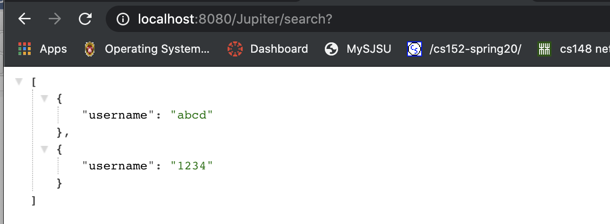

---

## Create Second Servlet

- Step 1, similar to SearchItem, let’s create another servlet called RecommendItem.java. 
  Right click on your project ‘Jupiter’, choose New->Servlet. 


- Step 2, name it RecommendItem, and make sure the package name is rpc. Click Finish

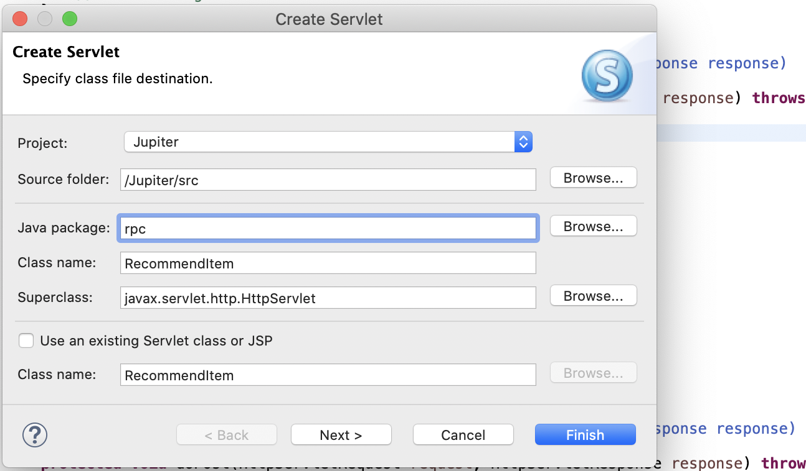


- Step 3, after RecommendItem is created, update the url mapping to “/recommendation” at line 13.

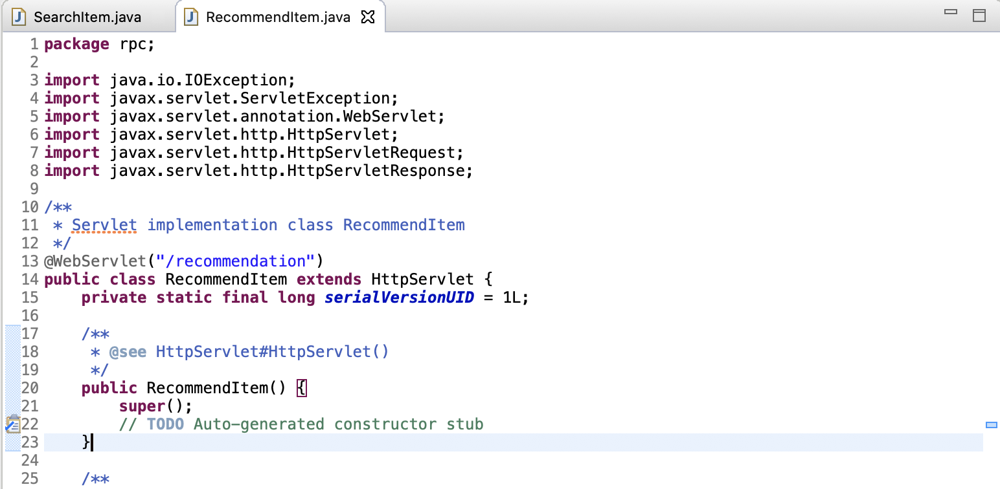


- Step 4, try to implement `doGet()` method in RecommendItem to 
  return the following JSON Array in response body.


```json
[
  {
	“name”: “abcd ”,
	“address”: “san francisco”,
	“time”: “01/01/2017”
  },
  {
	“name”: “1234 ”,
	“address”: “san jose”,
	“time”: “01/02/2017”
  }
]
```


```java
	protected void doGet(HttpServletRequest request, HttpServletResponse response) throws ServletException, IOException {
		response.setContentType("application/json");
		PrintWriter writer = response.getWriter();
		
		JSONArray array = new JSONArray(); 
		try {
			array.put(new JSONObject().put("name", "abcd").put("address", "San Francisco")
					.put("time", "01/01/2020"));
			array.put(new JSONObject().put("name", "1234").put("address", "San Jose")
					.put("time", "01/01/2020"));
		}catch(JSONException e) {
			e.printStackTrace();
		}
		writer.print(array);
		writer.close();
	}
```


- Step 5, save your changes and restart your server, then use the following URL to test the result: 
  `http://localhost:8080/Jupiter/recommendation`


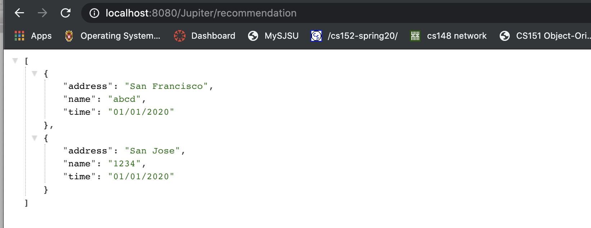


---

## Add RpcHelper Utility Class

- Step 1, to reduce some duplicate codes, add a new utility class called RpcHelper 
  to handle all rpc parsing codes. Right click on package ‘rpc’ and 
  choose New->Class. Careful, **choose class instead of servlet**.

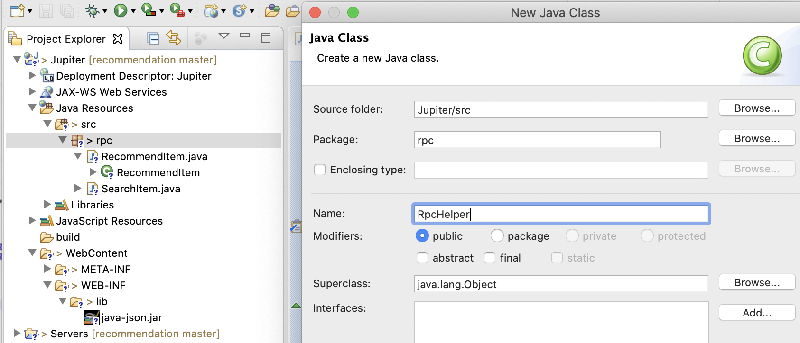

- Step 2, create two functions in this class, named `writeJsonObject` and `writeJsonArray` 

- Step 3 Let’s implement writeJsonArray first

- Step 4, similar thing for writeJsonObject, try to implement yourself.


```java
public class RpcHelper {
	// Writes a JSONArray to http response.
	public static void writeJsonArray(HttpServletResponse response, JSONArray array) throws IOException{
		response.setContentType("application/json");
		response.setHeader("Access-Control-Allow-Origin", "*");
		PrintWriter out = response.getWriter();	
		out.print(array);
		out.close();
	}
	
	// Writes a JSONObject to http response.
	public static void writeJsonObject(HttpServletResponse response, JSONObject obj) throws IOException {		
		response.setContentType("application/json");
		response.setHeader("Access-Control-Allow-Origin", "*");
		PrintWriter out = response.getWriter();	
		out.print(obj);
		out.close();
	}

}
```


- Step 5, now update both SearchItem and RecommendItem to use the helper function.


- `SearchItem.java`

```java
	protected void doGet(HttpServletRequest request, HttpServletResponse response) throws ServletException, IOException {
		// TODO Auto-generated method stub
//		response.setContentType("text/html");
		
		JSONArray array = new JSONArray();
		try {
			array.put(new JSONObject().put("username", "abcd"));
			array.put(new JSONObject().put("username", "1234"));
		} catch (JSONException e) {
			// TODO Auto-generated catch block
			e.printStackTrace();
		}
		RpcHelper.writeJsonArray(response, array);
	}
```


- `RecommandItem.java`

```java
	protected void doGet(HttpServletRequest request, HttpServletResponse response) throws ServletException, IOException {
		
		JSONArray array = new JSONArray(); 
		try {
			array.put(new JSONObject().put("name", "abcd").put("address", "San Francisco")
					.put("time", "01/01/2020"));
			array.put(new JSONObject().put("name", "1234").put("address", "San Jose")
					.put("time", "01/01/2020"));
		}catch(JSONException e) {
			e.printStackTrace();
		}
		RpcHelper.writeJsonArray(response, array);
	}
```


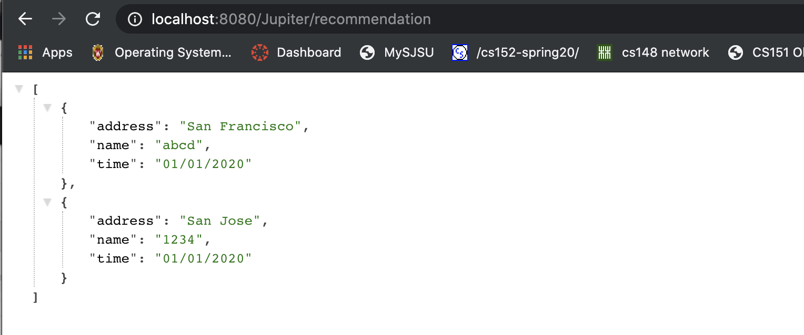

- 得到的结果是一致的

---

## Design of Our Backend Services

- Several ideas we’ve already mentioned earlier
  - Using HTTP methods to indicate what kind of operation a client wants to take.
  - Using HTTP url to indicate which service and data a client want to use and 
    what kind of data they request.
  - Every request is separated, there is no support for doing one post request 
    in several post requests, or doing a delete in a pair of get and post requests.


- Why we want to do that?
  - Operations are directly based on HTTP methods, so that server don’t need to parse extra thing
  -	URL clearly indicates which resource a client want, easy for client side users to understand.
  -	Server is running in stateless mode, improve scalability.


- These ideas are not only applied to our project, 
  it’s a widely used pattern in web service design. The name is called `REST` or `RESTful`


```
localhost:8080/create
localhost:8080/object?user=1234
```

---

## Register a user account

- [ticket master](http://developer.ticketmaster.com)