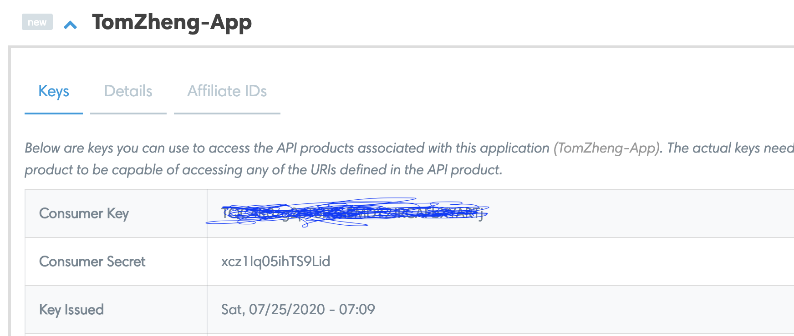
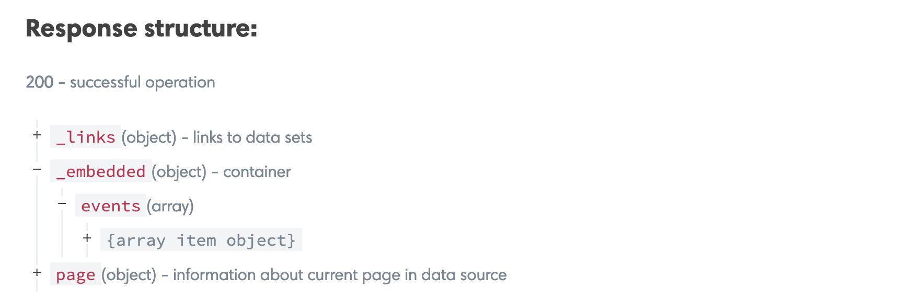
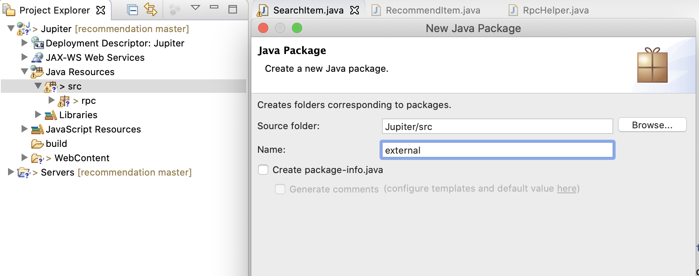
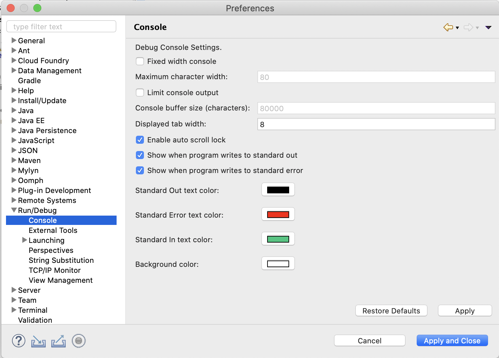
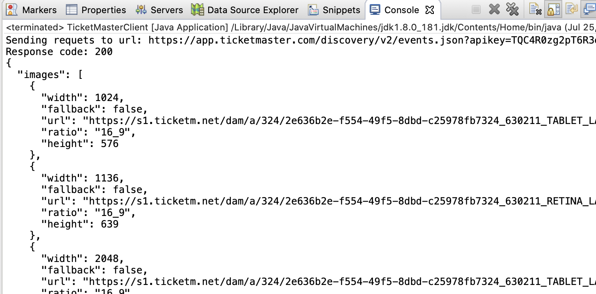
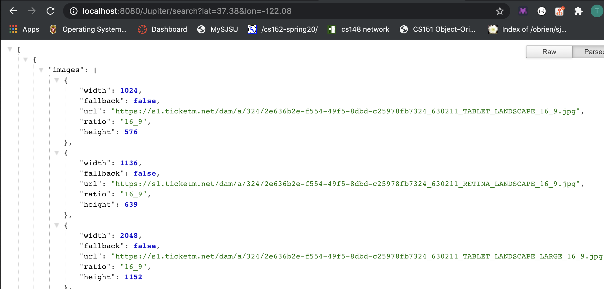

# Ticket Master API


### Goal

- Overview of TicketMaster API.
- Call TicketMaster API with Java code.
- Connect TicketMaster API with SearchItem servlet.

### API: application programming interface

- the function you can use
- 开放给别人可以用的接口


### Restful API

- Operations are directly based on HTTP methods, so that server don’t need to parse extra thing.
- URL clearly indicates which resource a client want, easy for client side users to understand.
- Server is running in stateless mode, improve scalability.


---

###  Ticket Master API Introduction

- Get your own API key 
  - Step 1, Login to your account at `http://developer.ticketmaster.com`, 
    then click your account icon at the top-right corner.


- Step 2, Expand the App under your account and you’ll see your consumer key.




- 这一步是 tracking, 权限不一样，毕竟是免费账户, 毕竟服务器资源有限

- 为什么在这里需要 key?
  - 验证身份方法 是 `账号密码`，
  - 程序调用请求，肯定不是每次都输入`用户名密码`, 所以在 `request` 里加上 `key`
  - 它可以通过 key 来验证你


---

- [Discover API Official Documentation](https://developer.ticketmaster.com/products-and-docs/apis/discovery-api/v2/)


- HTTP method: GET
- URL of discover API `(protocol://hostname:port/endpoint?query)` :
  -	protocol: https
  -	hostname: app.ticketmaster.com
  -	endpoint: /discovery/v2/events.json
  -	query:
    - apikey: it’s required by TicketMaster API for authentication
    - lat/long: lat/long since our search is based on client location
    - radius: radius of search area
    - keyword: search a specific kind of events
    

- Example:
  - `https://app.ticketmaster.com/discovery/v2/events.json?apikey=12345&latlong=37,-120&keyword=music&radius=50`

- Headers and Body: nothing to set since it’s not required for this API.

- get method 不需要把 query 写在 body



- 这里的数据结构是 `json object`, array 是 `[{...}, {...}, {...}, {...}]`

- Response Status: Should be 200 if you have a valid request.

- Response body: events data we need is located at 
  _embedded(JSON Object) -> events(JSON Array) -> item object(JSON Object).

---

## Connect to Ticket Master API

- Step 1, Add a new package called `external` under `src` folder. 



- In the `external` package, create a new class called `TicketMasterClient`.
  - 注意： 这次不是 `servlet`, 因为 class 充当客户端，发起 http 请求


- Step 2, Add some constants to TicketMasterClient class. Replace “YOUR_API_KEY” 
  with your own key. You can also copy all import lines that we’ll use in the next step.

```java
public class TicketMasterClient {
	private static final String HOST = "https://app.ticketmaster.com";
	private static final String ENDPOINT = "/discovery/v2/events.json";
	private static final String DEFAULT_KEYWORD = "event";
	private static final String API_KEY = "XXXXXXXXXXXXXXXXXXXXXXXXXXXXXX";
}
```

---

- Step 3, add a new search method.

```java
public class TicketMasterClient {
	private static final String HOST = "https://app.ticketmaster.com";
	private static final String ENDPOINT = "/discovery/v2/events.json";
	private static final String DEFAULT_KEYWORD = "event";
	private static final String API_KEY = "XXXXXXXXXXXXXXXXXXXXXXXXXXXXXXXX";
	
	public JSONArray search(double lat, double lon, String keyword) {
		//if keyword is null, we need to handle
		if(keyword == null) {
			keyword = DEFAULT_KEYWORD;
		}
		
		try {//if keyword is Chinese, we need to handle			
			keyword = URLEncoder.encode(keyword, "UTF-8");
			//encode 可以处理特殊字符，中文，空格，拉丁文 转译成 URL 可以识别的字符
		} catch (UnsupportedEncodingException e) {
			e.printStackTrace();
		}
		
		String query = String.format("apikey=%s&latlong=%s,%s&keyword=%s&radius=%s",
				API_KEY, lat, lon, keyword, 50);
		String url = HOST + ENDPOINT + "?" + query;
		StringBuilder responseBody = new StringBuilder();
		
		try {
			HttpURLConnection connection = (HttpURLConnection) new URL(url).openConnection();
			connection.setRequestMethod("GET");
			int responseCode = connection.getResponseCode();
			//this line，there are two operations：1. 发送请求 2. get response code 
			
			if(responseCode != 200) {//if code is not 200, fail, return empty 
				return new JSONArray();
			}
			System.out.println("Sending requets to url: " + url);
			System.out.println("Response code: " + responseCode);

			//connection.getInputStream();
			//这里是 getInputStream(), 是因为, client get response as input
			/**              
			 *              => output(request)
			 *     Client ----------------------- Server(Ticket)
			 *              <= input(response)
			 */
			BufferedReader reader = 
                new BufferedReader(new InputStreamReader(connection.getInputStream()));
			String line = "";
			while((line = reader.readLine()) != null) {
				responseBody.append(line);
			}
			reader.close();
			
		} catch (MalformedURLException e) {
			e.printStackTrace();
		} catch (IOException e) {
			e.printStackTrace();
		}
		
		try {
			JSONObject obj = new JSONObject(responseBody.toString());
			if(!obj.isNull("_embedded")) {
				JSONObject embedded = obj.getJSONObject("_embedded");	
				return embedded.getJSONArray("events");
			}
		} catch (JSONException e) {
			e.printStackTrace();
		}
		return new JSONArray();
	}
}
```

---

- Step 4, to test result, create a main function to call your search function.

```java
	/**
	 * Main entry to test TicketMasterClient.
	 */
	public static void main(String[] args) {
		TicketMasterClient client = new TicketMasterClient();
		JSONArray events = client.search(37.38, -122.08, null);
		try {
			for (int i = 0; i < events.length(); ++i) {
				JSONObject event = events.getJSONObject(i);
				System.out.println(event.toString(2));
			}
		} catch (Exception e) {
			e.printStackTrace();
		}	
	}	
```

- if result 不完整，是因为 `response` 太多，console 没办法显示全部。
  - 我们可以设置 eclipse, 



- 我们可以设置 `Limit console output`



- 现在这是我们所要的结果

---


## Connect TicketMaster API with SearchItem Servlet

- Step 1, Update `doGet()` method in rpc/SearchItems.java to use the TicketMasterClient.

```java
	protected void doGet(HttpServletRequest request, HttpServletResponse response)
			throws ServletException, IOException {
		
		double lat = Double.parseDouble(request.getParameter("lat"));
		double lon = Double.parseDouble(request.getParameter("lon"));

		TicketMasterClient client = new TicketMasterClient();
		RpcHelper.writeJsonArray(response, client.search(lat, lon, null));
		
	}
```

- Step 2, Save your changes and restart Tomcat server. Open your browser(or postman) and 
  put the following url: `http://localhost:8080/Jupiter/search?lat=37.38&lon=-122.08` 
  in the address bar.




