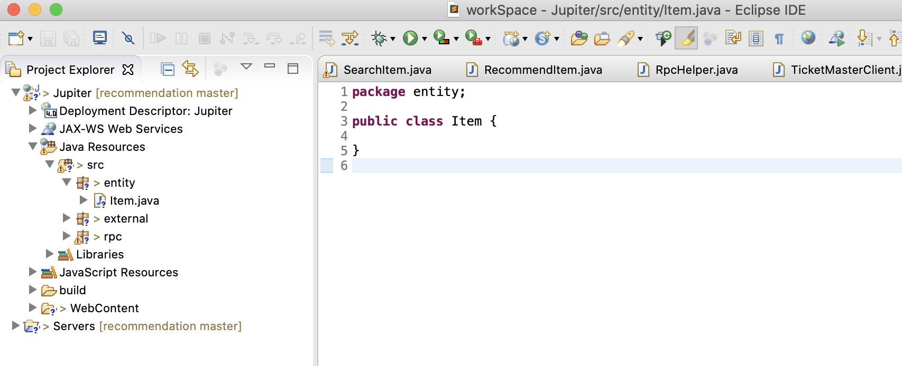
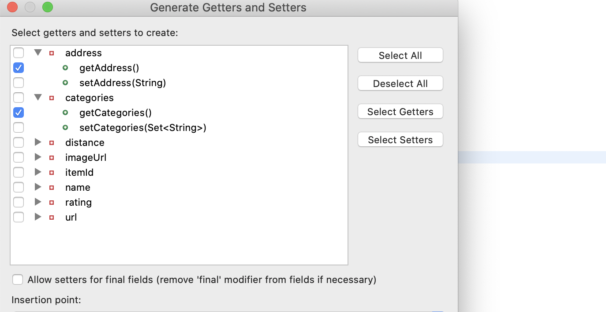
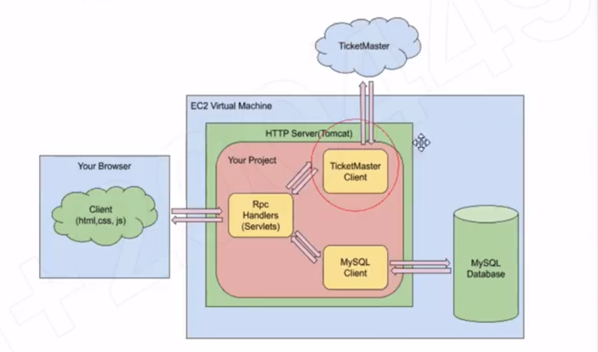
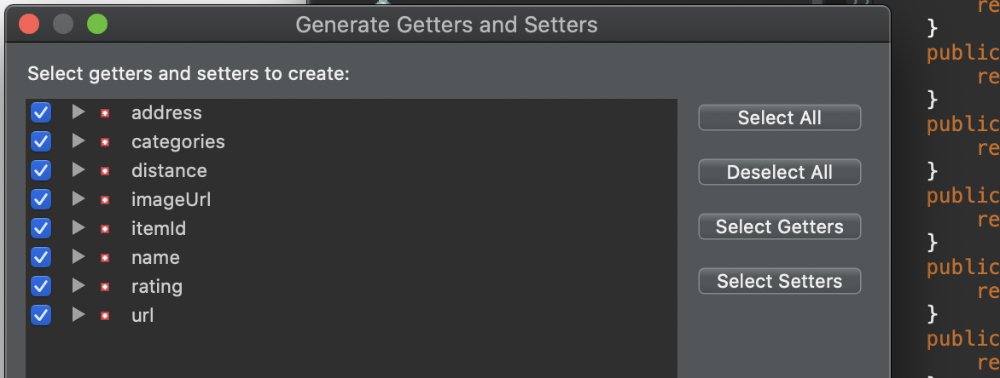

## TicketMaster API II

- Goal:
  - Understand how to create object with builder pattern.
  - Purify events data returned from TicketMaster API to only have information we need.

- Purify Data from TicketMaster
  - TicketMaster response is dirty. We’ll try to find and save fields that are needed 
    by our project.


- Step 1, create an Item class to hold data fields that are needed for our project
- Step 1.1 Create an `entity` package under `src` folder and then create a Item.java class inside.



- Step 1.2, Copy the following private fields into Item class.

```java
package entity;

import java.util.Set;

public class Item {
	private String itemId;
	private String name;
	private double rating;
	private String address;
	private Set<String> categories;
	private String imageUrl;
	private String url;
	private double distance;
}
```

- Step 1.3, to make data fields can be accessed by others, normally we need Getter and Setter
  for each of them. In this case, we just need Getters because 
  we don’t want to change an item instance once it’s constructed.



- Step 1.4, Add `toJSONObject()` method. Why? To convert an Item object a JSONObject 
  instance because in our application, frontend code cannot understand Java class, 
  it can only understand JSON.

```java
package entity;
import java.util.Set;
import org.json.JSONArray;
import org.json.JSONException;
import org.json.JSONObject;

public class Item {
	private String itemId;
	private String name;
	private double rating;
	private String address;
	private Set<String> categories;
	private String imageUrl;
	private String url;
	private double distance;
	
	public String getItemId() {
		return itemId;
	}
	public String getName() {
		return name;
	}
	public double getRating() {
		return rating;
	}
	public String getAddress() {
		return address;
	}
	public Set<String> getCategories() {
		return categories;
	}
	public String getImageUrl() {
		return imageUrl;
	}
	public String getUrl() {
		return url;
	}
	public double getDistance() {
		return distance;
	}

	public JSONObject toJSONObject() {
		JSONObject obj = new JSONObject();
		try {
			obj.put("item_id", itemId);
			obj.put("name", name);
			obj.put("rating", rating);
			obj.put("address", address);
			obj.put("categories", new JSONArray(categories));
			obj.put("image_url", imageUrl);
			obj.put("url", url);
			obj.put("distance", distance);
		} catch (JSONException e) {
			e.printStackTrace();
		}
		return obj;
	}	
}
```



- 最终的 object 还是要通过 `Servlet` 返回给前端来显示, 在返回数据的时候，前端不太理解 java 的 class
  还是得用 `json` 的格式

- 做数据处理，用 java 会比 javaScript 容易一些，或者说写起来会简单一些 
- 工业界也是如此，因为后端同时也会过滤掉 无效的数据

---

- Step 1.5, to create an instance of Item, we need to have constructors.
  - But think about this question before adding new constructors: could you guarantee 
    that TicketMaster can return all data fields to us every time? If it returns null 
    for some data field, how could your constructor deal with that? 
    Or do we have a better solution to handle this problem?


#### Builder Pattern

- Builder pattern builds a complex object using simple objects and using a 
  step by step approach. It separates the construction of a complex object from its 
  representation so that the same construction process can create different representations. 
  We can also make the object to build immutable. 


- Step 1.5.1, Add static class ItemBuilder in Item class. 
  Copy all fields from Item to ItemBuilder.


```java
	public static class ItemBuilder {
		private String itemId;
		private String name;
		private double rating;
		private String address;
		private Set<String> categories;
		private String imageUrl;
		private String url;
		private double distance;
	}
```


- Step 1.5.2 Generate Setters for all data fields in ItemBuilder



```java
	public static class ItemBuilder {
		private String itemId;
		private String name;
		private double rating;
		private String address;
		private Set<String> categories;
		private String imageUrl;
		private String url;
		private double distance;
		public void setItemId(String itemId) {
			this.itemId = itemId;
		}
		public void setName(String name) {
			this.name = name;
		}
		public void setRating(double rating) {
			this.rating = rating;
		}
		public void setAddress(String address) {
			this.address = address;
		}
		public void setCategories(Set<String> categories) {
			this.categories = categories;
		}
		public void setImageUrl(String imageUrl) {
			this.imageUrl = imageUrl;
		}
		public void setUrl(String url) {
			this.url = url;
		}
		public void setDistance(double distance) {
			this.distance = distance;
		}
	}
```


- Step 1.5.3 Define a build function to create a ItemBuilder object from Item object.

```java
		public Item build() {
			return new Item(this);
		}
```


- 


