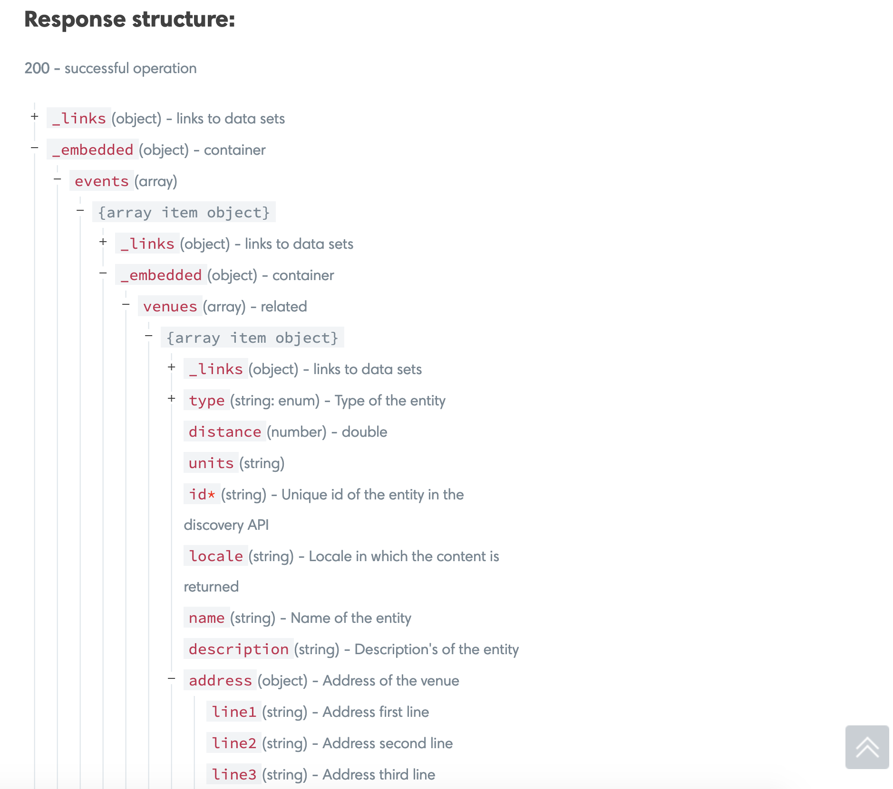
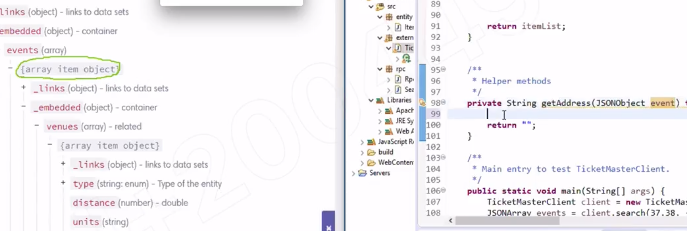
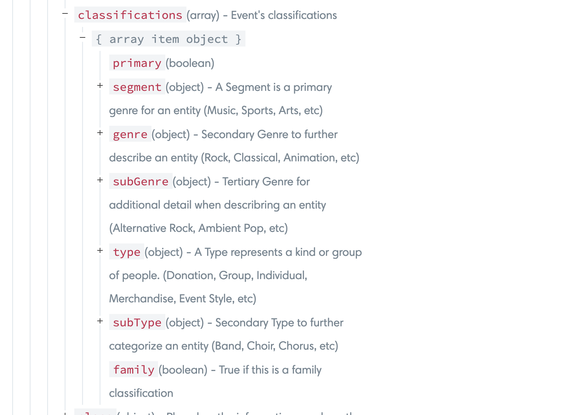
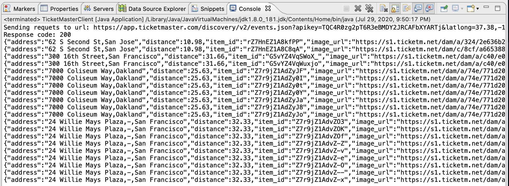
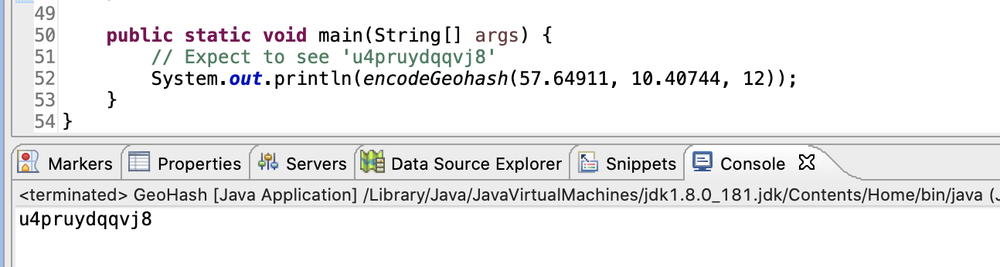
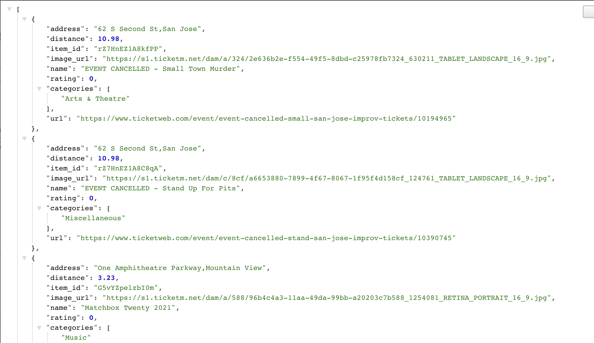

## TicketMaster API II

- Goal:
  - Understand how to create object with builder pattern.
  - Purify events data returned from TicketMaster API to only have information we need.

- Purify Data from TicketMaster
  - TicketMaster response is dirty. We’ll try to find and save fields that are needed 
    by our project.


- Step 1, create an Item class to hold data fields that are needed for our project
- Step 1.1 Create an `entity` package under `src` folder and then create a Item.java class inside.


- Step 1.2, Copy the following private fields into Item class.

```java
package entity;

import java.util.Set;

public class Item {
	private String itemId;
	private String name;
	private double rating;
	private String address;
	private Set<String> categories;
	private String imageUrl;
	private String url;
	private double distance;
}
```

- Step 1.3, to make data fields can be accessed by others, normally we need Getter and Setter
  for each of them. In this case, we just need Getters because 
  we don’t want to change an item instance once it’s constructed.


- Step 1.4, Add `toJSONObject()` method. Why? To convert an Item object a JSONObject 
  instance because in our application, frontend code cannot understand Java class, 
  it can only understand JSON.

```java
package entity;
import java.util.Set;
import org.json.JSONArray;
import org.json.JSONException;
import org.json.JSONObject;

public class Item {
	private String itemId;
	private String name;
	private double rating;
	private String address;
	private Set<String> categories;
	private String imageUrl;
	private String url;
	private double distance;
	
	public String getItemId() {
		return itemId;
	}
	public String getName() {
		return name;
	}
	public double getRating() {
		return rating;
	}
	public String getAddress() {
		return address;
	}
	public Set<String> getCategories() {
		return categories;
	}
	public String getImageUrl() {
		return imageUrl;
	}
	public String getUrl() {
		return url;
	}
	public double getDistance() {
		return distance;
	}

	public JSONObject toJSONObject() {
		JSONObject obj = new JSONObject();
		try {
			obj.put("item_id", itemId);
			obj.put("name", name);
			obj.put("rating", rating);
			obj.put("address", address);
			obj.put("categories", new JSONArray(categories));
			obj.put("image_url", imageUrl);
			obj.put("url", url);
			obj.put("distance", distance);
		} catch (JSONException e) {
			e.printStackTrace();
		}
		return obj;
	}	
}
```


- 最终的 object 还是要通过 `Servlet` 返回给前端来显示, 在返回数据的时候，前端不太理解 java 的 class
  还是得用 `json` 的格式

- 做数据处理，用 java 会比 javaScript 容易一些，或者说写起来会简单一些 
- 工业界也是如此，因为后端同时也会过滤掉 无效的数据

---

- Step 1.5, to create an instance of Item, we need to have constructors.
  - But think about this question before adding new constructors: could you guarantee 
    that TicketMaster can return all data fields to us every time? If it returns null 
    for some data field, how could your constructor deal with that? 
    Or do we have a better solution to handle this problem?


#### Builder Pattern

- Builder pattern builds a complex object using simple objects and using a 
  step by step approach. It separates the construction of a complex object from its 
  representation so that the same construction process can create different representations. 
  We can also make the object to build immutable. 


- Step 1.5.1, Add static class ItemBuilder in Item class. 
  Copy all fields from Item to ItemBuilder.


```java
	public static class ItemBuilder {
		private String itemId;
		private String name;
		private double rating;
		private String address;
		private Set<String> categories;
		private String imageUrl;
		private String url;
		private double distance;
	}
```


- Step 1.5.2 Generate Setters for all data fields in ItemBuilder


```java
	public static class ItemBuilder {
		private String itemId;
		private String name;
		private double rating;
		private String address;
		private Set<String> categories;
		private String imageUrl;
		private String url;
		private double distance;
		public void setItemId(String itemId) {
			this.itemId = itemId;
		}
		public void setName(String name) {
			this.name = name;
		}
		public void setRating(double rating) {
			this.rating = rating;
		}
		public void setAddress(String address) {
			this.address = address;
		}
		public void setCategories(Set<String> categories) {
			this.categories = categories;
		}
		public void setImageUrl(String imageUrl) {
			this.imageUrl = imageUrl;
		}
		public void setUrl(String url) {
			this.url = url;
		}
		public void setDistance(double distance) {
			this.distance = distance;
		}
	}
```


- Step 1.5.3 Define a build function to create a ItemBuilder object from Item object.

```java
		public Item build() {
			return new Item(this);
		}
```


- Step 1.5.4 Create a private constructor to use builder pattern.


```java
public class Item {
	private String itemId;
	private String name;
	private double rating;
	private String address;
	private Set<String> categories;
	private String imageUrl;
	private String url;
	private double distance;
	
	
	//由于 ItemBuilder 是一个静态嵌套在 Item 里，所以可以直接调用 filed
	private Item(ItemBuilder builder) {
		this.itemId = builder.itemId;
		this.name = builder.name;
		this.rating = builder.rating;
		this.address = builder.address;
		this.categories = builder.categories;
		this.imageUrl = builder.imageUrl;
		this.url = builder.url;
		this.distance = builder.distance;
	}
	

	public String getItemId() {
		return itemId;
	}
	public String getName() {
		return name;
	}
	public double getRating() {
		return rating;
	}
	public String getAddress() {
		return address;
	}
	public Set<String> getCategories() {
		return categories;
	}
	public String getImageUrl() {
		return imageUrl;
	}
	public String getUrl() {
		return url;
	}
	public double getDistance() {
		return distance;
	}

	public JSONObject toJSONObject() {
		JSONObject obj = new JSONObject();
		try {
			obj.put("item_id", itemId);
			obj.put("name", name);
			obj.put("rating", rating);
			obj.put("address", address);
			obj.put("categories", new JSONArray(categories));
			obj.put("image_url", imageUrl);
			obj.put("url", url);
			obj.put("distance", distance);
		} catch (JSONException e) {
			e.printStackTrace();
		}
		return obj;
	}
	
    //假如这里没有 static 关键字，那必须先创建 Item 对象，然后你才能调用 ItemBuilder
    //所以在这个设计思维里，不能没有 static 关键字 ！
	public static class ItemBuilder {//同时我们还不能把ItemBuilder 单独建立在entry包底下，
		private String itemId; //因为如果这么做，private Item(ItemBuilder builder), 就无效了  
		private String name;
		private double rating;
		private String address;
		private Set<String> categories;
		private String imageUrl;
		private String url;
		private double distance;
		public void setItemId(String itemId) {
			this.itemId = itemId;
		}
		public void setName(String name) {
			this.name = name;
		}
		public void setRating(double rating) {
			this.rating = rating;
		}
		public void setAddress(String address) {
			this.address = address;
		}
		public void setCategories(Set<String> categories) {
			this.categories = categories;
		}
		public void setImageUrl(String imageUrl) {
			this.imageUrl = imageUrl;
		}
		public void setUrl(String url) {
			this.url = url;
		}
		public void setDistance(double distance) {
			this.distance = distance;
		}
		
		
		
		public Item build() {
			return new Item(this);
		}
		
		
		
	}
	
	public static void main(String[] args) {
		ItemBuilder builder = new ItemBuilder();
		
		builder.setItemId("1234");
		builder.setAddress("abcd");
		builder.setName("Tom");
		
		Item item = builder.build();
	}
}	
```

- 假如希望设置 `Item` 的 filed is immutable, 就不能用 `set()`
- 但是我们可以通过 设置 `ItemBuilder` mutable, 可以调用 `set()`

---

- Step 2, use Item class in TicketMaster API to get clean data.

- Step 2.1, add purify method in TicketMasterClient.java to convert JSONArray to a list of items.


```java
	// Convert JSONArray to a list of item objects.
	private List<Item> getItemList(JSONArray events) throws JSONException {
		List<Item> itemList = new ArrayList<>();

		return itemList;
	}
```


- Step 2.2, implement some helper methods to fetch data fields which 
  are included deeply in TicketMaster response body.
  - 有些 api filed 藏得比较深，所以我们需要通过 helper 来获得这些深入数据  


- Step 2.2.1, fetch address from event JSONObject.





- 可以从图中看到，传进来的根结点 在画圈位置

```java
	/**
	 * Helper methods
	 */
	private String getAddress(JSONObject event) throws JSONException {
		if (!event.isNull("_embedded")) {
			JSONObject embedded = event.getJSONObject("_embedded");
			if (!embedded.isNull("venues")) {
				JSONArray venues = embedded.getJSONArray("venues");
				StringBuilder builder = new StringBuilder();
				for (int i = 0; i < venues.length(); i++) {// since venues(array) is an array
					JSONObject venue = venues.getJSONObject(i);
					if (!venue.isNull("address")) {
						JSONObject address = venue.getJSONObject("address");
						if (!address.isNull("line1")) {
							builder.append(address.getString("line1"));
						}
						if (!address.isNull("line2")) {
							builder.append(",");
							builder.append(address.getString("line2"));
						}
						if (!address.isNull("line3")) {
							builder.append(",");
							builder.append(address.getString("line3"));
						}
					}
					if (!venue.isNull("city")) {
						JSONObject city = venue.getJSONObject("city");
						builder.append(",");
						builder.append(city.getString("name"));
					}

					String result = builder.toString();
					if (!result.isEmpty()) {
						return result;
					}
				}
			}
		}
		return "";
	}
```


- Step 2.2.2, fetch imageUrl from event JSONObject. Try to implement this yourself.

```java
	private String getImageUrl(JSONObject event) throws JSONException {
		if (!event.isNull("images")) {
			JSONArray array = event.getJSONArray("images");
			for (int i = 0; i < array.length(); i++) {
				JSONObject image = array.getJSONObject(i);
				if (!image.isNull("url")) {
					return image.getString("url");
				}
			}
		}
		return "";
	}

```


- Step 2.2.3, fetch Categories from event JSONObject.



```java
	private String getImageUrl(JSONObject event) throws JSONException {
		if (!event.isNull("images")) {
			JSONArray array = event.getJSONArray("images");
			for (int i = 0; i < array.length(); i++) {
				JSONObject image = array.getJSONObject(i);
				if (!image.isNull("url")) {
					return image.getString("url");
				}
			}
		}
		return "";
	}
```

---

- 到这里三个 helper 已经写完

- Step 2.3, implement `getItemList` method.

```java
	// Convert JSONArray to a list of item objects.
	private List<Item> getItemList(JSONArray events) throws JSONException {
		List<Item> itemList = new ArrayList<>();
		for(int i = 0; i < events.length(); i++) {
			JSONObject event = events.getJSONObject(i);
			ItemBuilder builder = new ItemBuilder();
			if(!event.isNull("id")) {
				builder.setItemId(event.getString("id"));
			}
			if(!event.isNull("name")) {
				builder.setName(event.getString("name"));
			}	
			if(!event.isNull("url")) {
				builder.setUrl(event.getString("url"));
			}	
			if(!event.isNull("distance")) {
				builder.setDistance(event.getDouble("distance"));
			}				
			builder.setAddress(getAddress(event));
			builder.setCategories(getCategories(event));
			builder.setImageUrl(getImageUrl(event));
			
			itemList.add(builder.build());
		}

		return itemList;
	}
```

---

- Step 2.4, Modify `search` function to use `getItemList` and return a `list` of Item 
  instead of `JSONArray`. 

```java
	public List<Item> search(double lat, double lon, String keyword) {
		// if keyword is null, we need to handle
		if (keyword == null) {
			keyword = DEFAULT_KEYWORD;
		}

		try {// if keyword is Chinese, we need to handle
			keyword = URLEncoder.encode(keyword, "UTF-8");
			// encode 可以处理特殊字符，中文，空格，拉丁文 转译成 URL 可以识别的字符
			// "Java Servlet" => "Java%20Servlet"
		} catch (UnsupportedEncodingException e) {
			e.printStackTrace();
		}

		String query = String.format("apikey=%s&latlong=%s,%s&keyword=%s&radius=%s", API_KEY, lat, lon, keyword, 50);
		String url = HOST + ENDPOINT + "?" + query;
		StringBuilder responseBody = new StringBuilder();

		try {
			// Create a URLConnection instance that represents a connection to the remote
			// object referred to by the URL. The HttpUrlConnection class allows us to
			// perform basic HTTP requests without the use of any additional libraries.			
			HttpURLConnection connection = (HttpURLConnection) new URL(url).openConnection();
			connection.setRequestMethod("GET");
			
			// Get the status code from an HTTP response message. To execute the request we
			// can use the getResponseCode(), connect(), getInputStream() or
			// getOutputStream() methods.			
			int responseCode = connection.getResponseCode();
			// this line，there are two operations：1. 发送请求 2. get response code
			System.out.println("Sending requets to url: " + url);
			System.out.println("Response code: " + responseCode);

			if (responseCode != 200) {// if code is not 200, fail, return empty
//				return new JSONArray();
				return new ArrayList<>();				
			}
			// connection.getInputStream();
			// 这里是 getInputStream(), 是因为, client get response as input
			/**
			 * => output(request) Client ----------------------- Server(Ticket) <=
			 * input(response)
			 */
			BufferedReader reader = new BufferedReader(new InputStreamReader(connection.getInputStream()));
			String line;
			while ((line = reader.readLine()) != null) {
				responseBody.append(line);
			}
			reader.close();

		} catch (MalformedURLException e) {
			e.printStackTrace();
		} catch (IOException e) {
			e.printStackTrace();
		}

		try {
			// Extract events array only.			
			JSONObject obj = new JSONObject(responseBody.toString());
			if (!obj.isNull("_embedded")) {
				JSONObject embedded = obj.getJSONObject("_embedded");
//				return embedded.getJSONArray("events");
				return getItemList(embedded.getJSONArray("events"));				
			}
		} catch (JSONException e) {
			e.printStackTrace();
		}
//		return new JSONArray();
		return new ArrayList<>();		
	}
```


- Step 2.5, Update main function accordingly to print item list.

```java
	/**
	 * Main entry to test TicketMasterClient.
	 */
	public static void main(String[] args) {
		TicketMasterClient client = new TicketMasterClient();
//		JSONArray events = client.search(37.38, -122.08, null);
	
//		try {
//			for (int i = 0; i < events.length(); ++i) {
//				JSONObject event = events.getJSONObject(i);
//				System.out.println(event.toString(2));
//			}
//		} catch (Exception e) {
//			e.printStackTrace();
//		}
		
		List<Item> events = client.search(37.38, -122.08, null);	
		for(Item event: events) {
			System.out.println(event.toJSONObject());
		}
	}
```

- Step 2.6, Save your changes. Right click TicketMasterClient.java and select 
  “Run As Java Application”. Make sure your console in Eclipse 
  can print something like below.



---

## use `geoPont` instead `latlong`

- since `ticketMaster API` said to latlong, Filter events by latitude and longitude, 
  this filter is deprecated(不赞成的) and maybe removed in a future release, 
  please use `geoPoint` instead


#### Step 3, (optional) use geoPoint instead of latlong.

- Since TicketMaster suggested to use `geoPoint` instead of latlong in request, 
  we can create a helper class to do GeoHash encoding.

- Step 3.1, create a new class under external package and name it `GeoHash`. 
  Then copy the following code into your class.

```java
package external;

public class GeoHash {
	private static final String BASE_32 = "0123456789bcdefghjkmnpqrstuvwxyz";

	private static int divideRangeByValue(double value, double[] range) {
		double mid = middle(range);
		if (value >= mid) {
			range[0] = mid;
			return 1;
		} else {
			range[1] = mid;
			return 0;
		}
	}

	private static double middle(double[] range) {
		return (range[0] + range[1]) / 2;
	}

	public static String encodeGeohash(double latitude, double longitude, int precision) {
		double[] latRange = new double[] { -90.0, 90.0 };
		double[] lonRange = new double[] { -180.0, 180.0 };
		boolean isEven = true;
		int bit = 0;
		int base32CharIndex = 0;
		StringBuilder geohash = new StringBuilder();

		while (geohash.length() < precision) {
			if (isEven) {
				base32CharIndex = (base32CharIndex << 1) | divideRangeByValue(longitude, lonRange);
			} else {
				base32CharIndex = (base32CharIndex << 1) | divideRangeByValue(latitude, latRange);
			}

			isEven = !isEven;

			if (bit < 4) {
				bit++;
			} else {
				geohash.append(BASE_32.charAt(base32CharIndex));
				bit = 0;
				base32CharIndex = 0;
			}
		}

		return geohash.toString();
	}

	public static void main(String[] args) {
		// Expect to see 'u4pruydqqvj8'
		System.out.println(encodeGeohash(57.64911, 10.40744, 12));
	}
}
```

- Step 3.2, To test your encode method, you can right click GeoHash.java and select 
  “Run As Java Application”. Result in console will be the GeoHash 
  for the given latitude and longitude in main function.




- Step 3.3, update search method to use `encodeGeoHash()`.
  - update `TicketMasterClient`'s `serach()`

```java
		String geoHash = GeoHash.encodeGeohash(lat, lon, 8);
//		String query = String.format("apikey=%s&latlong=%s,%s&keyword=%s&radius=%s", API_KEY, lat, lon, keyword, 50);
		String query = String.format("apikey=%s&geoPoint=%s&keyword=%s&radius=%s", API_KEY, geoHash, keyword, 50);
```


---

## Update SearchItem Servlet

- Step 1, Update `doGet()` method in rpc/SearchItems.java to use handled item list
  returned from TicketMasterClient.

```java
	protected void doGet(HttpServletRequest request, HttpServletResponse response)
			throws ServletException, IOException {

		double lat = Double.parseDouble(request.getParameter("lat"));
		double lon = Double.parseDouble(request.getParameter("lon"));

		TicketMasterClient client = new TicketMasterClient();
		List<Item> items = client.search(lat, lon, null);
		JSONArray array = new JSONArray();
		for (Item item : items) {
			array.put(item.toJSONObject());
		}
//		RpcHelper.writeJsonArray(response, client.search(lat, lon, null));
		RpcHelper.writeJsonArray(response, array);

	}
```


- Step 2, Save your changes and restart Tomcat server. Open your browser(or postman) 
  and put the following url: `http://localhost:8080/Jupiter/search?lat=37.38&lon=-122.08` 
  in the address bar.




