# Web Application Basics

- 我已经安装过 `Eclipse IDE for Enterprise`, 所以略过

- `Tomcat server`, 我也已经安装过了

- 这里java servlet, 我就还是用 `Eclipse Enterprise`

---

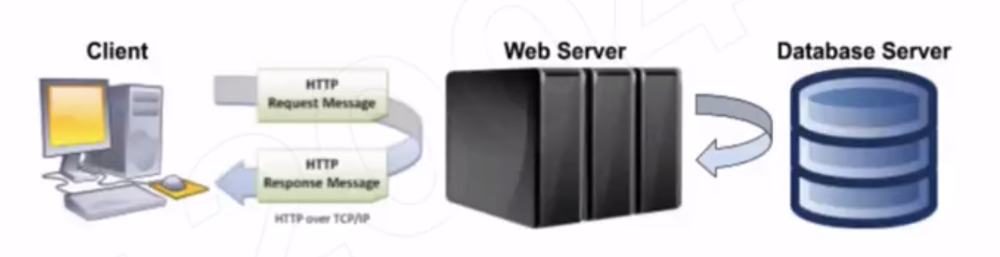

- Client: user interface
  - A user interface is for user to interact with web services. UI can provide an easy
    way for you to send request to backend service, and show you the corresponding
    response. It usually runs in the browser, but can be provided by mobile apps.

- Web Server: host web service
  - Service is a program can receive different requests from different clients and 
    return correct result, a web service is a service offered by a device to others over 
    the internet.

- Database Server: host a database
  - A database is an organized collection of data, stored and accessed electronically.

- Internet
  - Make connection between client and server so that client can successfully send 
    request to server, and server can successfully send response to client.
    - Make sure request/response destination is correct.
    - Make sure delivering connection is open for data transportation.
    - Make sure data format is understandable.

---

## How to build a web application

- Three tier architecture

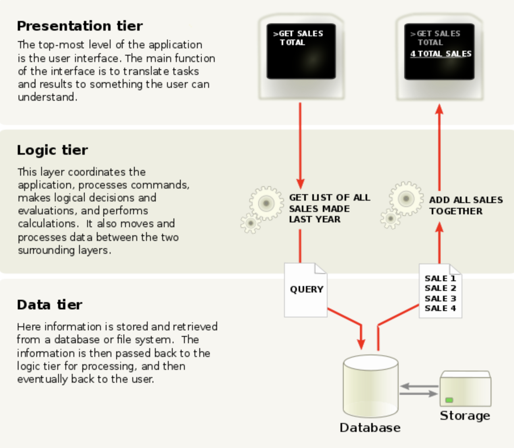

- Overview of our project
- Ticket+:Event Search and Ticket Recommendation
- The project aims to use personalization to improve ticket search and recommendation
  - Created Java servlets with RESTful APIs to handle HTTP requests and responses
  - Built relational and NoSQL databases (MySQL, MongoDB) to capture event data 
    (name, description, location, parking info) from TicketMaster API
  - Designed algorithms (e.g., content-based recommendation) to improve 
    event recommendation based on search history and favorite records
  - Deployed server to Amazon EC2 to handle 150 queries per second tested by Apache JMeter.  

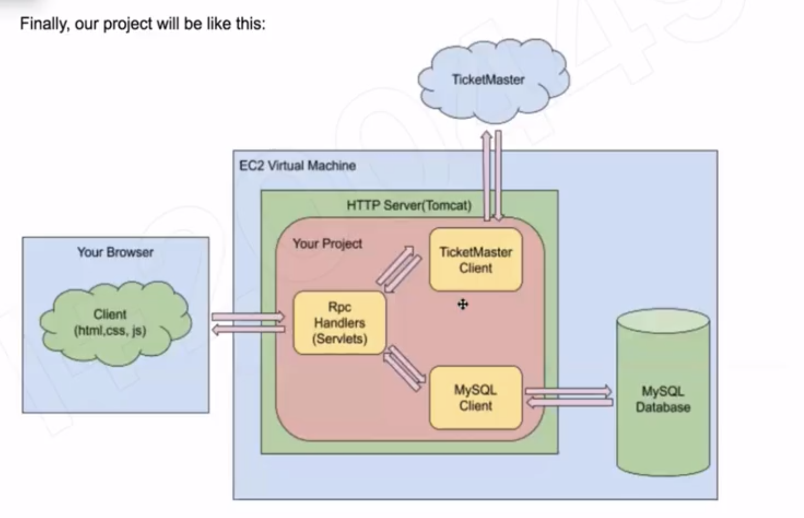

---

## Setup Tomcat Server

- Tomcat
  - Apache Tomcat, often referred to as Tomcat Server, is an open-source Java Servlet 
    Container developed by the Apache Software Foundation (ASF). 
    Tomcat implements several Java EE specifications including Java Servlet, 
    JavaServer Pages (JSP), Java EL, and WebSocket, 
    and provides a "pure Java" HTTP web server environment in which Java code can run.
    - RPC(Remote Procedure Call): a function call to a remote server.
    - Java Servlet: Java class to handle RPC on server side.
    - Tomcat is an environment to run your web service, it provides low level support 
      such as making TCP connection, receiving request from client, 
      finding the correct service to handle that request, and sending response back.
    - If you want to create a web service based on Tomcat Server, 
      all you need to do is implement the logic to handle certain HTTP request.  

---

- Step 1, create a new Workspace. Open Eclipse. In ‘File’ -> ‘Switch Workspace’ -> ‘Other’. 
  Choose an empty folder.

- Step 2, (optional) reset view. In ‘Window’->’Reset Perspective...’

- Step 3, add Tomcat Server.
  - Step 3.1, in ‘Servers’ window, click ‘No servers are available. 
    If you cannot find ‘Servers’, go to ‘Window’->’Show View’->’Servers’ 
    and then ‘Servers’ would show up.
  - Step 3.2, choose ‘Apache’->’Tomcat v9.0 Server’ and click Next. 
    If you cannot find Tomcat v9.0 Server, it’s because the Eclipse version is too old. 
    Either use a newer version of Eclipse or download an older version of Tomcat.  

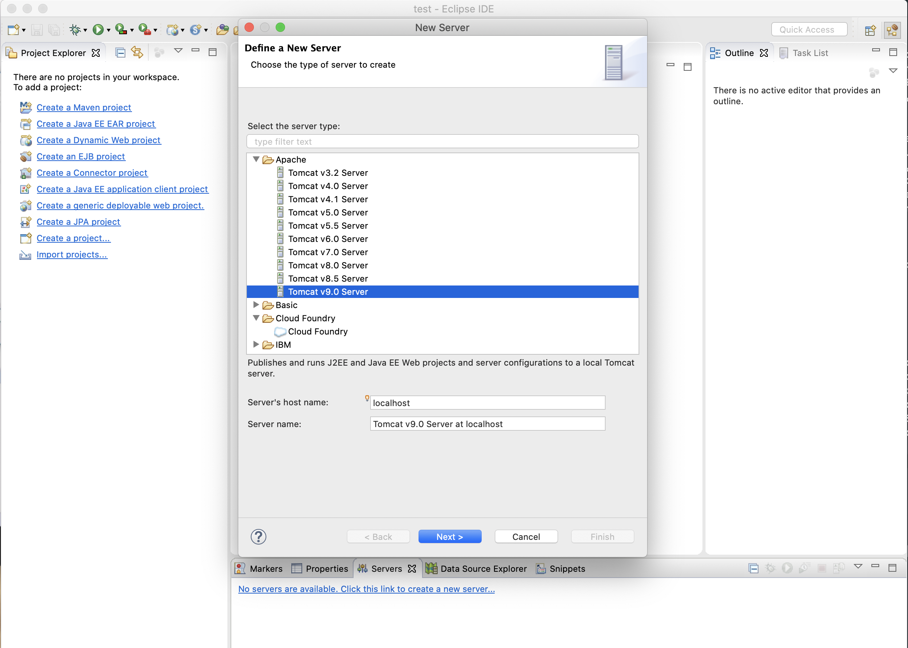

- [download tomcat 9.0 : tar.gz (pgp, sha512) for macOs](https://tomcat.apache.org/download-90.cgi)

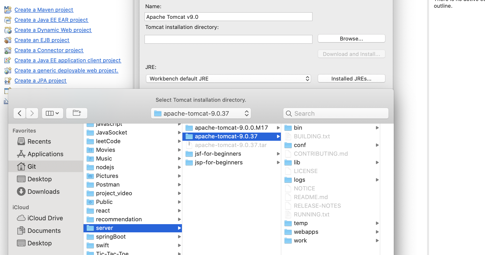

- 选中： tomcat-9.037

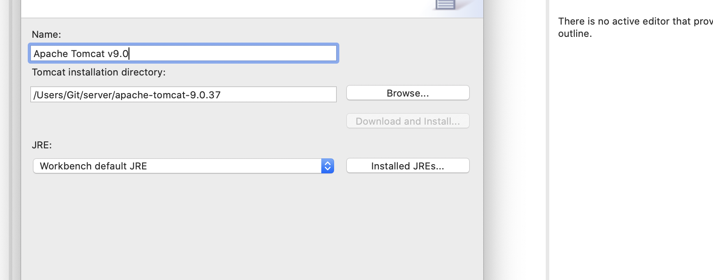

- click `next`, => finish

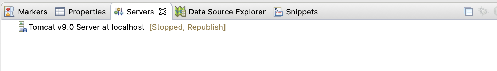

- 双击 `Stopped, Republish`

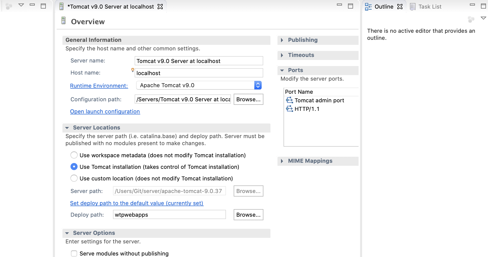

- `command + s` to save

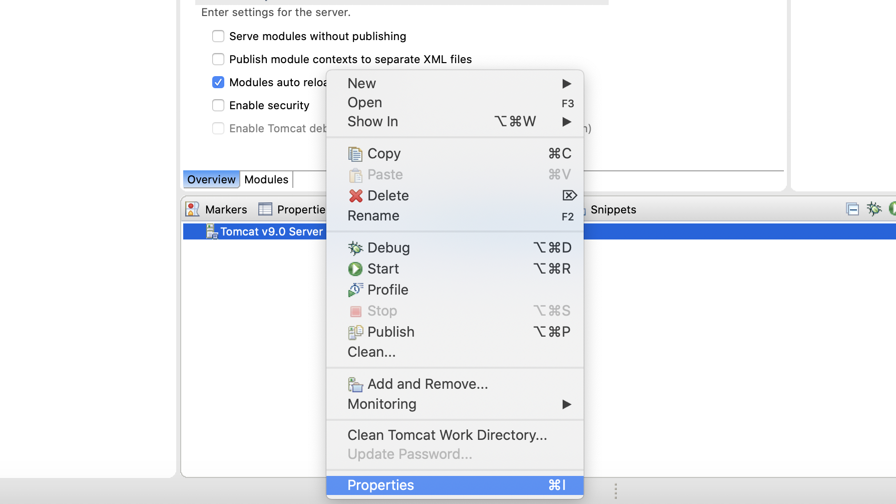

- click `properties`

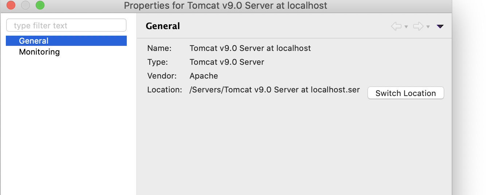

- `switch location`

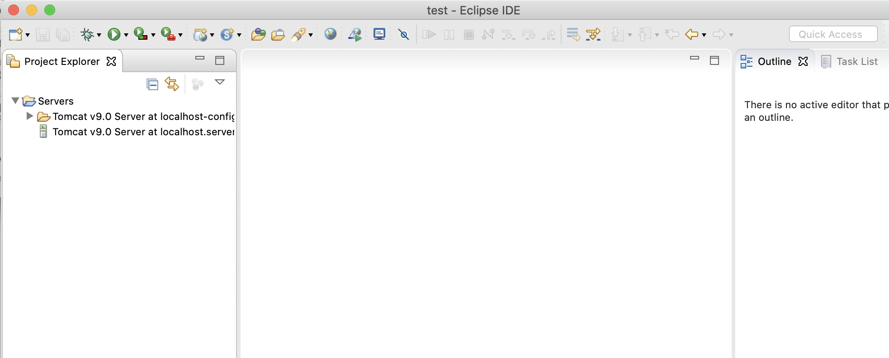

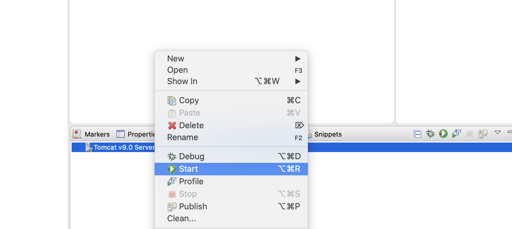

- run server

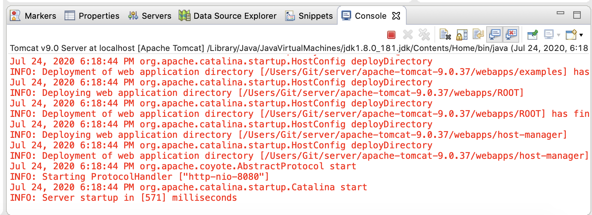

---

## 建立一个新的 dynamic project

- Step 1, go to ‘File’ ->’New’->’Dynamic Web Project’

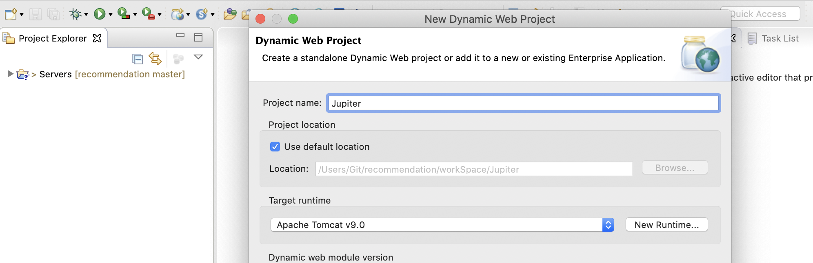

- click `finish`

- there should be not error

- Step 3.1, to add a library: right click Jupiter, select ’Properties’.

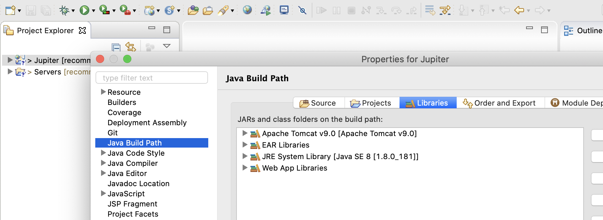

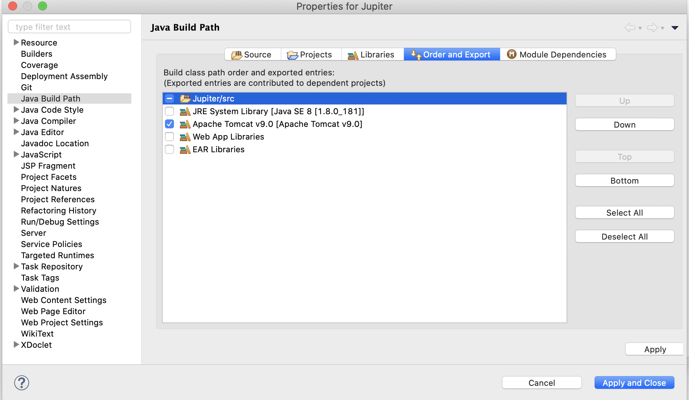

- 看到以上这张图所示，说明一切正常

- Step 4, add Jupiter to hosted app.
  
- Step 4.1, right click on your ‘Tomcat v9.0 server at localhost’ 
  and choose ‘Add and Remove’

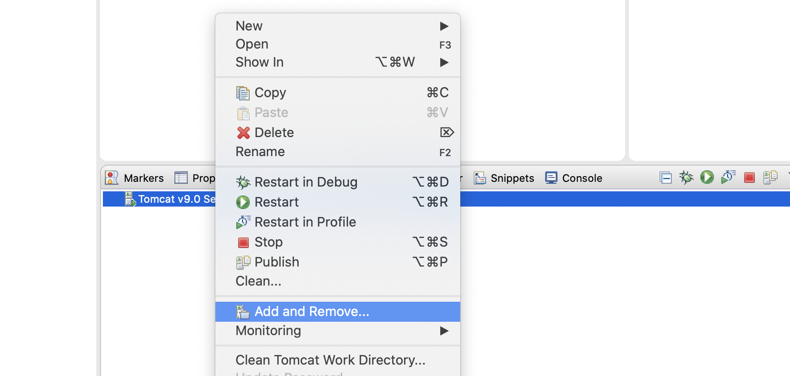
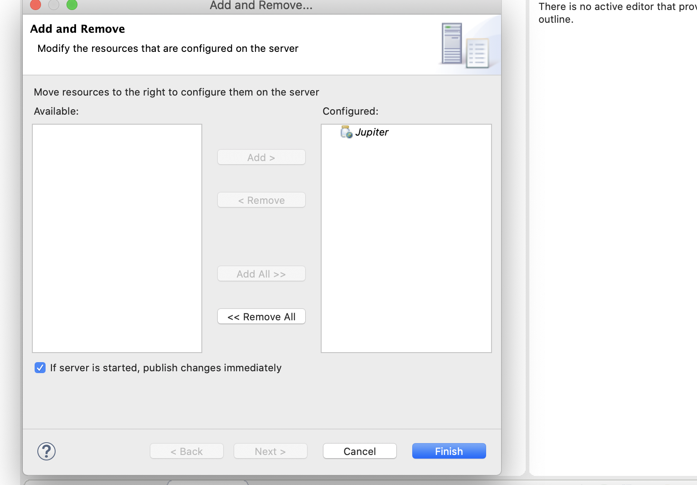

- click `finish`

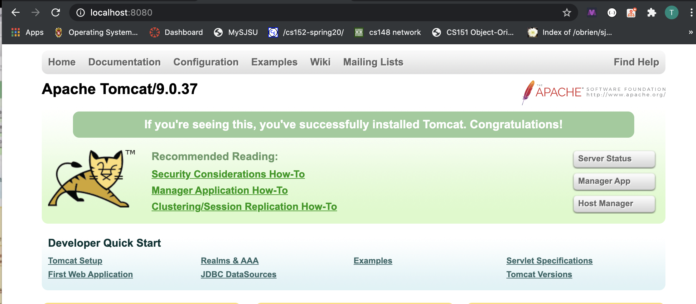

- input address, no problem.

