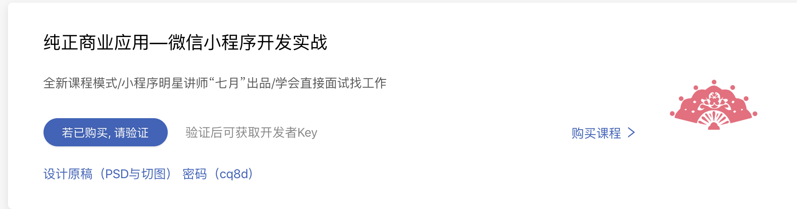
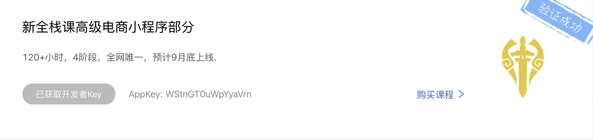

# 5. appkey apply
- http://talelin.unna.com.cn

- create a new account
- my email `1219.zheng@gmail.com`


- input my moke id
---


- `WStnGT0uWpYyaVrn`
---

## involve server API

- packaging API
- reading wexin documentation
https://developers.weixin.qq.com/miniprogram/dev/framework/app-service/api.html
- event listening
- click `pages/home/home.js`

```js
  /**
   * Lifecycle function--listening when page load
   */
  onLoad: function (options) {
    wx.request({
      // url: 'http://se.7yue.pro/v1/theme/by/names?names=t-1',
      url: 'http://se.7yue.pro/v1/theme/by/names',
      method: 'GET',
      data: {
        names: 't-1'
      },
      header: {
        appkey: 'WStnGT0uWpYyaVrn'
      }
    })
  },
```
- but this style is not good, we can package these data
### create a project root directory `config/config.js`


```js
const config = {
    appkey: 'WStnGT0uWpYyaVrn',
    apiBaseUrl: 'http://se.7yue.pro/v1/'
};

export {
    config
}

//module.exports
```
---

## back to wechat miniApp
- click setting -> Project setting

