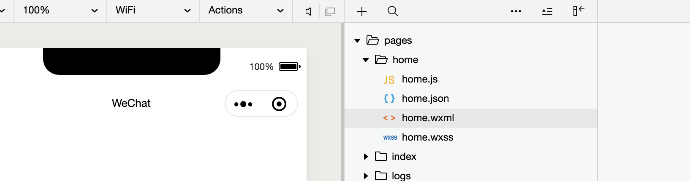
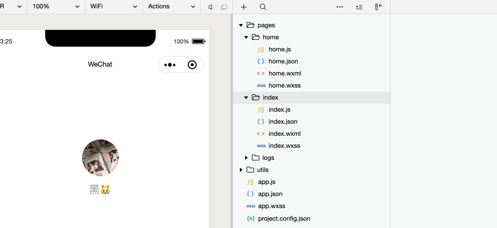
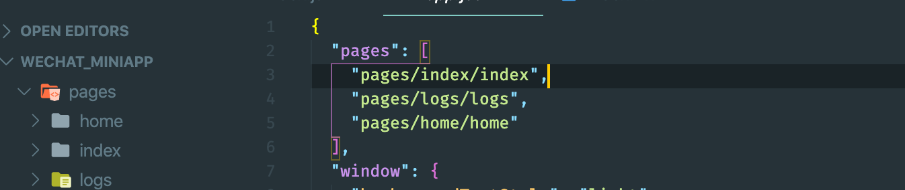
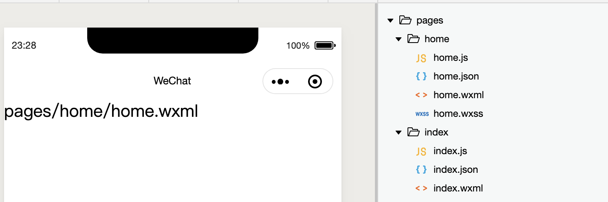
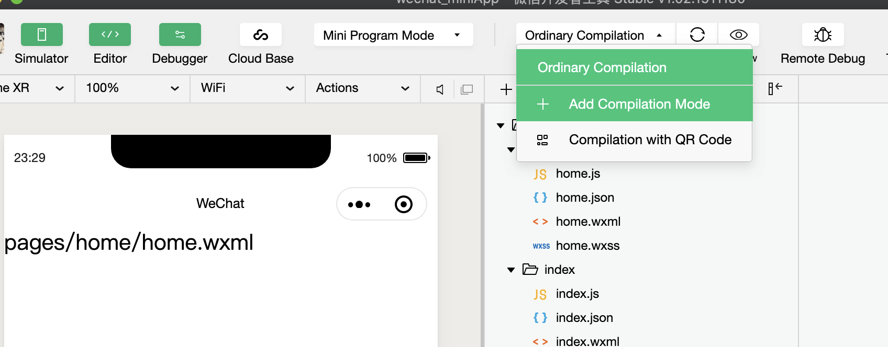
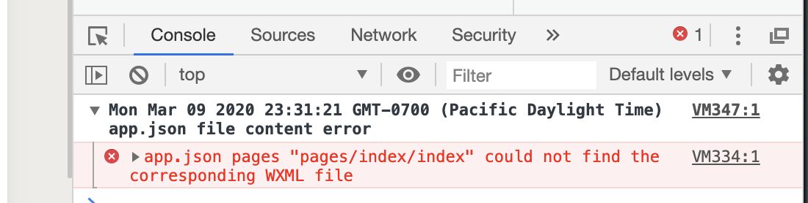
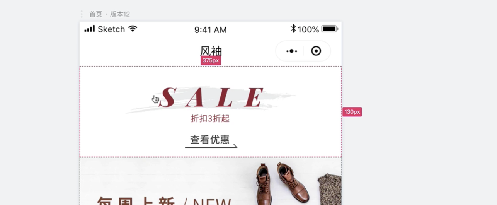

## create my page

- create a new folder `home` in `pages`


- main screen still point to index.js
- we can change that by modify app.json

- we can change the home's order

---
- Or: choose `Add Compilation Mode`


- now we can remove `index` and `logs`
- at the same time, 

- this error tell us that we need to remove `index` and `logs` 
  in `app.json`
---

## Note: all images are dynamic and we may adjust them

- open home.wxml
- create a `image` tag, set top-theme's styles
- click `home.wxss`


- width fills entire screen
- home.wxml  
```html
<view>
	<image class="top-theme" src="" />
</view>
```
- home.wxss
```css
.top-theme{
    width:100%;  /*if u can use 100%, don't use 750 rpx*/
    height: 260rpx;
}
/* option+command+L */
```
---


## about `appkey` 

- http://talelin.unna.com.cn