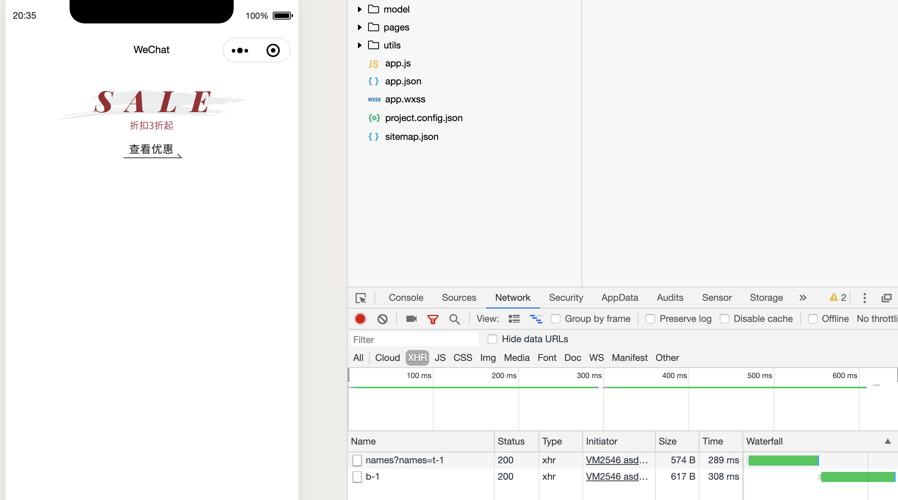

#  get the banner(横幅，标语) data

- [获取API banner 清单](https://course.talelin.com/lin/sleeve/3%20API%EF%BC%9ABanner.html#banner)

- create `model/banner.js`

```js
/**
 * Author: Tom Zheng
 */
import { Http } from "../utils/http";

class Banner {
    static locationB = 'b-1';

    static async getHomeLocationB() {
        return await Http.request({
            url: `banner/name/${Banner.locationB}`
        })
    }
}

export {
    Banner
}
```

---
- 再次修改 `page/home/home.js`

```js
import { config } from "../../config/config"
import { Theme } from "../../model/theme"
import { Banner } from "../../model/banner"

// pages/home/home.js
Page({

  /**
   * Page initial data
   */
  data: {
    themeA: null,
    bannerB: null,
  },

  /**
   * Lifecycle function--listening when page load
   * JS 类型的约束
   * 业务逻辑
   * 数据绑定
   * view视图层 业务逻辑层 桥梁 中间层
   * mvc C controller
   * Model, Logic, Service
   * Service, Manager,  
   */
  async onLoad(options) {
    //在这里使用 async and await 就不需要 callback function
    this.initAllData()
  },

  async initAllData() {
    const themeA = await Theme.getHomeLocationA()
    const bannerB = await Banner.getHomeLocationB()
    this.setData({
      themeA: themeA[0],
      bannerB
    })
  },

  /**
   * Page event handler function--listening when user drop down
   */
  onPullDownRefresh: function () {

  },

  /**
   * Called when page reach bottom
   */
  onReachBottom: function () {

  },

  /**
   * Called when user click on the top right corner to share
   */
  onShareAppMessage: function () {

  }
})
```

---
- 同时修改  `pages/home/home.wxml`

```html
<!--pages/home/home.wxml-->
<view>
	<image class="top-theme" src="{{themeA.entrance_img}}" />
</view>
```


- 可以看到，我们获取了两个数据

