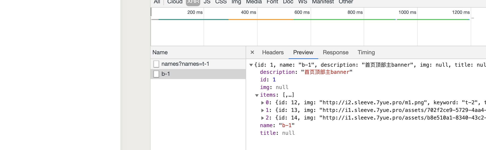
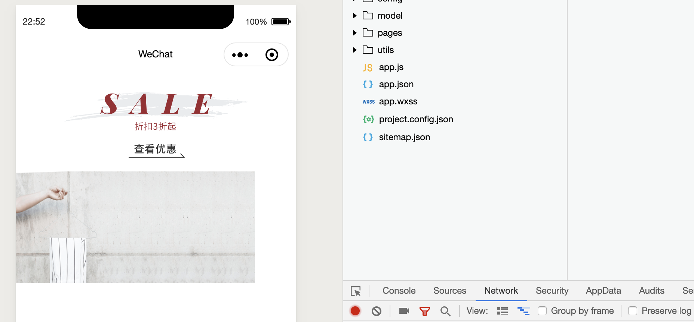
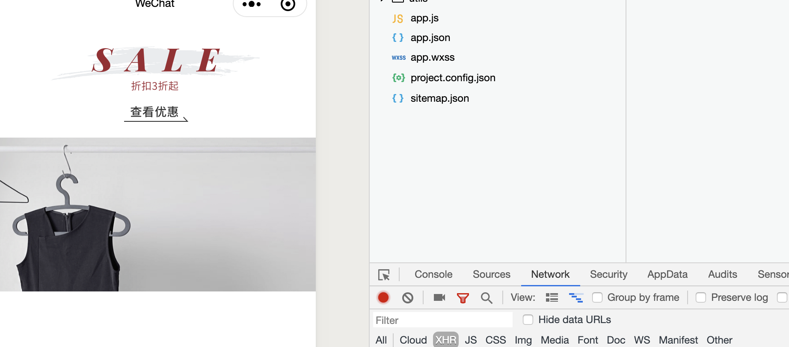
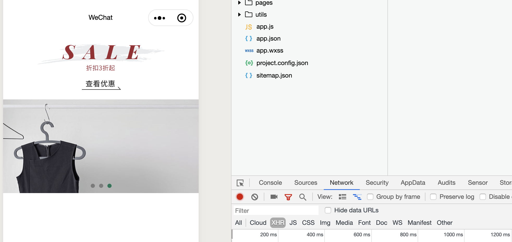

# banner carousel(轮播图) implementation | 插槽



- `<swiper>` 必须结合 `<swiper-item>` 这个组建一起使用，
  - `<swiper-item>` 也是小程序原生组件

- 同时当 `banner.js` export 出当前组件，
  - `home.wxml` 也可以接收到组件

## home.wxml

```html
<!--pages/home/home.wxml-->
<view>
	<image class="top-theme" src="{{themeA.entrance_img}}" />
	<swiper class="swiper">
		<block wx:for="{{bannerB.items}}">
			<swiper-item>
				<image class="swiper" src="{{item.img}}" />
			</swiper-item>
		</block>
	</swiper>
</view>
```


- 现在已经可以看到 banner carousel, 只不过还需要补充样式

- update `home.wxss`

```css
/* pages/home/home.wxss */
.top-theme{
    width:100%;  /*if u can use 100%, don't use 750 rpx*/
    height: 260rpx;
}

.swiper{
    width:100%;
    height: 360rpx;
}
/* option+command+L */
```



- 但是现在还没办法滚动，所以我们 继续装饰 swiper 组件, indicator-dots
  - 同时设置 indicator-active-color 颜色
  - 设置自动播放功能， autoplay
  - 设置循环播放， circular
```html
<!--pages/home/home.wxml-->
<view>
	<image class="top-theme" src="{{themeA.entrance_img}}" />
	<swiper
	 class="swiper"
	 indicator-dots="{{true}}"
	 indicator-active-color="#157658"
	 autoplay="{{true}}"
	 circular="{{true}}"
	>
		<block wx:for="{{bannerB.items}}">
			<swiper-item>
				<image class="swiper" src="{{item.img}}" />
			</swiper-item>
		</block>
	</swiper>
</view>
```


