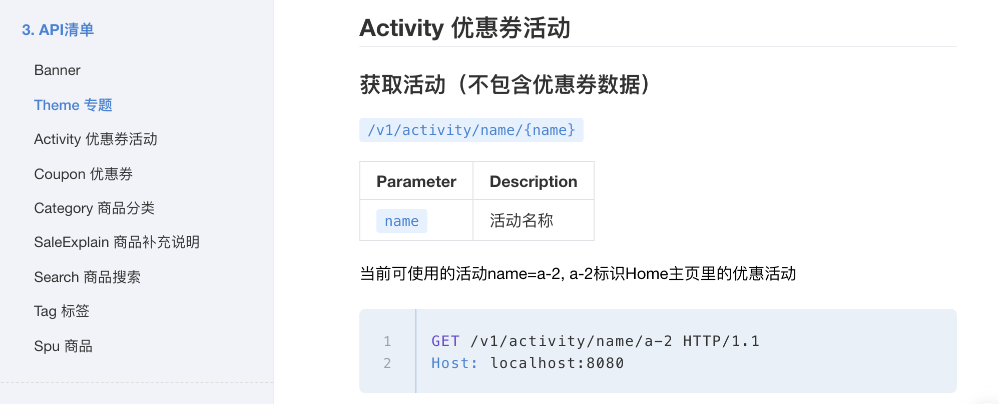

## Coupon Concept


- 先改一下 六宫格的函数名, `home.js`

```js
  async initAllData() {
    const themeA = await Theme.getHomeLocationA();
    const bannerB = await Banner.getHomeLocationB();
    const grid = await Category.getHomeLocationC();
    this.setData({
      themeA: themeA[0],
      bannerB,
      grid
    })
  },
```

- `category.js`

```js
import { Http } from "../utils/http";

class Category {
    static async getHomeLocationC() {
        return await Http.request({
            url: `category/grid/all`
        })
    }
}

export {
    Category
}
```

---




- create `model/Activity.js`

```js
import { Http } from "../utils/http";

class Activity {
    static locationD = 'a-2'
    static async getHomeLocationD() {
        return await Http.request({
            url: `activity/name/${Activity.locationD}`
        })
    }
}

export {
    Activity
}
```

- 同时修改 `home.js`

```js
import { config } from "../../config/config"
import { Theme } from "../../model/theme"
import { Banner } from "../../model/banner"
import { Category } from "../../model/category"
import { Activity } from "../../model/Activity"

// pages/home/home.js
Page({

  /**
   * Page initial data
   */
  data: {
    themeA: null,
    bannerB: null,
    grid: [],
    activityD: null
  },

  async onLoad(options) {
    //在这里使用 async and await 就不需要 callback function
    this.initAllData()
  },

  async initAllData() {
    const themeA = await Theme.getHomeLocationA();
    const bannerB = await Banner.getHomeLocationB();
    const grid = await Category.getHomeLocationC();
    const activityD = await Activity.getHomeLocationD();
    this.setData({
      themeA: themeA[0],
      bannerB,
      grid,
      activityD
    })
  },

```


- update `home.wxml`

```html
<!--pages/home/home.wxml-->
<view>
	<image class="top-theme" src="{{themeA.entrance_img}}" />
	<swiper
	 class="swiper"
	 indicator-dots="{{true}}"
	 indicator-active-color="#157658"
	 autoplay="{{true}}"
	 circular="{{true}}"
	>
		<block wx:for="{{bannerB.items}}">
			<swiper-item>
				<image class="swiper" src="{{item.img}}" />
			</swiper-item>
		</block>
	</swiper>

	<s-category-grid grid="{{grid}}" />

	<image class="activity" src="{{activityD.entrance_img}}" />
</view>
```


- set style `home.wxss`

```css
.activity{
    width:100%;
    height: 310rpx;
}
```


