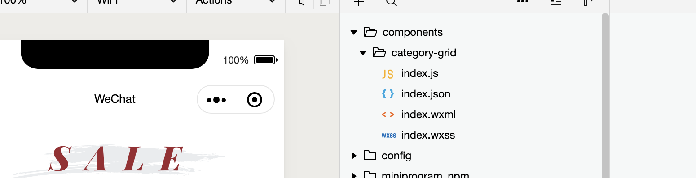
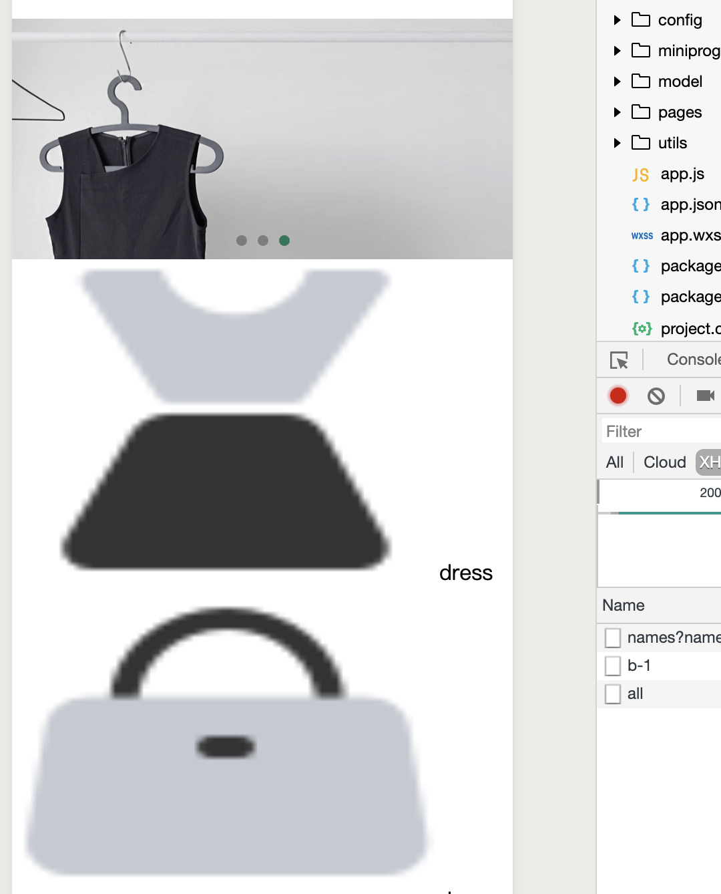
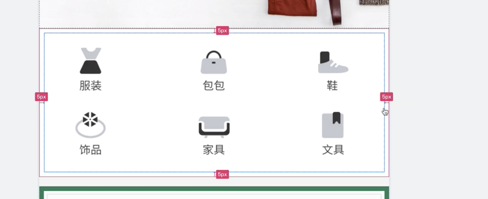
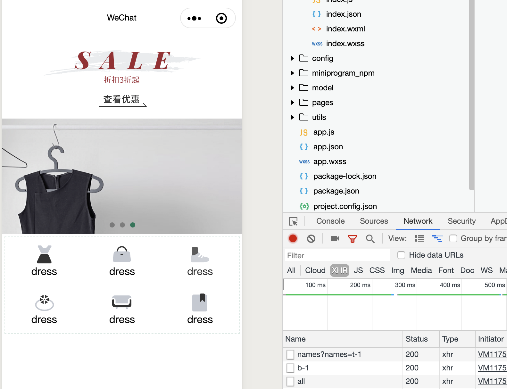

# LinUI Grid 组件分类六宫格

- 我们准备开始写一个自定义组件
- create `components/category-grid`
  - create `index`, 在小程序里，会同时新建4个文件



- `app.json` 是全局控制 components

```json
{
  "pages": [
    "pages/home/home"
  ],
  "window": {
    "backgroundTextStyle": "light",
    "navigationBarBackgroundColor": "#fff",
    "navigationBarTitleText": "WeChat",
    "navigationBarTextStyle": "black"
  },
  "style": "v2",
  "sitemapLocation": "sitemap.json",
  "usingComponents": {
    "l-grid": "/miniprogram_npm/lin-ui/grid/index",
    "l-grid-item": "/miniprogram_npm/lin-ui/grid-item/index"
  }
}
```

- update `index.wxml`

```html
<view class="container">
	<l-grid>
		<block wx:for="{{grid}}">
			<l-grid-item>
				<view>
					<image src="{{item.img}}" />
					<text>{{item.title}}</text>
				</view>
			</l-grid-item>
		</block>
	</l-grid>
</view>
```


- create `model/category.js`

```js
import { Http } from "../utils/http";

class Category {
    static async getGridCategory() {
        return await Http.request({
            url: `category/grid/all`
        })
    }
}

export {
    Category
}
```

- update `pages/home/home.js`

```js
import { config } from "../../config/config"
import { Theme } from "../../model/theme"
import { Banner } from "../../model/banner"
import { Category } from "../../model/category"

// pages/home/home.js
Page({

  /**
   * Page initial data
   */
  data: {
    themeA: null,
    bannerB: null,
    grid: []
  },

  async onLoad(options) {
    //在这里使用 async and await 就不需要 callback function
    this.initAllData()
  },

  async initAllData() {
    const themeA = await Theme.getHomeLocationA();
    const bannerB = await Banner.getHomeLocationB();
    const grid = await Category.getGridCategory();
    this.setData({
      themeA: themeA[0],
      bannerB,
      grid
    })
  },

```

- updage `components/category-grid/index.js`, 设置 组件属性列表

```js
// components/category-grid/index.js
Component({
  /**
   * Component properties
   */
  properties: {
    grid: Array
  },

  /**
   * Component initial data
   */
  data: {

  },

  /**
   * Component methods
   */
  methods: {

  }
})
```

- update path `pages/home/home.json`

```json
{
  "usingComponents": {
    "s-category-grid": "/components/category-grid/index"
  }
}
```

- 同时我们需要给 `pages/home/home.wxml` 添加 `category-grid` 组件

```html
<!--pages/home/home.wxml-->
<view>
	<image class="top-theme" src="{{themeA.entrance_img}}" />
	<swiper
	 class="swiper"
	 indicator-dots="{{true}}"
	 indicator-active-color="#157658"
	 autoplay="{{true}}"
	 circular="{{true}}"
	>
		<block wx:for="{{bannerB.items}}">
			<swiper-item>
				<image class="swiper" src="{{item.img}}" />
			</swiper-item>
		</block>
	</swiper>

	<s-category-grid grid="{{grid}}" />
</view>
```

---



- 但是我们还没有设置样式，所以还不是六宫格效果.



- if we look at this sample picture, there are 5 px 边距
  - `/components/category-grid/index.wxss`  

```css
/* components/category-grid/index.wxss */
.container{
    height: 320rpx;
    width: 100%;
    display:flex;
    flex-direction: row;
    align-items: center;
    justify-content: center;
}

.inner-container{
    width:730rpx;
    height: 300rpx;
    border: 1px dashed #DCEBE6;
}

.grid-item{
    /* height: 200rpx; */
    /* 这里的高不需要设置，如果高不设置，那图片的高度就是自身的高度 */
    width: 200rpx;
    /* 但是宽必须设置，因为这样触摸的范围才足够 */
    display: flex;
    flex-direction: column;
    align-items: center;
}
.img{
    width:60rpx;
    height:60rpx;
}
```



- 到这里为止，六宫格完成
