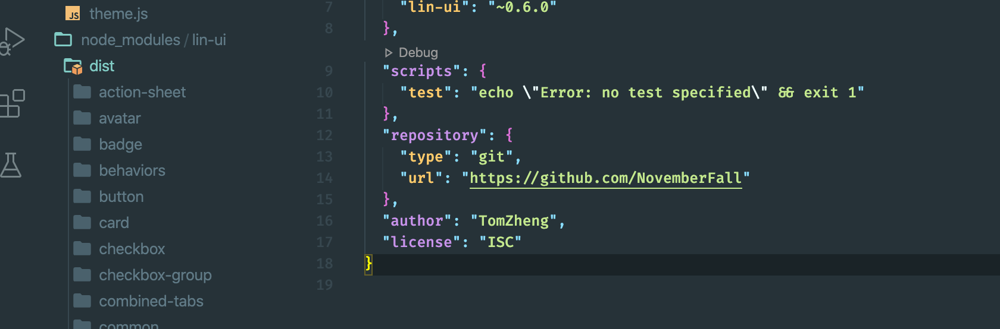
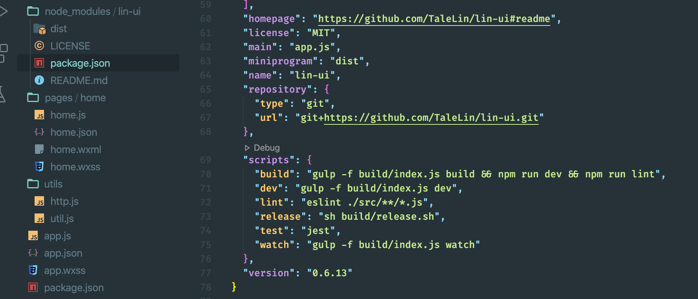
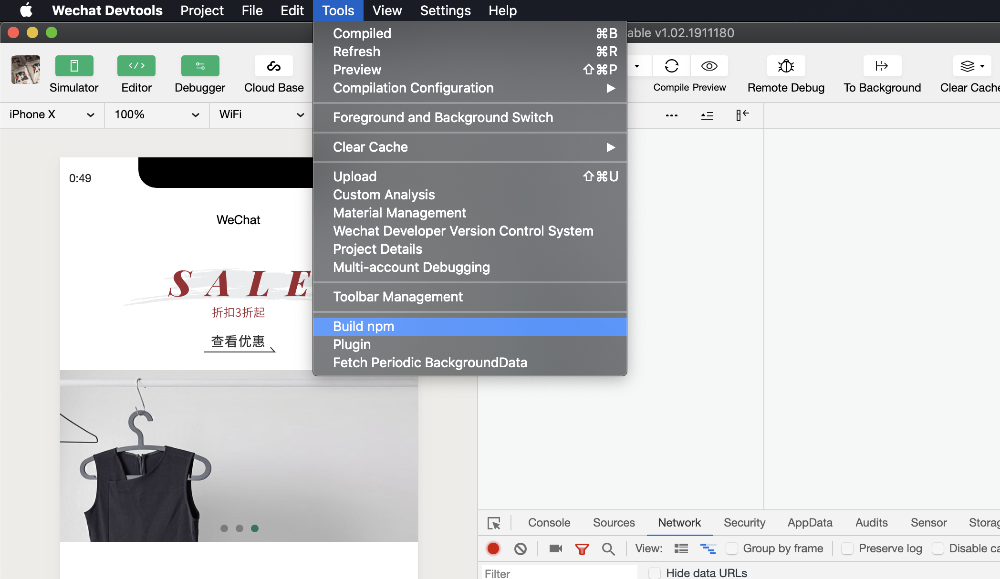
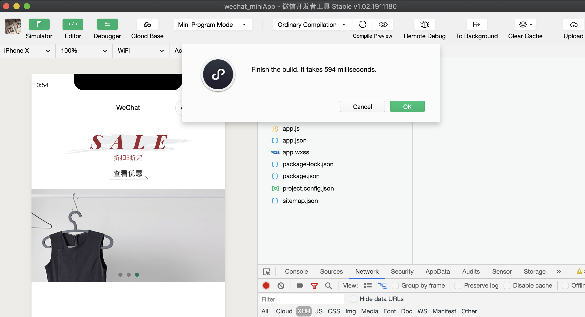
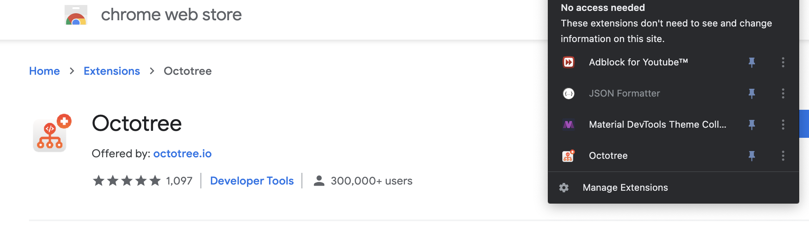

## Lin UI install

- under `wechat_miniapp`, run `npm install`, 来安装`Lin UI`, 
  - 由于我们已经在上一节介绍过了，package.json 来配置 dependencies include `Lin UI`

- 可以看到 `node_modules/lin-ui`, 底下有一个包 `dist`

- 另外可以看到 `"version": "0.6.13"`, 说明目前的 `Lin UI` 版本

### 现在我们打开小程序开发，来import npm `Lin UI`

- 注意这里 `Build npm`, 我们接下来会安装一个 小程序的 `node_modules/lin-ui`
  - 同时我们就可以删除掉，vscode 里的 `node_modules/lin-ui`，因为小程序上传时候是会忽略掉这个包

- 这里我们就已经安装了该包

- 顺便给 chrome 下载这个插件：

- 这个插件强烈推荐！！！