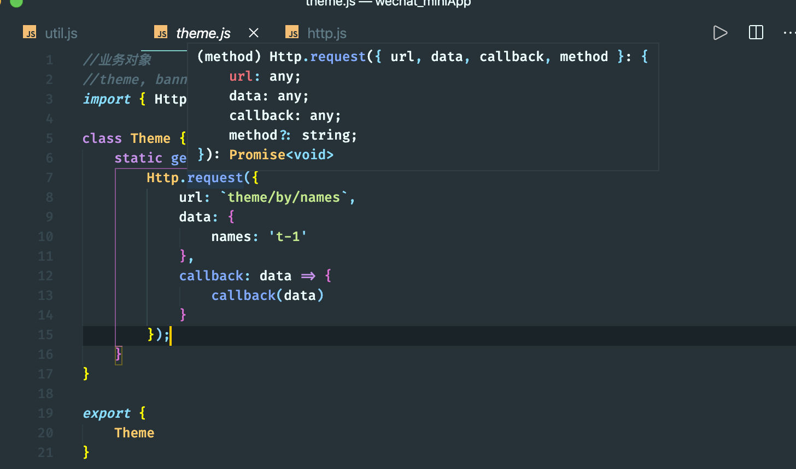
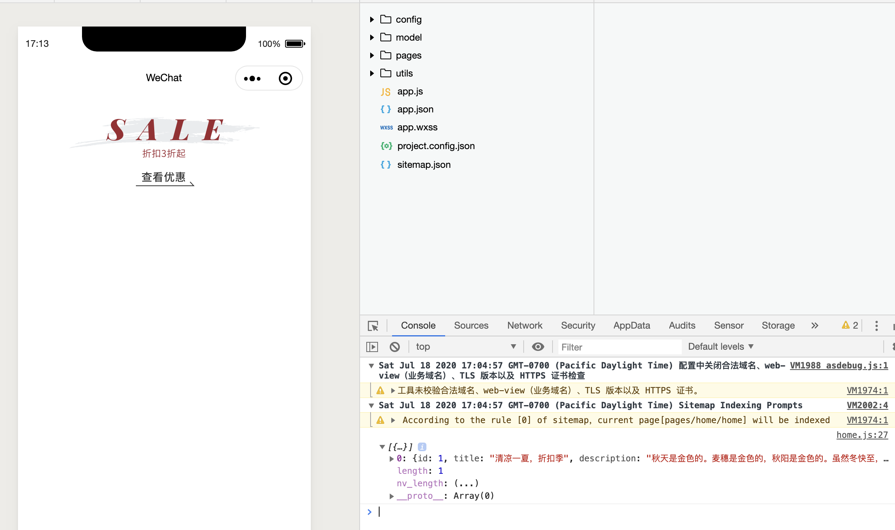

## convert all `callback` to `async` and `await`


- 来看一下 `theme.js`
- 由于 wx 已经支持 promise 的转换，但是 我们还是 follow 课程：


- 这里可以看出已经是promise

- 现在全部改成 async and await


### util.js

```js
const promisic = function (func) {
    return function (params = {}) {
        return new Promise((resolve, reject) => {
            const args = Object.assign(params, {
                success: (res) => {
                    resolve(res);
                },
                fail: (error) => {
                    reject(error);
                }
            });
            func(args);
        });
    };
};

export {
    promisic
}
```


### http.js

```js
import { config } from "../config/config";
import { promisic } from "./util";
class Http {
    static async request({ url, data, method = 'GET' }) {
        //wx.request
        const res = await promisic(wx.request)({
            url: `${config.apiBaseUrl}${url}`,
            data,
            method,
            header: {
                appkey: config.appkey
            }
            //这里用 promisic API 封装成 promise, 就不需要success() 函数

            // , success(res) {
            //     callback(res.data);
            // }
        })
        return res.data
    }
}

//wx.request, 把它当作参数传进来，不能加(), 否则是调用
// promisic(wx.request)({
//     url: '',
//     data: data,

// })
//这里把一个函数传递进另一个函数
//动态类型 非常常见， python


export {
    Http
}
```


### theme.js

```js
//业务对象
//theme, banner, spu, sku, address, user
import { Http } from "../utils/http";
import { promisic } from "../utils/util";

class Theme {
    static async getHomeLocationA() {
        return await Http.request({
            url: `theme/by/names`,
            data: {
                names: 't-1'
            }
        });

        //也可以这么写：
        // return await promisic(Http.request)({
        //     url: `theme/by/names`,
        //     data: {
        //         names: 't-1'
        //     }
        // });

    }
}

export {
    Theme
}
```


### home.js

```js
import { config } from "../../config/config"
import { Theme } from "../../model/theme"

// pages/home/home.js
Page({

  /**
   * Page initial data
   */
  data: {
    topTheme: null,
  },

  /**
   * Lifecycle function--listening when page load
   * JS 类型的约束
   * 业务逻辑
   * 数据绑定
   * view视图层 业务逻辑层 桥梁 中间层
   * mvc C controller
   * Model, Logic, Service
   * Service, Manager,  
   */
  onLoad: async function (options) {
    //在这里使用 async and await 就不需要 callback function
    const data = await Theme.getHomeLocationA();
    this.setData({
      topTheme: data[0]
    })


    // Theme.getHomeLocationA(data => {
    //   this.setData({
    //     topTheme: data[0]
    //   })
    // })
  },

  /**
   * Page event handler function--listening when user drop down
   */
  onPullDownRefresh: function () {

  },

  /**
   * Called when page reach bottom
   */
  onReachBottom: function () {

  },

  /**
   * Called when user click on the top right corner to share
   */
  onShareAppMessage: function () {

  }
})
```


- 看到图片的展示，没有问题


