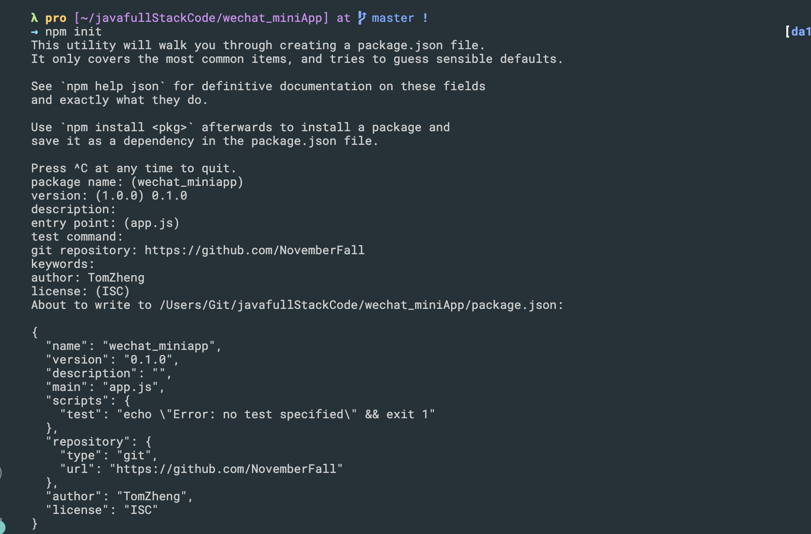

## npm semver

- [Lin UI npm install](https://doc.mini.talelin.com/start/)


- npm init

- 可以看一下 package.json

```json
{
  "name": "wechat_miniapp",
  "version": "0.1.0",
  "description": "e-commerce app",
  "main": "app.js",
  "dependencies":{
    "lin-ui": "~0.6.0"
  },
  "scripts": {
    "test": "echo \"Error: no test specified\" && exit 1"
  },
  "repository": {
    "type": "git",
    "url": "https://github.com/NovemberFall"
  },
  "author": "TomZheng",
  "license": "ISC"
}
```

- lin-ui 已经在npm 仓库里，所以设置完，package.json, 就可以下载使用
  - 关于 semver, 
  - 注意:

```json
  "dependencies":{
    "lin-ui": "~0.6.0" 
  },
```

- `~` 代表不是固定的版本，就是说下载的时候可能已经是当前的 ~0.6.5 这样的版本， 最后 x.x.0 就是版本号
- 但是如果 是 `"lin-ui": "0.6.0"`, 这就是固定版本了
  - 这样 `~` 就只升级最后一位， 那如果想升级 成 => `0.7.0`, 中间这位，那该怎么做呢？
  - `^`, 在前面加上这个符号，就代表可以升级到 `0.7.0`, 比如 `"lin-ui": "^0.6.0"`
- 总之，可以学习一下， `npm semver`


