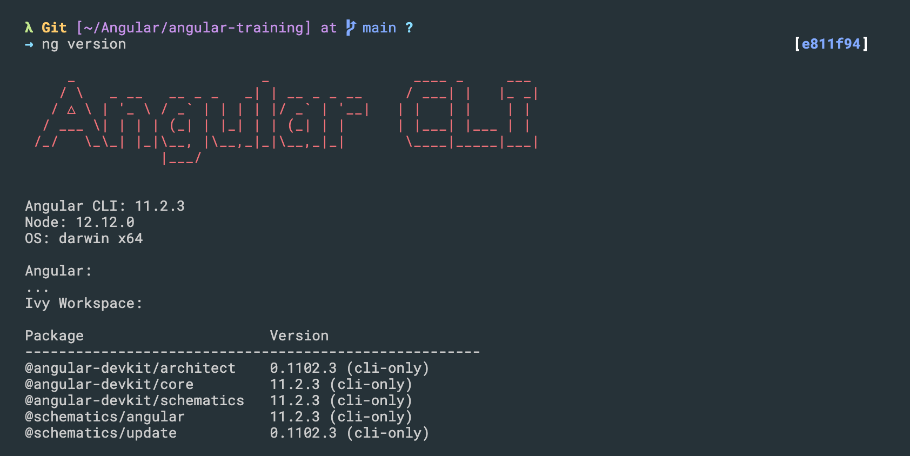
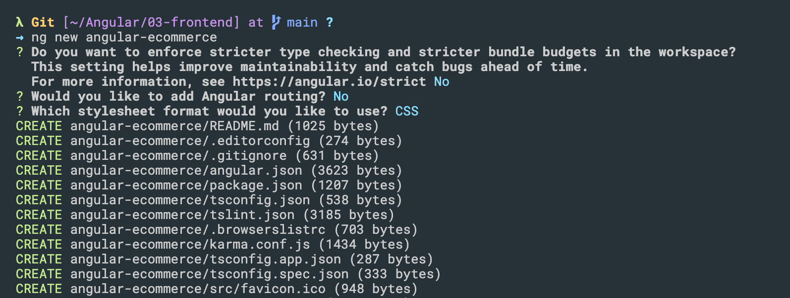

## install

- `npm install -g @angular/cli`


- `ng version`:




### Create a new angular project

- `ng new angular-ecommerce`



-----

### import bootstrap css

 - [bootstrap link](https://getbootstrap.com/docs/5.0/getting-started/introduction/)

```html
    <meta name="viewport" content="width=device-width, initial-scale=1">

    <!-- Bootstrap CSS -->
    <link href="https://cdn.jsdelivr.net/npm/bootstrap@5.0.0-beta2/dist/css/bootstrap.min.css" rel="stylesheet" integrity="sha384-BmbxuPwQa2lc/FVzBcNJ7UAyJxM6wuqIj61tLrc4wSX0szH/Ev+nYRRuWlolflfl" crossorigin="anonymous">
```


