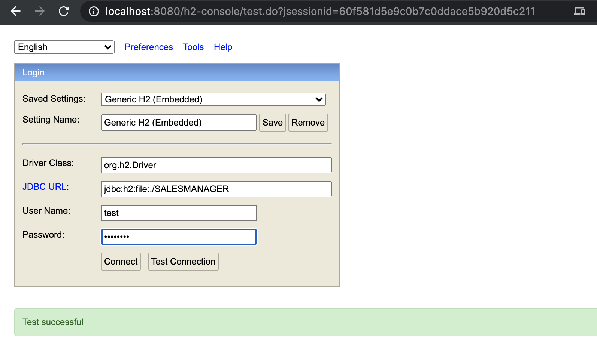

## H2 Embedded

- `sm-shop/src/main/resources/database.properties`


```ruby
#H2
#H2 is used in unit test, and it is preloaded with content
db.jdbcUrl=jdbc\:h2\:file\:./SALESMANAGER;AUTOCOMMIT=OFF;;mv_store=false;INIT\=CREATE SCHEMA IF NOT EXISTS SALESMANAGER
db.user=test
db.password=password
db.driverClass=org.h2.Driver
hibernate.dialect=org.hibernate.dialect.H2Dialect
db.preferredTestQuery=SELECT 1

db.show.sql=false
db.schema=SALESMANAGER
hibernate.hbm2ddl.auto=update
```

---


- `sm-shop/src/main/resources/application.properties`


```ruby
spring.h2.console.enabled=true
```


---

- `http://localhost:8080/h2-console/`





