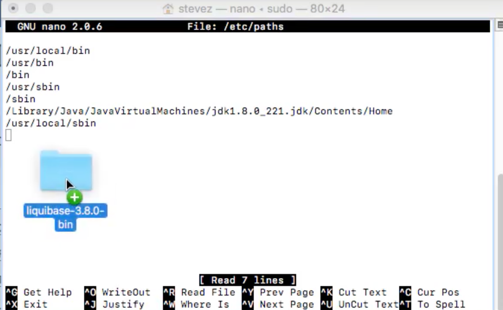

## Liqubase

### Changeset

- A **changeset** describes a set of changes that liquibase executes within one transaction

- To enable successful rollbacks and keep track of the executed changesets, each
  changeset is idetified by:
  - Author name
  - Id(can ba any unique id like 1, 2, 3  or time stamp)

---

### init a springboot project with gradle or maven

---

### How to Download and Install Liquibase on MacOS

- go to `https://www.liquibase.org/`

- [download liquibase](https://github.com/liquibase/liquibase/releases/download/v4.2.2/liquibase-4.2.2.tar.gz)

- unzip `.zip` files

- this **liquibase shell script** called **liquibase**, so every time we type `liquibase` on terminal  
  it's going to execute liquibase, now in order to for us to actully execute liquibase from anywhere
  in our file system, so we're not specifically on this folder all the time when we want to execute 
  liquibase. We're going to have to set an environment path environment variable.
- now in order for us to set this path environment variable we're going to open terminal:
  `sudo nano /etc/paths`

- drag `liquibase-4.2.2` into terminal

- we can click `control X`, click `Y` to save
- and click `enter` to return
- then close terminal, and reopen

---

- now we can run `liquibase --version` to see if it works

- Note: liquibase need java to run

