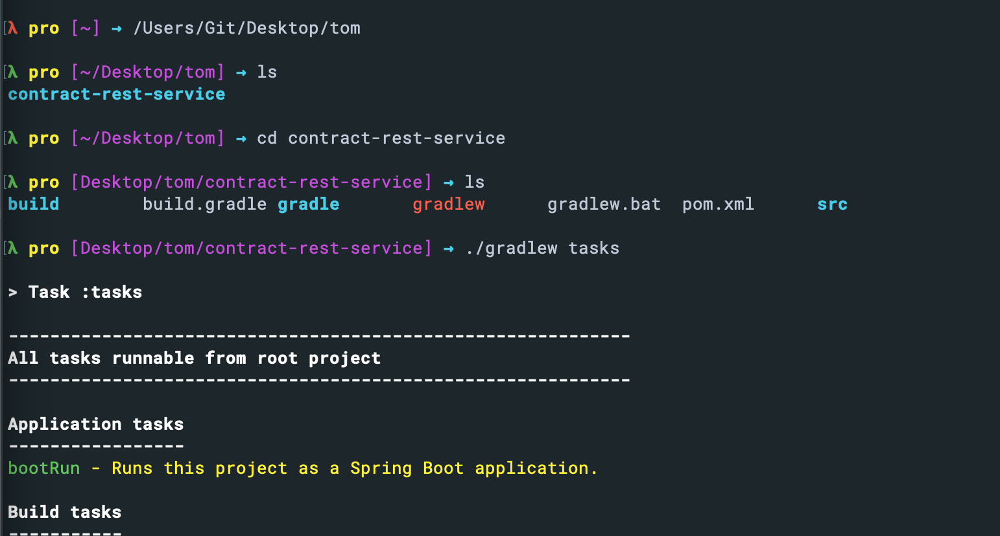
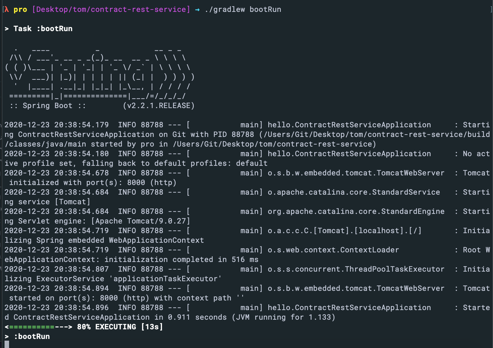

## run gradle project with springboot





- Note: when we run on terminal with `./gradlew bootRun`, don't run on intellij

---

## gradle project with Unit test

- if **No tests found for given includes: in intellij**
- [stackflow](https://stackoverflow.com/questions/30474767/no-tests-found-for-given-includes-error-when-running-parameterized-unit-test-in)

- import the following codes into `build.gradle`

```java
test {
    useJUnitPlatform()
}
```


