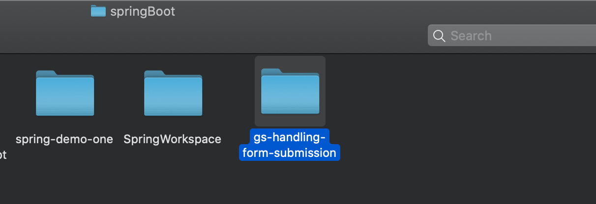

## Handling Form Submission

- project name:



---


## Starting with Spring Initializr

- git clone https://github.com/spring-guides/gs-handling-form-submission.git


---

## Create a Web Controller

---


- src/main/resources/templates/greeting.html


```html
<!DOCTYPE HTML>
<html xmlns:th="https://www.thymeleaf.org">
<head> 
    <title>Getting Started: Handling Form Submission</title>
    <meta http-equiv="Content-Type" content="text/html; charset=UTF-8" />
</head>
<body>
	<h1>Form</h1>
    <form action="#" th:action="@{/greeting}" th:object="${greeting}" method="post">
    	<p>Id: <input type="text" th:field="*{id}" /></p>
        <p>Message: <input type="text" th:field="*{content}" /></p>
        <p><input type="submit" value="Submit" /> <input type="reset" value="Reset" /></p>
    </form>
</body>
</html>
```


---


- 1. The `th:action="@{/greeting}"` expression directs the form to POST to the /greeting endpoint
-    while the `th:object="${greeting}"` expression declares the model object to use for collecting the form data.
- 2. The two form fields, expressed with `th:field="{id}"` and `th:field="{content}"`, 
  correspond to the fields in the `Greeting` object.   

---


- Greeting


```java
public class Greeting {

	private long id;
	private String content;

	public long getId() {
		return id;
	}

	public void setId(long id) {
		this.id = id;
	}

	public String getContent() {
		return content;
	}

	public void setContent(String content) {
		this.content = content;
	}

}
```


- GreetingController


```java
@Controller
public class GreetingController {

	@GetMapping("/greeting")
	public String greetingForm(Model model) {
		model.addAttribute("greeting", new Greeting());
		return "greeting";
	}

	@PostMapping("/greeting")
	public String greetingSubmit(@ModelAttribute Greeting greeting, Model model) {
		model.addAttribute("greeting", greeting);
		return "result";
	}

}
```


---


- input `http://localhost:8080/greeting`


