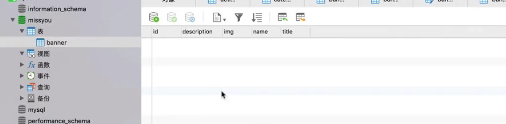
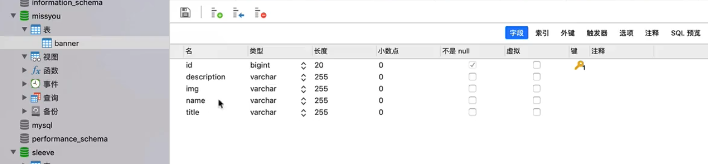
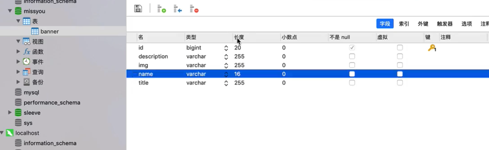
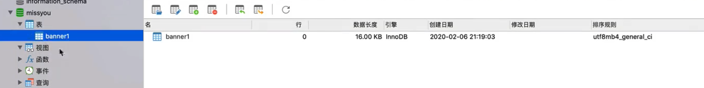
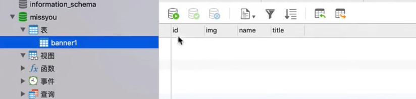

## 如何让一个class 变成数据库里的一张表table?


### yml | properties


- yml 和 properties 的区别就是格式的区别
  - yml 是一种层级结构：


```yml
server:
  port: 8081

spring:
  datasource:
    url: jdbc:mysql://localhost:3306/sleeve?characterEncoding=utf-8&serverTimezone=GMT%2B8
    username: root
    password: 12345678
  jpa:
    properties:
      hibernate:
        show_sql: true
        format_sql: true
  redis:
    localhost: localhost
    port: 6379
    database: 7
    password:
    listen-pattern: __keyevent@7__:expired

rocketmq:
  consumer:
    consumer-group: SleeveConsumerGroup
  producer:
    producer-group: SleeveProducerGroup
  namesrv-addr: 127.0.0.1:9876


missyou:
  security:
    jwt-key: 7777777
    token-expired-in: 86400000
  order:
    max-sku-limit: 777
    pay-time-limit: 3600
    pay-callback-host: http://talelin.com
    pay-callback-path: /v1/payment/wx/notify
```

- 比起 properties 优先考虑使用yml

---


## 数据库链接配置

- 在jPA 里可以有这种机制，映射一个class到数据库里
- 要让这种机制运行，

---

- application-dev.yml


```yml
server:
  port: 8081

spring:
  datasource:
    url: jdbc:mysql://localhost:3306/sleeve?characterEncoding=utf-8&serverTimezone=GMT%2B8
    username: root
    password: 12345678
  jpa:
    properties:
      hibernate:
        show_sql: true
        format_sql: true
  redis:
    localhost: localhost
    port: 6379
    database: 7
    password:
    listen-pattern: __keyevent@7__:expired

rocketmq:
  consumer:
    consumer-group: SleeveConsumerGroup
  producer:
    producer-group: SleeveProducerGroup
  namesrv-addr: 127.0.0.1:9876


missyou:
  security:
    jwt-key: 7777777yue
    token-expired-in: 86400000
  order:
    max-sku-limit: 777
    pay-time-limit: 3600
    pay-callback-host: http://talelin.com
    pay-callback-path: /v1/payment/wx/notify

```


---


```java
import javax.persistence.*;
import java.util.List;

//orm
//物理外键 逻辑外键 实体与实体关系配置 单表查询

@Entity
public class Banner {
    @Id
    private long id; //在这里，这个叫做主键


    private String name;
    private String description;
    private String img;
    private String title;
}
```




- 可以看到我们生成了一张表table

- 但是我们还要设计，name stirng 这些的长度：


```java
import javax.persistence.*;
import java.util.List;

@Entity
public class Banner {
    @Id
    private long id; //在这里，这个叫做主键

    @Column(length = 16)
    private String name;
    private String description;
    private String img;
    private String title;
}
```

- 加上`@Column(length = 16)`, 就可以设计长度了
  


- 现在更改了长度。

---

- 如果说不想让 table 名字和 class名字相同，我们还可以更改table名字：


```java
@Entity
@Table(name="banner")
public class Banner {
    @Id
    private long id; //在这里，这个叫做主键

    @Column(length = 16)
    private String name;
    private String description;
    private String img;
    private String title;
}
```



---

- 有时候我们不希望table里的，也有class里的filed, 我们可以用@Transient


```java
@Entity
@Table(name="banner")
public class Banner {
    @Id
    private long id; //在这里，这个叫做主键

    @Column(length = 16)
    private String name;

    @Transient
    private String description;
    private String img;
    private String title;
}
```



- 可以看到这次 description 已经不在table里。


