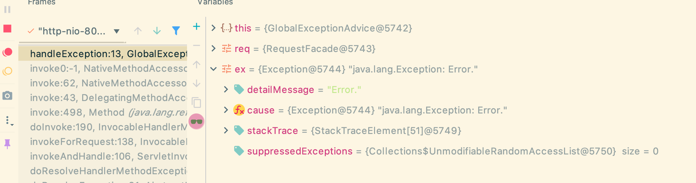

## 全局异常处理机制导学

 - 来写一个异常


```java
@ControllerAdvice
public class GlobalExceptionAdvice {

    @ExceptionHandler(value=Exception.class)
    public void handleException(HttpServletRequest req, Exception ex) {
        System.out.println("hello");
    }
}


@RestController
@RequestMapping("/v1/banner")
public class BannerController {

    @Autowired
    private ISkill iSkill;

    @GetMapping("/test")
    public String test() throws Exception{
        iSkill.r();
        throw new Exception("Error.");
    }
}
```




---


