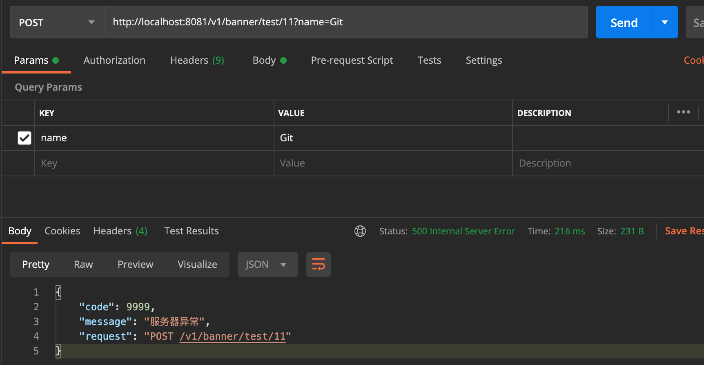
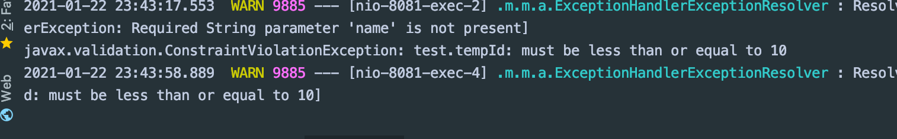

## @Validated 注解进行基础参数校验

- 在 @RestController 里，不推荐写太多的逻辑


## jsr-303 bean Validation 验证规范


### Hibernate-Validator

- @Min
- @Max
- @Positive

```java
@RestController
@RequestMapping("/v1/banner")
public class BannerController {

    @Autowired
//    @Qualifier("irelia")
    private ISkill iSkill;

    // v1/banner/test/2
    @PostMapping("/test/{id}")
    public String test(@PathVariable(name="id") Integer tempId,
                       @RequestParam String name,
                       @RequestBody PersonDTO person
                       ) throws Exception{
        iSkill.r();

//        PersonDTO dto = new PersonDTO();
        PersonDTO dto = PersonDTO.builder()
                .name("fall")
                .age(18)
                .build();

        //抛出已知异常
        throw new ForbiddenException(10000);
    }
}
```

- 比如我们希望上面这段代码， id < 10, 的条件

---

- 所以必须加上 @Validated  


```java
@RestController
@RequestMapping("/v1/banner")
@Validated
public class BannerController {

    @Autowired
//    @Qualifier("irelia")
    private ISkill iSkill;

    // v1/banner/test/2
    @PostMapping("/test/{id}")
    public String test(@PathVariable(name="id") @Max(10) Integer tempId,
                       @RequestParam String name,
                       @RequestBody PersonDTO person
                       ) throws Exception{
        iSkill.r();

//        PersonDTO dto = new PersonDTO();
        PersonDTO dto = PersonDTO.builder()
                .name("fall")
                .age(18)
                .build();

        //抛出已知异常
        throw new ForbiddenException(10000);
    }
}
```



- 可以看到传过去的  id = 11 > 10, 所以报错



- 也可以用自己自定义信息：

```java
@RestController
@RequestMapping("/v1/banner")
@Validated
public class BannerController {

    @Autowired
//    @Qualifier("irelia")
    private ISkill iSkill;

    // v1/banner/test/2
    @PostMapping("/test/{id}")
    public String test(@PathVariable(name="id") @Range(min = 1, max=10, message="不可以超过10!") Integer tempId,
                       @RequestParam String name,
                       @RequestBody PersonDTO person
                       ) throws Exception{
        iSkill.r();

//        PersonDTO dto = new PersonDTO();
        PersonDTO dto = PersonDTO.builder()
                .name("fall")
                .age(18)
                .build();

        //抛出已知异常
        throw new ForbiddenException(10000);
    }
}
```


