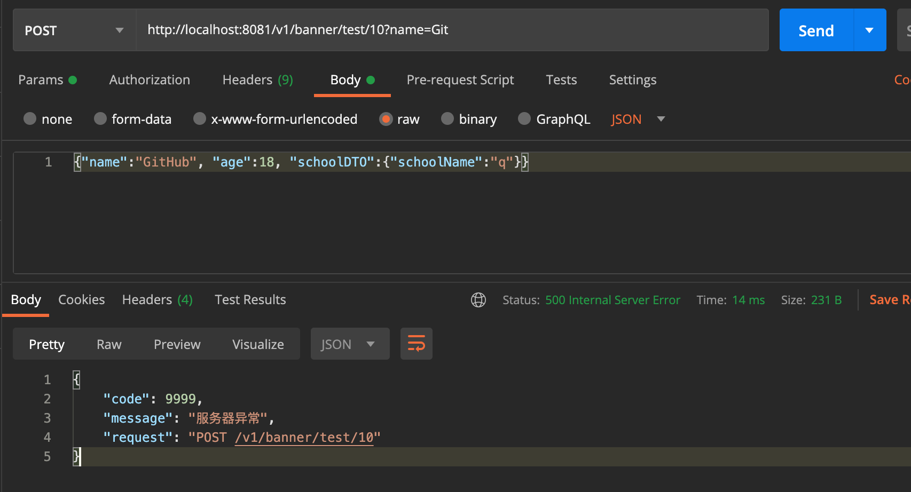
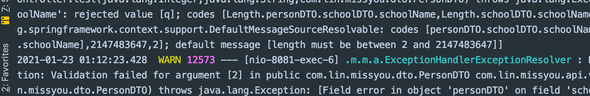

##

- 给personDTO 加上一个注解 @Length
- 同时给 BannerController 加上 `@RequestBody @Validated PersonDTO person`


```java
@Builder
@Getter
public class PersonDTO {

    @Length(min=2, max=10, message="test @Validated")
    private String name;
    private Integer age;
}


@RestController
@RequestMapping("/v1/banner")
@Validated
public class BannerController {

    @Autowired
//    @Qualifier("irelia")
    private ISkill iSkill;

    // v1/banner/test/2
    @PostMapping("/test/{id}")
    public String test(@PathVariable(name="id") @Range(min = 1, max=10, message="不可以超过10!") Integer tempId,
                       @RequestParam String name,
                       @RequestBody @Validated PersonDTO person
                       ) throws Exception{
        iSkill.r();

//        PersonDTO dto = new PersonDTO();
        PersonDTO dto = PersonDTO.builder()
                .name("fall")
                .age(18)
                .build();

        //抛出已知异常
        throw new ForbiddenException(10000);
    }
}
```


-----


## 假如一个DTO底下，有一个 object field 呢？

```java
@Getter
@Setter
public class SchoolDTO {

    @Length(min=2)
    private String schoolName;
}


@Builder
@Getter
public class PersonDTO {

    @Length(min=2, max=10, message="test @Validated")
    private String name;
    private Integer age;

    private SchoolDTO schoolDTO;
}


@RestController
@RequestMapping("/v1/banner")
@Validated
public class BannerController {

    @Autowired
//    @Qualifier("irelia")
    private ISkill iSkill;

    // v1/banner/test/2
    @PostMapping("/test/{id}")
    public PersonDTO test(@PathVariable(name="id") @Range(min = 1, max=10, message="不可以超过10!") Integer tempId,
                       @RequestParam String name,
                       @RequestBody @Validated PersonDTO person
                       ) throws Exception{
        iSkill.r();

        PersonDTO dto = PersonDTO.builder()
                .name("fall")
                .age(18)
                .build();
        return dto;

        //抛出已知异常
        throw new ForbiddenException(10000);
    }
}
```


---

- 假如， 要验证 "schoolDTO": null， 应该要报错，加上 @Valid


```java
@Builder
@Getter
public class PersonDTO {

    @Length(min=2, max=10, message="test @Validated")
    private String name;
    private Integer age;

    @Valid
    private SchoolDTO schoolDTO;
}


@RestController
@RequestMapping("/v1/banner")
@Validated
public class BannerController {

    @Autowired
//    @Qualifier("irelia")
    private ISkill iSkill;

    // v1/banner/test/2
    @PostMapping("/test/{id}")
    public PersonDTO test(@PathVariable(name="id") @Range(min = 1, max=10, message="不可以超过10!") Integer tempId,
                       @RequestParam String name,
                       @RequestBody @Validated PersonDTO person
                       ) throws Exception{
        iSkill.r();

        PersonDTO dto = PersonDTO.builder()
                .name("fall")
                .age(18)
                .build();
        return dto;

        //抛出已知异常
//        throw new ForbiddenException(10000);
    }
}
```






- @Validated 是千万不能取消，因为它在验证 personDTO

-----


## @Valid @Validated 的区别

- @Valid @Validated 它们的地位是一样的，只是稍微有区别
  - @Valid 是java的扩展
  - @Validated 是spring的扩展


