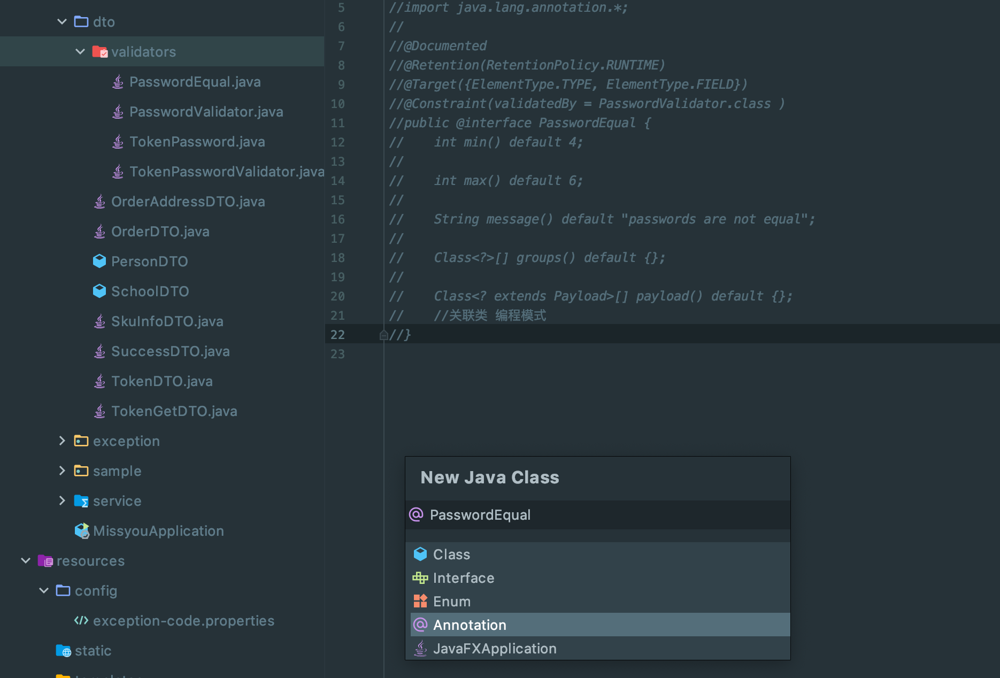
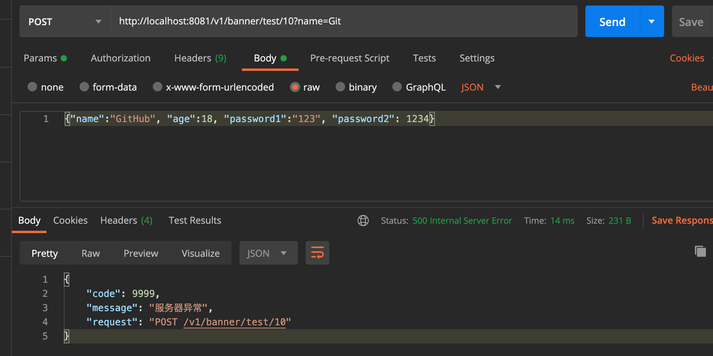
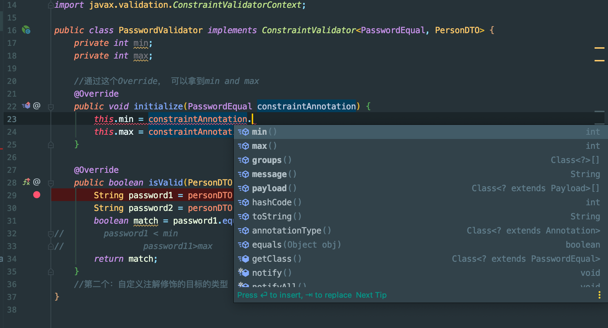

## 自定义注解：

- 有时候我们需要自定义 @annotation

- create `validators` package



```java
@Documented //可以让注解里的注释加到文档里面
@Retention(RetentionPolicy.RUNTIME) //这些注解会被保留到运行的阶段
@Target({ElementType.TYPE, ElementType.FIELD}) //可以指定自定义的注解用在哪些目标上面
public @interface PasswordEqual {

    String message() default "passwords are not equal";


    //以下这两个是模版，必须包含
    Class<?>[] groups() default {};

    Class<? extends Payload>[] payload() default {};
    //关联类 编程模式
}
```


-----

## 自定义校验注解的关联类

- `ConstraintValidator<PasswordEqual, PersonDTO>`, 第一个参数是我们自定义注解，第二个是自定义注解修饰的目标类型


```java
@Documented //可以让注解里的注释加到文档里面
@Retention(RetentionPolicy.RUNTIME) //这些注解会被保留到运行的阶段
@Target({ElementType.TYPE, ElementType.FIELD}) //可以指定自定义的注解用在哪些目标上面
@Constraint(validatedBy = PasswordValidator.class ) //指定具体的关联类，来验证
public @interface PasswordEqual {

    String message() default "passwords are not equal";

    Class<?>[] groups() default {};

    Class<? extends Payload>[] payload() default {};
    //关联类 编程模式
}


@Builder
@Getter
@PasswordEqual  //先给PersonDTO 打上这个自定义注解
public class PersonDTO {

    @Length(min=2, max=10, message="test @Validated")
    private String name;
    private Integer age;

    private String password1;
    private String password2;
}


public class PasswordValidator implements ConstraintValidator<PasswordEqual, PersonDTO> {

    @Override
    public boolean isValid(PersonDTO personDTO, ConstraintValidatorContext constraintValidatorContext) {
        String password1 = personDTO.getPassword1();
        String password2 = personDTO.getPassword2();
        boolean match = password1.equals(password2);
        return match;
    }
    //第二个：自定义注解修饰的目标的类型
}
```

-----

## 获取自定义注解校验参数




- 可以看到提示错误

---


### 获取自定义注解的参数

```java
@Documented //可以让注解里的注释加到文档里面
@Retention(RetentionPolicy.RUNTIME) //这些注解会被保留到运行的阶段
@Target({ElementType.TYPE, ElementType.FIELD}) //可以指定自定义的注解用在哪些目标上面
@Constraint(validatedBy = PasswordValidator.class ) //指定具体的关联类，来验证
public @interface PasswordEqual {
    int min() default 4; //这里的默认值，自己决定

    int max() default 6;

    String message() default "passwords are not equal";

    Class<?>[] groups() default {};

    Class<? extends Payload>[] payload() default {};
    //关联类 编程模式
}
```





- 可以看到上面的自定义注解其实可以通过 `constraintAnnotation`拿到


