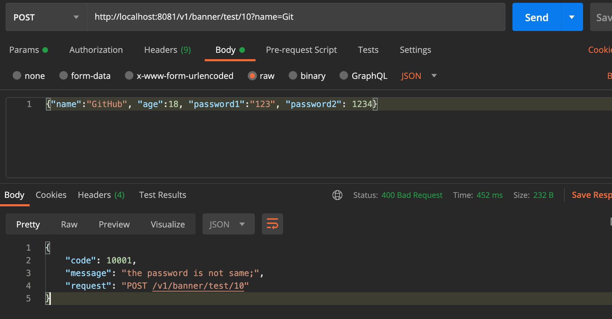

## 捕获DTO类的参数校验异常信息


```java
@Builder
@Getter
@PasswordEqual(min=1, message="the password is not same")
public class PersonDTO {

    @Length(min=2, max=10, message="test @Validated")
    private String name;
    private Integer age;

    private String password1;
    private String password2;
}


@ControllerAdvice
public class GlobalExceptionAdvice {

    @Autowired
    private ExceptionCodeConfiguration codeConfiguration;

    //处理未知异常
    @ExceptionHandler(value=Exception.class)
    @ResponseBody
    @ResponseStatus(code = HttpStatus.INTERNAL_SERVER_ERROR)
    public UnifyResponse handleException(HttpServletRequest req, Exception ex) {
        String requestUrl = req.getRequestURI();
        String method = req.getMethod();
        System.out.println(ex);
        UnifyResponse message = new UnifyResponse(9999, "服务器异常", method + " " + requestUrl);
        return message;
    }

    //处理已知异常
    @ExceptionHandler(HttpException.class)
    public ResponseEntity<UnifyResponse> handleHttpException(HttpServletRequest req, HttpException e){
        String requestUrl = req.getRequestURI();
        String method = req.getMethod();

        UnifyResponse message = new UnifyResponse(e.getCode(), codeConfiguration.getMessage(e.getCode()), method + " " + requestUrl);
        HttpHeaders headers = new HttpHeaders();
        headers.setContentType(MediaType.APPLICATION_JSON);
        HttpStatus httpStatus = HttpStatus.resolve(e.getHttpStatusCode());

        ResponseEntity<UnifyResponse> r = new ResponseEntity<>(message, headers, httpStatus);
        return r;
    }

    @ExceptionHandler(MethodArgumentNotValidException.class)
    @ResponseBody
    @ResponseStatus(code = HttpStatus.BAD_REQUEST)
    public UnifyResponse handleBeanValidation(HttpServletRequest req, MethodArgumentNotValidException e) {
        String requestUrl = req.getRequestURI();
        String method = req.getMethod();

        List<ObjectError> errors = e.getBindingResult().getAllErrors();
        String message = this.formatAllErrorMessages(errors);

        return new UnifyResponse(10001, message,method + " " + requestUrl);
    }


    private String formatAllErrorMessages(List<ObjectError> errors) {
        StringBuffer errorMsg = new StringBuffer();
        errors.forEach(error ->
                errorMsg.append(error.getDefaultMessage()).append(';')
        );
        return errorMsg.toString();
    }
}
```




