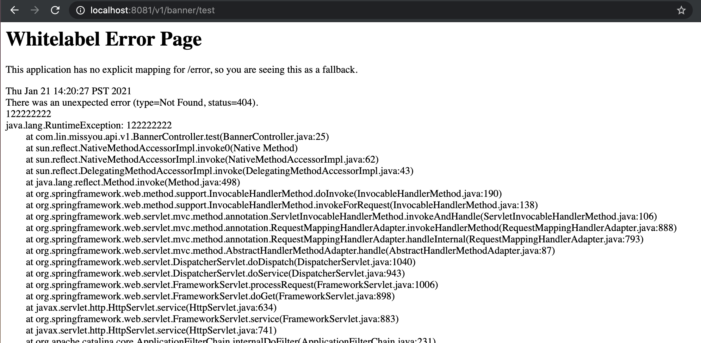
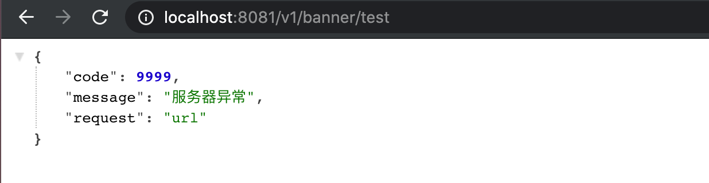
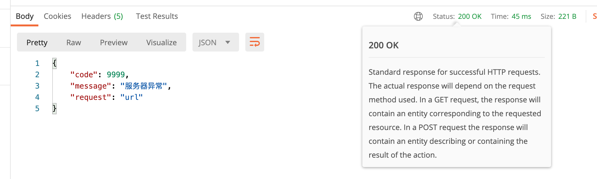
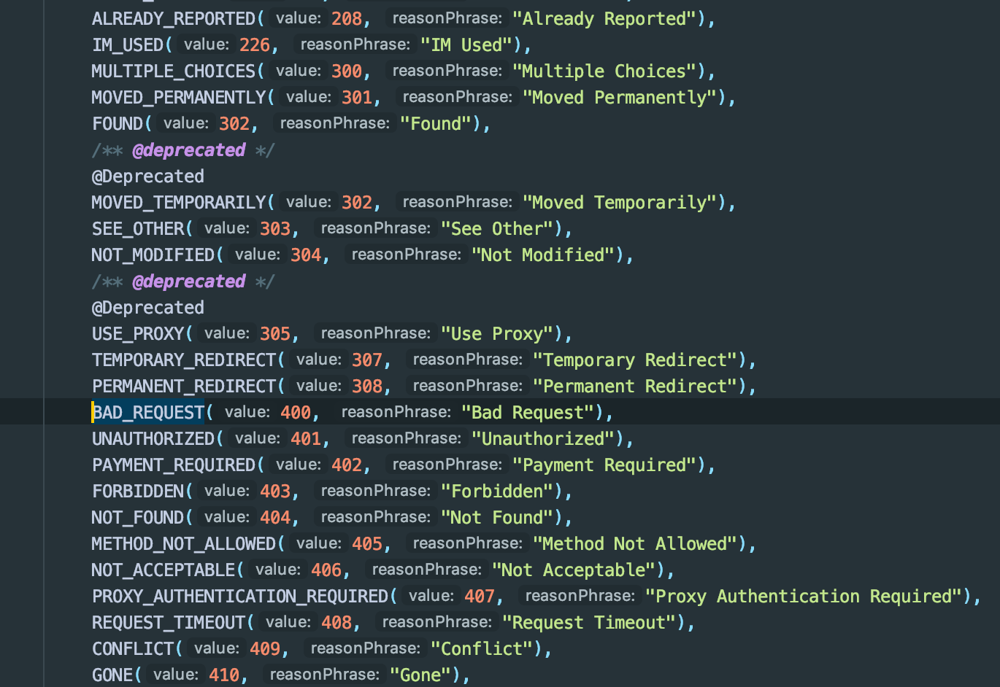
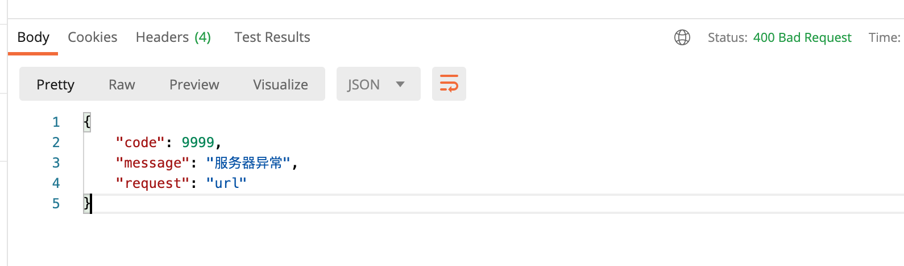
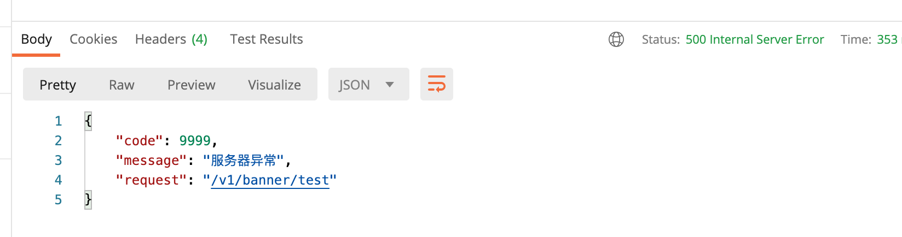
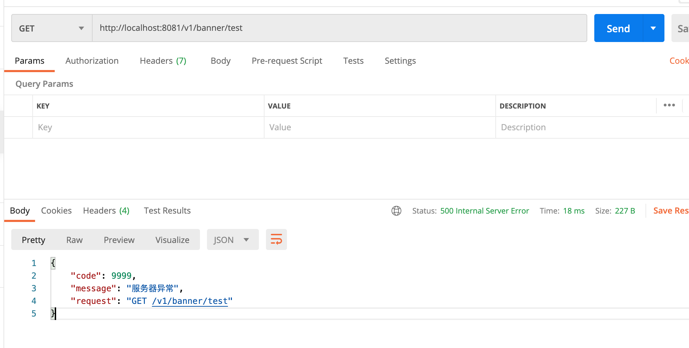
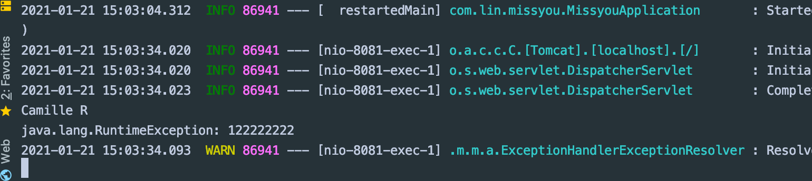

## UnifyRresponse ｜ 处理未知异常

- 未知异常： 对于前端开发者和用户 都是无意义的。服务端开发者代码逻辑有问题


---

## @ExceptionHandler 中返回Unify 消息

- 如何返回unify message 到前端？


```java
public class UnifyResponse {
    private int code;
    private String message;
    private String request;

    public int getCode() {
        return code;
    }

    public String getMessage() {
        return message;
    }

    public String getRequest() {
        return request;
    }

    public UnifyResponse(int code, String message, String request){
        this.code = code;
        this.message = message;
        this.request = request;
    }

    public static void createSuccess(int code) {
        throw new CreateSuccess(code);
    }
}


@ControllerAdvice
public class GlobalExceptionAdvice {

    //处理未知异常
    @ExceptionHandler(value=Exception.class)
    public UnifyResponse handleException(HttpServletRequest req, Exception ex) {
//        System.out.println("hello");
        UnifyResponse message = new UnifyResponse(9999, "服务器异常", "url");
        return message;
    }

    //处理已知异常
    @ExceptionHandler(HttpException.class)
    public void handleHttpException(HttpServletResponse req, Exception e){
        System.out.println("hello");
    }
}


@RestController
@RequestMapping("/v1/banner")
public class BannerController {

    @Autowired
    private ISkill iSkill;

    @GetMapping("/test")
    public String test() throws Exception{
        iSkill.r();
        throw new RuntimeException("122222222");
    }
}

```



- 打上 `@ResponseBody` 关键字， 
  - @ResponseBody is a Spring annotation which binds a method return value to the web response body. 
    It is not interpreted as a view name. It uses HTTP Message converters to convert the return value to HTTP response body, 
    based on the content-type in the request HTTP header.
  - 总的来说，如果不加注解，则无法返回josn 数据给前端


```java
@ControllerAdvice
public class GlobalExceptionAdvice {

    //处理未知异常
    @ExceptionHandler(value=Exception.class)
    @ResponseBody
    public UnifyResponse handleException(HttpServletRequest req, Exception ex) {
        UnifyResponse message = new UnifyResponse(9999, "服务器异常", "url");
        return message;
    }

    //处理已知异常
    @ExceptionHandler(HttpException.class)
    public void handleHttpException(HttpServletResponse req, Exception e){
        System.out.println("hello");
    }
}
```






- 但是现在status 是 200, 所以

---

## 那如何修改 http status code ？

### 使用注解修改status code



- 我们可以看到源码里的 BAD_REQUEST刚好是400

```java
@ControllerAdvice
public class GlobalExceptionAdvice {

    //处理未知异常
    @ExceptionHandler(value=Exception.class)
    @ResponseBody
    @ResponseStatus(code = HttpStatus.BAD_REQUEST)
    public UnifyResponse handleException(HttpServletRequest req, Exception ex) {
        UnifyResponse message = new UnifyResponse(9999, "服务器异常", "url");
        return message;
    }

    //处理已知异常
    @ExceptionHandler(HttpException.class)
    public void handleHttpException(HttpServletResponse req, Exception e){
        System.out.println("hello");
    }
}
```



- 可以看到我们更改了status

---

- 但是我们需要更改成内部的模糊错误，无法告诉前端具体是什么错误：


```java
@ControllerAdvice
public class GlobalExceptionAdvice {

    //处理未知异常
    @ExceptionHandler(value=Exception.class)
    @ResponseBody
    @ResponseStatus(code = HttpStatus.INTERNAL_SERVER_ERROR)
    public UnifyResponse handleException(HttpServletRequest req, Exception ex) {
        String requestUrl = req.getRequestURI();
        UnifyResponse message = new UnifyResponse(9999, "服务器异常", requestUrl);
        return message;
    }

    //处理已知异常
    @ExceptionHandler(HttpException.class)
    public void handleHttpException(HttpServletResponse req, Exception e){
        System.out.println("hello");
    }
}
```



- 这一次我们也拿到了具体 url

---

- 我们也可以得到具体的方法

```java
@ControllerAdvice
public class GlobalExceptionAdvice {

    //处理未知异常
    @ExceptionHandler(value=Exception.class)
    @ResponseBody
    @ResponseStatus(code = HttpStatus.INTERNAL_SERVER_ERROR)
    public UnifyResponse handleException(HttpServletRequest req, Exception ex) {
        String requestUrl = req.getRequestURI();
        String method = req.getMethod();
        UnifyResponse message = new UnifyResponse(9999, "服务器异常", method + " " + requestUrl);
        return message;
    }

    //处理已知异常
    @ExceptionHandler(HttpException.class)
    public void handleHttpException(HttpServletResponse req, Exception e){
        System.out.println("hello");
    }
}
```



---

- 有时候在调试中，我们是需要知道当前的异常是什么的，所以我们需要把当前异常打印

```java
@ControllerAdvice
public class GlobalExceptionAdvice {

    //处理未知异常
    @ExceptionHandler(value=Exception.class)
    @ResponseBody
    @ResponseStatus(code = HttpStatus.INTERNAL_SERVER_ERROR)
    public UnifyResponse handleException(HttpServletRequest req, Exception ex) {
        String requestUrl = req.getRequestURI();
        String method = req.getMethod();
        System.out.println(ex);
        UnifyResponse message = new UnifyResponse(9999, "服务器异常", method + " " + requestUrl);
        return message;
    }

    //处理已知异常
    @ExceptionHandler(HttpException.class)
    public void handleHttpException(HttpServletResponse req, Exception e){
        System.out.println("hello");
    }
}
```




