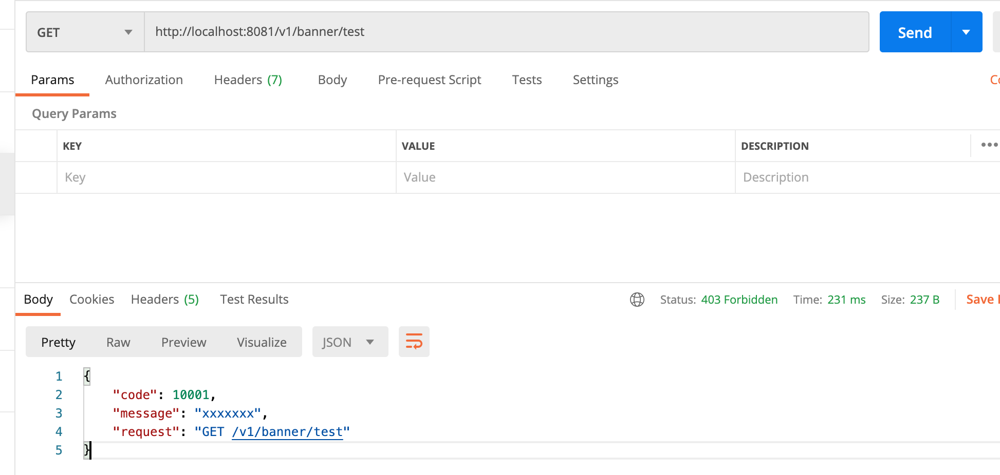

## 处理已知异常

```java

public class ForbiddenException extends HttpException {
    public ForbiddenException(int code){
        this.code = code;
        this.httpStatusCode = 403;
    }
}


@ControllerAdvice
public class GlobalExceptionAdvice {

    //处理未知异常
    @ExceptionHandler(value=Exception.class)
    @ResponseBody
    @ResponseStatus(code = HttpStatus.INTERNAL_SERVER_ERROR)
    public UnifyResponse handleException(HttpServletRequest req, Exception ex) {
        String requestUrl = req.getRequestURI();
        String method = req.getMethod();
        System.out.println(ex);
        UnifyResponse message = new UnifyResponse(9999, "服务器异常", method + " " + requestUrl);
        return message;
    }

    //处理已知异常
    @ExceptionHandler(HttpException.class)
    public ResponseEntity<UnifyResponse> handleHttpException(HttpServletRequest req, HttpException e){
        String requestUrl = req.getRequestURI();
        String method = req.getMethod();

        UnifyResponse message = new UnifyResponse(e.getCode(), "xxxxxxx", method + " " + requestUrl);
        HttpHeaders headers = new HttpHeaders();
        headers.setContentType(MediaType.APPLICATION_JSON);
        HttpStatus httpStatus = HttpStatus.resolve(e.getHttpStatusCode());

        ResponseEntity<UnifyResponse> r = new ResponseEntity<>(message, headers, httpStatus);
        return r;
    }
}


@RestController
@RequestMapping("/v1/banner")
public class BannerController {

    @Autowired
//    @Qualifier("irelia")
    private ISkill iSkill;

    @GetMapping("/test")
    public String test() throws Exception{
        iSkill.r();

        //抛出已知异常
        throw new ForbiddenException(10001);
    }
}
```



---


```java
UnifyResponse message = new UnifyResponse(e.getCode(), "xxxxxxx", method + " " + requestUrl);
```

- 我们看到这句话还是hard code


