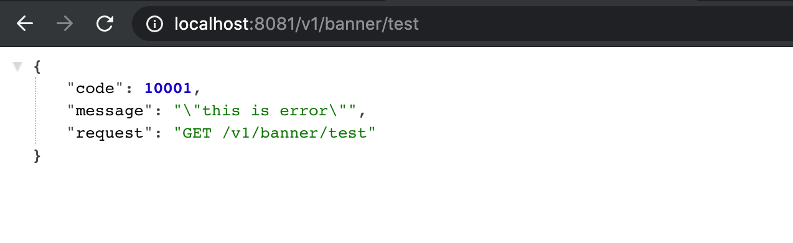

## 为什么要将exception写在配置文件里

```java
@RestController
@RequestMapping("/v1/banner")
public class BannerController {

    @Autowired
//    @Qualifier("irelia")
    private ISkill iSkill;

    @GetMapping("/test")
    public String test() throws Exception{
        iSkill.r();

        //抛出已知异常
        throw new ForbiddenException(10001);

    }
}
```

- ` throw new ForbiddenException(10001)`, 如果我们要做国际化，message 就不能写在这里，我们需要写进配置文件
- 我们可以在`resources`下面新建一个config


-----

- 配置类，我们建立在core 底下


- @PropertySource, 可以配置路径
- @ConfigurationProperties(prefix = "lin"), 可以配置前缀
- @Component 同时注入容器:


```java
@ConfigurationProperties(prefix = "lin")
@PropertySource(value = "classpath:config/exception-code.properties")
@Component
public class ExceptionCodeConfiguration {

    private Map<Integer, String> codes = new HashMap<>();

    public Map<Integer, String> getCodes() {
        return codes;
    }

    public void setCodes(Map<Integer, String> codes) {
        this.codes = codes;
    }


    public String getMessage(int code){
        String message = codes.get(code);
        return message;
    }
}
```

- 这里建议单独写一个配置文件

---

## 现在来简单测试一下：

- 由于已经打入 @Component, 所以直接给 ExceptionCodeConfiguration 标记 @Autowired


```java
@ControllerAdvice
public class GlobalExceptionAdvice {

    @Autowired
    private ExceptionCodeConfiguration codeConfiguration;

    //处理未知异常
    @ExceptionHandler(value=Exception.class)
    @ResponseBody
    @ResponseStatus(code = HttpStatus.INTERNAL_SERVER_ERROR)
    public UnifyResponse handleException(HttpServletRequest req, Exception ex) {
        String requestUrl = req.getRequestURI();
        String method = req.getMethod();
        System.out.println(ex);
        UnifyResponse message = new UnifyResponse(9999, "服务器异常", method + " " + requestUrl);
        return message;
    }

    //处理已知异常
    @ExceptionHandler(HttpException.class)
    public ResponseEntity<UnifyResponse> handleHttpException(HttpServletRequest req, HttpException e){
        String requestUrl = req.getRequestURI();
        String method = req.getMethod();

        UnifyResponse message = new UnifyResponse(e.getCode(), codeConfiguration.getMessage(e.getCode()), method + " " + requestUrl);
        HttpHeaders headers = new HttpHeaders();
        headers.setContentType(MediaType.APPLICATION_JSON);
        HttpStatus httpStatus = HttpStatus.resolve(e.getHttpStatusCode());

        ResponseEntity<UnifyResponse> r = new ResponseEntity<>(message, headers, httpStatus);
        return r;
    }
}


@RestController
@RequestMapping("/v1/banner")
public class BannerController {

    @Autowired
    private ISkill iSkill;

    @GetMapping("/test")
    public String test() throws Exception{
        iSkill.r();

        //抛出已知异常
        throw new ForbiddenException(10001);
    }
}
```



- 这里有反斜杆在string前面， 是因为我们不需要在配置文件加引号


