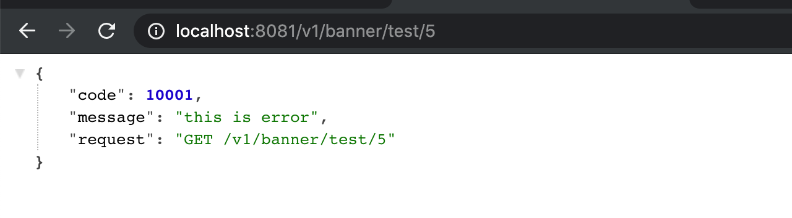
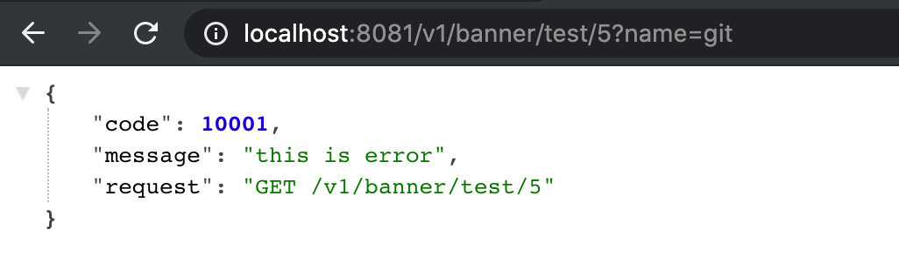
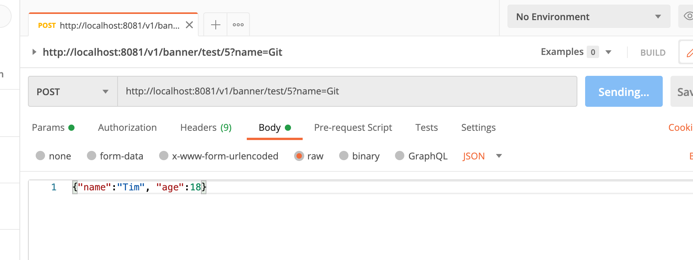
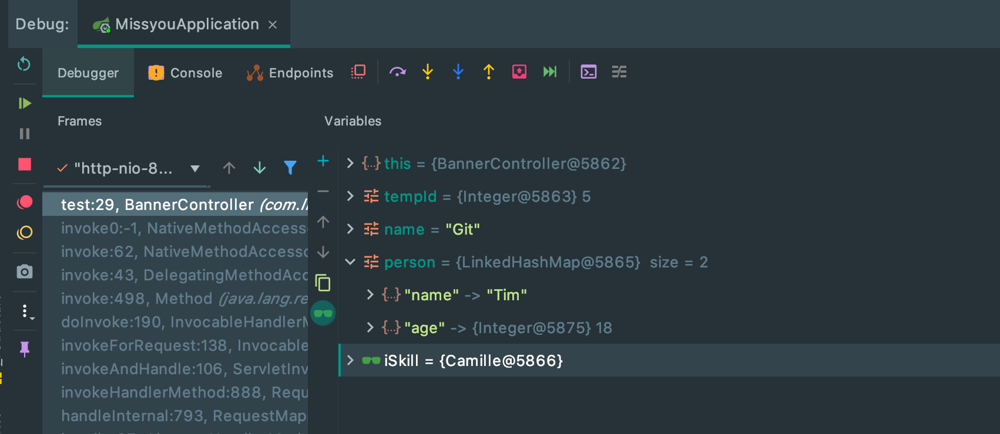

## 如何接收前端传过来的参数

```java
@RestController
@RequestMapping("/v1/banner")
public class BannerController {

    @Autowired
//    @Qualifier("irelia")
    private ISkill iSkill;

    // v1/banner/test/2
    @GetMapping("/test/{id}")
    public String test(@PathVariable(name="id") Integer tempId) throws Exception{
        iSkill.r();
        // 这一行我们是为了抛出未知异常
//        throw new RuntimeException("122222222");

        //抛出已知异常
        throw new ForbiddenException(10001);
    }
}
```

- 可以看到 `"/test/{id}"`, 其中{id}映射到 (name="id")



---

## 路径后面的查询参数， ? 后面的查询参数，如何接收?

```java
@RestController
@RequestMapping("/v1/banner")
public class BannerController {

    @Autowired
//    @Qualifier("irelia")
    private ISkill iSkill;

    // v1/banner/test/2
    @GetMapping("/test/{id}")
    public String test(@PathVariable(name="id") Integer tempId, @RequestParam String name) throws Exception{
        iSkill.r();
        throw new ForbiddenException(10001);
    }
}
```




---

## 数据传输对象 DTO 的接收

- 如何接收 POST的 requestBody 的参数


```java
@RestController
@RequestMapping("/v1/banner")
public class BannerController {

    @Autowired
//    @Qualifier("irelia")
    private ISkill iSkill;

    // v1/banner/test/2
    @PostMapping("/test/{id}")
    public String test(@PathVariable(name="id") Integer tempId,
                       @RequestParam String name,
                       @RequestBody Map<String, Object> person
                       ) throws Exception{
        iSkill.r();
        // 这一行我们是为了抛出未知异常
//        throw new RuntimeException("122222222");

        //抛出已知异常
        throw new ForbiddenException(10001);
    }
}
```






