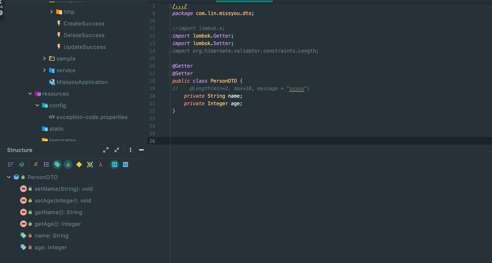
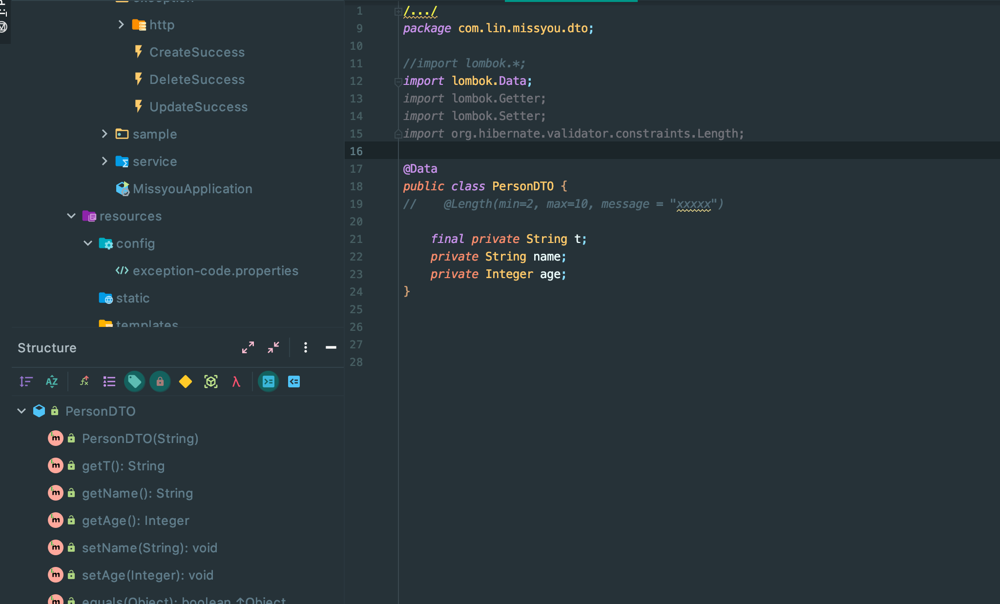
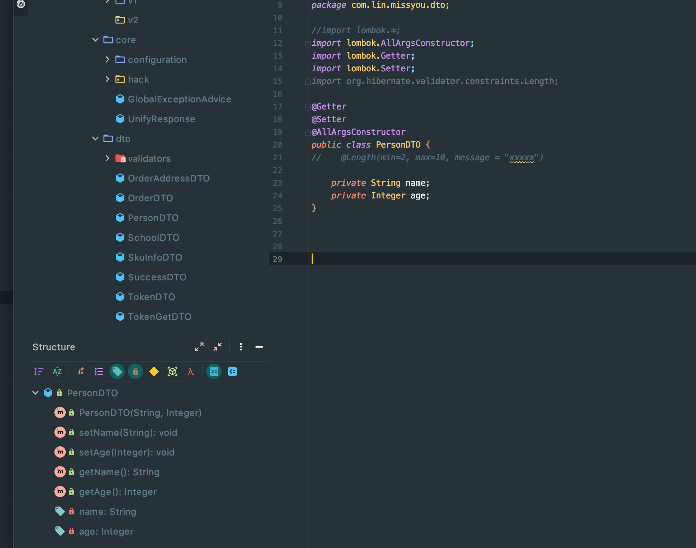
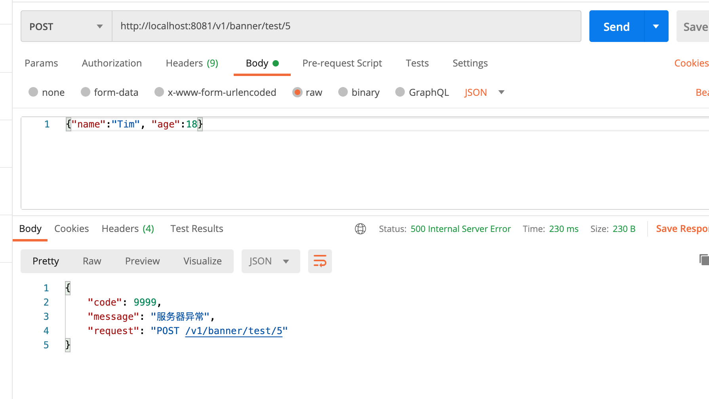

##

- 先 加上 dependency, pom.xml

```xml
<dependency>
    <groupId>org.projectlombok</groupId>
    <artifactId>lombok</artifactId>
</dependency>
```



---

- `@Data` , 可以生成 equals hashCode toString



- 我们看到打上@Data, 是不会生成 set method for final


---

## LomBok 中关于构造函数的几个注解：

- `@AllArgsConstructor` 的作用




- @NoArgsConstructor


```java
@Getter
@Setter
@AllArgsConstructor
@NoArgsConstructor
public class PersonDTO {
//    @Length(min=2, max=10, message = "xxxxx")

    private String name;
    private Integer age;
}
```

---

### @NotNull 

```java
@Getter
@Setter
@AllArgsConstructor
@NoArgsConstructor
public class PersonDTO {

    @NotNull
    private String name;
    private Integer age;
}
```



- `org.springframework.web.bind.MissingServletRequestParameterException: Required String parameter 'name' is not present`

- 可以用 `@RequiredArgsConstructor`


