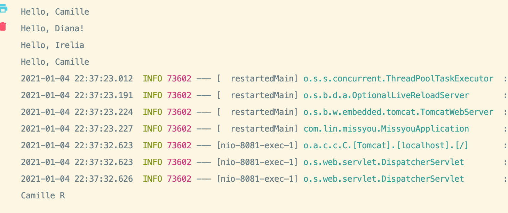

## @Configuration 配置类

```java
public interface ISkill {
    void q();
    void w();
    void e();
    void r();
}

@Component
public class Camille implements ISkill {
    private String skillName = "Camille R";

    public Camille() {
        System.out.println("Hello, Camille");
    }
    public void q(){
        System.out.println("Camille Q");
    }

    public void w(){
        System.out.println("Camille W");
    }

    public void e(){
        System.out.println("Camille E");
    }

    public void r(){
        System.out.println(this.skillName);
    }
}


@Configuration
public class HeroConfiguration {
    @Bean
    public ISkill caille() {
        return new Camille();
    }
}


@RestController
@RequestMapping("/v1/banner")
public class BannerController {

    @Autowired
//    @Qualifier("irelia")
    private ISkill camille;

    @GetMapping("/test")
    public String test(){
        camille.r();
        return "Hello World!";
    }
}
```





- @Configuration 就是用来替换原来的xml bean 标签的。


