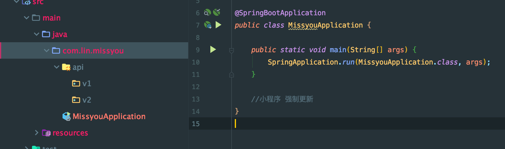
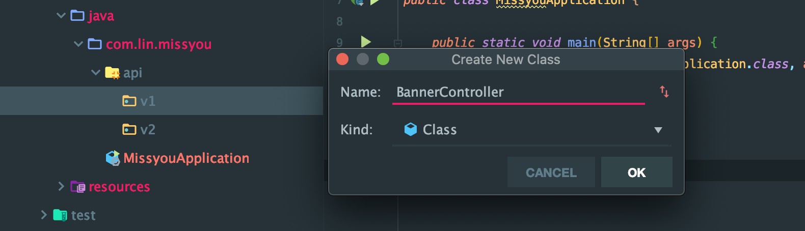
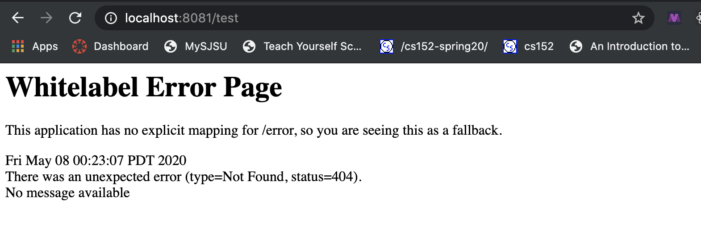
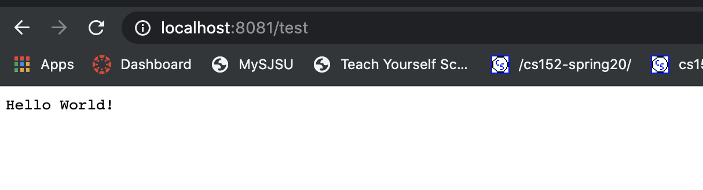
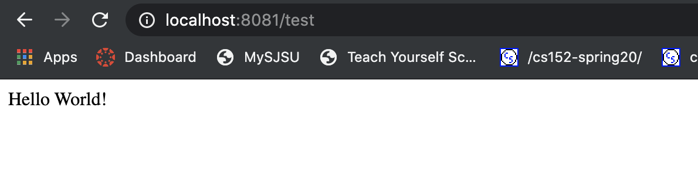

# 2. run the first project

```xml
<?xml version="1.0" encoding="UTF-8"?>
<project xmlns="http://maven.apache.org/POM/4.0.0" xmlns:xsi="http://www.w3.org/2001/XMLSchema-instance"
	xsi:schemaLocation="http://maven.apache.org/POM/4.0.0 https://maven.apache.org/xsd/maven-4.0.0.xsd">
	<modelVersion>4.0.0</modelVersion>
	<parent>
		<groupId>org.springframework.boot</groupId>
		<artifactId>spring-boot-starter-parent</artifactId>
		<version>2.2.1.RELEASE</version>
		<relativePath/> <!-- lookup parent from repository -->
	</parent>
	<groupId>com.lin</groupId>
	<artifactId>missyou</artifactId>
	<version>0.0.1-SNAPSHOT</version>
	<name>missyou</name>
	<description>Demo project for Spring Boot</description>

```

- version `2.2.1`

---

## how to change port

- `application.properties`

```java
server.port = 8081
```

- run springboot project

- 其实用 spirngboot 框架开发应用是非常快的，比很多框架都快，比python php 还要快

- 现在开始配置`api`， 用来写springboot 路由`route`



- 之所以创建两个版本api, 因为客户端也有可能老用户不更新版本还在用之前的版本



- 我们写了这样一个class

```java
package com.lin.missyou.api.v1;

public class BannerController {
    //MVC SpringMVC
    //Controller Model View

    public String test(){
        return "Hello World!";
    }
}
```

- 无论写多少个，springboot 都不会管你，但是如果要让前端访问这个method, 那就必须接受springboot 管理


---

## ResponseBody

- 尽管class name 是 controller, 但是只是普通类，想要让springboot 识别就必须

- run 



- 由于我们之前已经配置到 `8081` 端口

- 我们需要引入一个 `HttpServletResponse` 

```java
@Controller
public class BannerController {
    //MVC SpringMVC
    //Controller Model View

    @GetMapping("/test")
    public void test(HttpServletResponse response){
        try {
            response.getWriter().write("Hello World!");
        } catch (IOException e) {
            e.printStackTrace();
        }
//        return "Hello World!";
    }
}
```




## `ResponseBody` 简化 `ServletResponse`

```java
@Controller
public class BannerController {
    //MVC SpringMVC
    //Controller Model View

    @GetMapping("/test")
    @ResponseBody
    public String test(){
//            response.getWriter().write("Hello World!");

    //response header text/plain
    //application/json
    //POSTMAN
    //Junit test
        return "Hello World!";
    }
}

```

- 同时，responsebody 还可以解决中文编码问题




