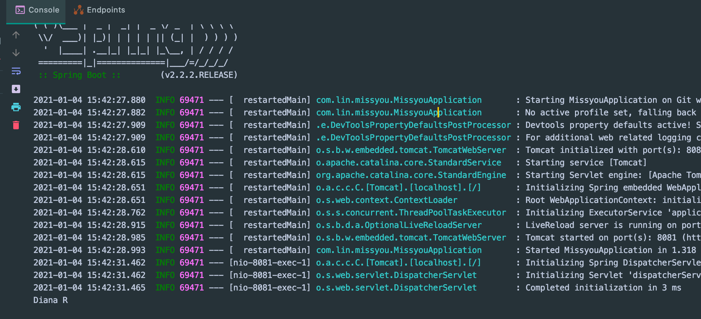
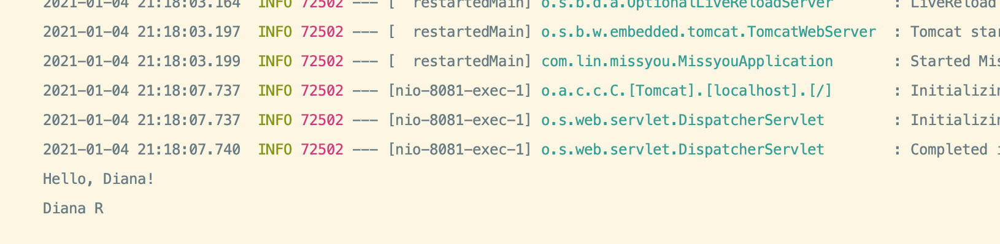

## Spring IOC的核心机制：实例化与注入

### SpringBoot 最基础的编程模式 @Component + @Autowired

- `@Component` 会被加入到容器，example：

- `missyou/sample/hero/`

```java
@Component
public class Diana {
    public void q(){
        System.out.println("Diana Q");
    }

    public void w(){
        System.out.println("Diana W");
    }

    public void e(){
        System.out.println("Diana E");
    }

    public void r(){
        System.out.println("Diana R");
    }
}

```

- 加上`@Component` springboot 就会自动把它加入容器，

- 现在我们使用 注入 `inject` 到 `api/v1/BannerController`
  - 通过`@Autowired`来inject

```java
@RestController
@RequestMapping("v1/banner")
public class BannerController {

    @Autowired
    private Diana diana;

    @GetMapping("/test")
    public String test(){
        diana.r();
        return "Hello World!";
    }
}
```

- `@Autowired`, 可以不用 new 一个实例，直接 call method



- console, show `Diana R`

---


## 标记上 @Service, 也将被 inject into container

- service/BannerService

```java
@Service
public class BannerService {
}
//关于 @Service 之后会解释!


@RestController
@RequestMapping("v1/banner")
public class BannerController {

    @Autowired
    private Diana diana;

    @Autowired
    private BannerService bannerService;

    @GetMapping("/test")
    public String test(){
        diana.r();
        return "Hello World!";
    }
}
```

---

## stereotype annotations 模式注解

```java
@Component 组件/类/bean 类的实例化 new

@Service   
@Controller
@Repository

@Configuration
```

- 底下四个都是以第一个 Component为基础

---

## 如果不写 @Component 注入

```java
//@Component
public class Diana {
    public void q(){
        System.out.println("Diana Q");
    }

    public void w(){
        System.out.println("Diana W");
    }

    public void e(){
        System.out.println("Diana E");
    }

    public void r(){
        System.out.println("Diana R");
    }
}


@RestController
@RequestMapping("v1/banner")
public class BannerController {

    @Autowired(required = false)
    private Diana diana;

    @Autowired
    private BannerService bannerService;

    @GetMapping("/test")
    public String test(){
        diana.r();
        return "Hello World!";
    }
}
```

- 但是访问的时候会有error


---

## IOC 注入时机：

- IOC 对象实例化，inject的时机

- 它的机制是： 立即/提前 实例化

- 但是我们可以让它 **延迟实例化** `@Lazy`

- 如果只给 Diana `@Lazy` 标签这样做是无效的，还是会被立即实例化，只有给 BannnerController 也注入此标签才会生效：

```java
@Component
@Lazy
public class Diana {
    public Diana() {
        System.out.println("Hello, Diana!");
    }

    public void q(){
        System.out.println("Diana Q");
    }

    public void w(){
        System.out.println("Diana W");
    }

    public void e(){
        System.out.println("Diana E");
    }

    public void r(){
        System.out.println("Diana R");
    }
}

@RestController
@Lazy
@RequestMapping("v1/banner")
public class BannerController {

    @Autowired
    private Diana diana;

    @Autowired
    private BannerService bannerService;

    @GetMapping("/test")
    public String test(){
        diana.r();
        return "Hello World!";
    }
}
```

- 记得刷新一下页面，再请求一下，就会看到 **Diana 已经不会被立即执行实例化**:




- 注意没有特殊理由不要开启，延迟实例化 `@Lazy`

---


