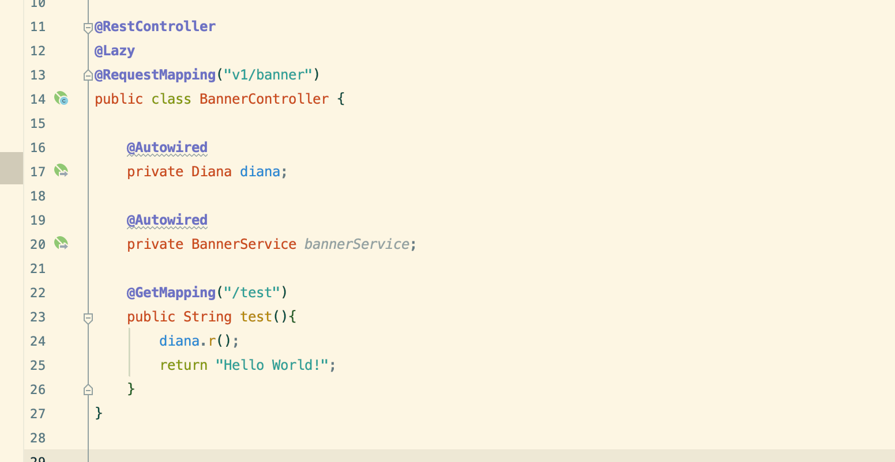
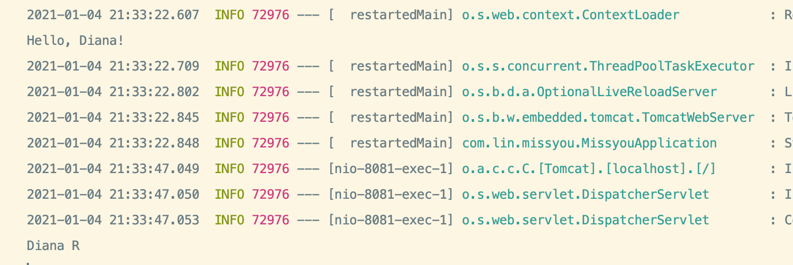
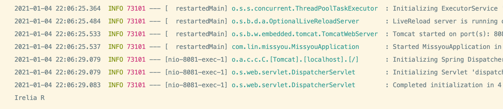

## 成员变量注入、Setter注入与构造注入



- 我们可以看到有黄色提示，实际上spring, 不提倡这种字段注入。
- 它提倡的是constructor 注入

```java
@RestController
@RequestMapping("v1/banner")
public class BannerController {

//    @Autowired
    private Diana diana;

    @Autowired
    private BannerService bannerService;

    public BannerController(Diana diana) {
        this.diana = diana;
    }

    @GetMapping("/test")
    public String test(){
        diana.r();
        return "Hello World!";
    }
}
```

- 可以看到生成一个 constructor 注入。

---

### 生成一个 setter

```java
@RestController
@RequestMapping("v1/banner")
public class BannerController {

//    @Autowired
    private Diana diana;

    @Autowired
    public void setDiana(Diana diana) {
        this.diana = diana;
    }

    @GetMapping("/test")
    public String test(){
        diana.r();
        return "Hello World!";
    }
}
```

- 我们发现setter 也是可以注入的。



---

### 总结： 注入时候最好加上@Autowired, 最推荐的是constructor 注入

---

### 一个接口多个实现类的处理

```java
@Component
public class Irelia implements ISkill {
    public Irelia() {
        System.out.println("Hello, Irelia");
    }
    public void q(){
        System.out.println("Irelia Q");
    }

    public void w(){
        System.out.println("Irelia W");
    }

    public void e(){
        System.out.println("Irelia E");
    }

    public void r(){
        System.out.println("Irelia R");
    }
}


@RestController
@RequestMapping("v1/banner")
public class BannerController {

    @Autowired
    private ISkill diana;
    

    @GetMapping("/test")
    public String test(){
        diana.r();
        return "Hello World!";
    }
}
}
```

- 现在有两个英雄继承了 interface, 那谁会被调用？

---

## @Autowired按类型注入 | 被动推断注

1. by type, 它是 @Autowired 的默认注入形式, 
  - 比如， spring 会找到一个已经implemented 了 iskill 的类的类型

2. by name

---

## 主动选择注入 @Qualifier

```java
@RestController
@RequestMapping("v1/banner")
public class BannerController {

    @Autowired
    @Qualifier("irelia")
    private ISkill diana;


    @GetMapping("/test")
    public String test(){
        diana.r();
        return "Hello World!";
    }
}
```

- 在指定了name以后，可以看到如下, 并不是diana



---


## 面向对象中变化的方案

1. 指定一个interface, 然后用多个类实现同一个interface  => **strategy pattern**


