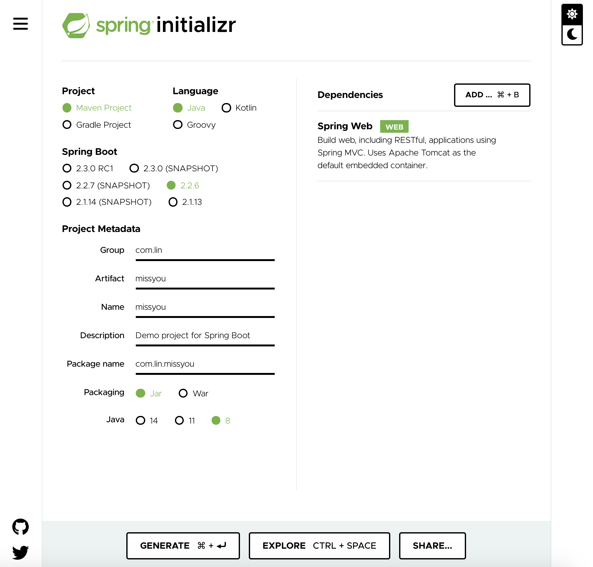
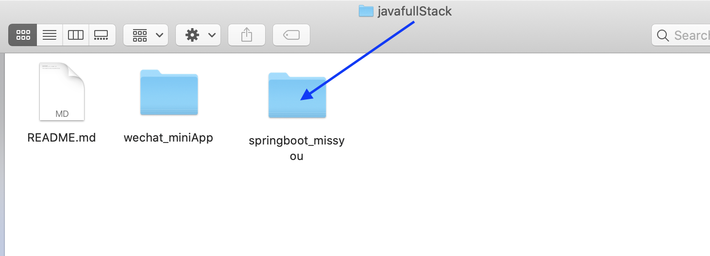
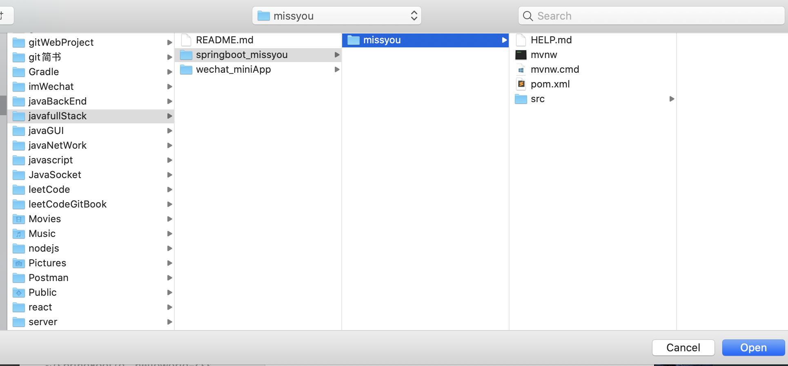
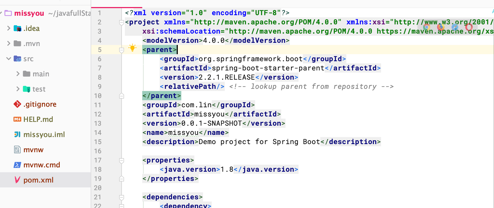

# p3: initialize SpringBoot Project

- input `https://start.spring.io/`

1. initialize a project by offical website

- click `generate`

---

- intellij open `javafullstack/springboot-missyou` project

- change to `2.2.1RELEASE`

